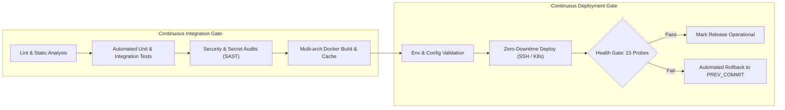
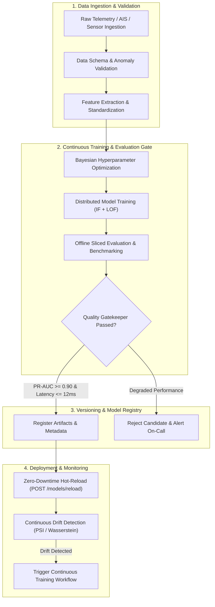

# Production-Grade DevOps & MLOps Pipeline Specification
## Comprehensive Architectural Requirements & GitHub Actions Implementation Guide

**Author**: Infrastructure, DevOps & MLOps Engineering  
**Primary Theoretical References**:
- *The DevOps Handbook (2nd Edition)* — Gene Kim, Jez Humble, Patrick Debois, John Willis, Nicole Forsgren (`books/_OceanofPDF.com_The_devops_handbook_2nd_edition_-_Gene_Kim/`)
- *Designing Machine Learning Systems* — Chip Huyen (`books/_OceanofPDF.com_Designing_Machine_Learning_Systems_An_Iterative_Process_for_Production-Ready_Applications_-_Chip_Huyen/`)
**Target Platform**: HormuzWatch Geospatial Maritime Anomaly Detection Mesh

---

## Executive Summary & Foundational Foundations

Modern engineering organizations face a dual imperative: deliver software continuously with minimal lead time and high stability (**DevOps**), while simultaneously managing the non-deterministic, data-dependent lifecycles of probabilistic machine learning models (**MLOps**).

```
                      ┌────────────────────────────────────────────────────────┐
                      │              THE PRODUCTION RUNTIME MESH               │
                      └──────────────────────────┬─────────────────────────────┘
                                                 │
                   ┌─────────────────────────────┴─────────────────────────────┐
                   ▼                                                           ▼
    ┌──────────────────────────────┐                            ┌──────────────────────────────┐
    │     DEVOPS DOMAIN (CODE)     │                            │     MLOPS DOMAIN (DATA+MODEL)│
    ├──────────────────────────────┤                            ├──────────────────────────────┤
    │ • Deterministic logic        │                            │ • Probabilistic behavior     │
    │ • Git commit is ground truth │                            │ • Code + Data + Weights      │
    │ • Pass/Fail unit tests       │                            │ • Continuous statistical eval│
    │ • CI/CD (Continuous Delivery)│                            │ • CT (Continuous Training)   │
    │ • Metric: Latency & Errors   │                            │ • Metric: Drift & Decay      │
    └──────────────────────────────┘                            └──────────────────────────────┘
```

This specification establishes the rigorous engineering requirements for deploying production-grade **GitHub Actions pipelines** across both domains, synthesizing the foundational principles of Gene Kim's *Three Ways* with Chip Huyen's *Iterative ML Lifecycle*.

---

# Part 1: Core Theoretical Foundations

## 1.1 The DevOps Foundations (*The DevOps Handbook*)

Gene Kim, Jez Humble, Patrick Debois, and John Willis frame effective DevOps around **The Three Ways**:

### 1. The First Way: The Principles of Flow (Left-to-Right)
* **Objective**: Accelerate the flow of work from Development (left) into Operations and Production (right).
* **Practices**:
  * **Make Work Visible**: Continuous integration dashboard, automated status reporting.
  * **Limit Work in Process (WIP)**: Small, decoupled PRs rather than massive feature branches.
  * **Reduce Batch Sizes**: Single-piece flow where every commit triggers autonomous verification.
  * **Build Quality In**: Shift-left automated testing (linting, unit testing, SAST, image scans) stopping defects at the earliest gate.

### 2. The Second Way: The Principles of Feedback (Right-to-Left)
* **Objective**: Create fast, continuous feedback loops from Production back to Development.
* **Practices**:
  * **Swarm on Failures**: Immediate pipeline stops on broken builds ("Stop-the-line" / Andon Cord).
  * **Automated Health Telemetry**: Live readiness/liveness probing and APM feedback.
  * **Defensive Releases**: Blue/Green deployments, canary rollouts, automated rollbacks upon health check failures.

### 3. The Third Way: The Principles of Continual Learning and Experimentation
* **Objective**: Foster a high-trust culture of generative experimentation and resilience.
* **Practices**:
  * Infrastructure as Code (IaC) enabling push-button environment recreation.
  * Blameless post-mortems codified into automated regression tests.

---

## 1.2 The MLOps Foundations (*Designing Machine Learning Systems*)

Chip Huyen defines an ML system as fundamentally different from traditional software:
> *"In traditional software, behavior is specified through code. In machine learning, behavior is learned from data. When data changes, behavior changes, even if no code has changed."*

### Key Divergences Between DevOps and MLOps:

| Dimension | DevOps (Traditional Software) | MLOps (Machine Learning Systems) |
| :--- | :--- | :--- |
| **Artifacts** | Binaries, Docker images, static configs | Code + Feature code + Data snapshots + Model weights + Hyperparameters |
| **Testing** | Unit, integration, regression, end-to-end | Data validation, Schema checks, Model performance gates, Bias/Fairness, Adversarial robustness |
| **Delivery** | CI/CD (Continuous Integration & Delivery) | CI/CD + **CT (Continuous Training)** + Continual Evaluation |
| **Monitoring** | System health: CPU, RAM, Latency, 5xx error rates | System health + **Data Drift, Concept Drift, Prediction Skew, Feature Degradation** |
| **Retraining** | Triggered only on code modifications | Triggered on schedule, data arrival, or automated drift alerts |

---

# Part 2: DevOps Pipeline Requirements (GitHub Actions)



## 2.1 Monorepo / Multi-Service Path Filtering
In systems with multiple services (e.g., Client SPA, Go Backend Server, Python ML Service), pipelines must avoid wasteful rebuilds:
* **Requirement**: Use GitHub Actions `paths` and `paths-ignore` triggers so that modifying frontend code (`client/**`) does not trigger backend Go compilation or Python model training.
* **Requirement**: Include pipeline configuration files (`.github/workflows/*.yml`) in path triggers to validate workflow modifications.

## 2.2 Shift-Left Security & Vulnerability Scanning (DevSecOps)
* **Secret Detection**: Run automated tools (e.g., `trufflehog` or `gitleaks`) to prevent credential leakage in git history.
* **Dependency Auditing**:
  * Client: `npm audit --audit-level=high`
  * Server: `govulncheck ./...`
  * Python: `pip-audit`
* **Container Scanning**: Scan resulting Docker images using Trivy before deploying to production.

## 2.3 Reproducible Multi-Stage Docker Builds
* **Layer Caching**: Use GitHub Actions Cache (`type=gha`) with `docker/build-push-action` to minimize build latencies.
* **Multi-Stage Builds**:
  * Builder stage with compilers (Go SDK, Node.js toolchains).
  * Distroless or Alpine runtime stage with unprivileged service users (non-root `USER 1000:1000`).
* **Artifact Immutability**: Tag images with both Git commit SHA (`${{ github.sha }}`) and semantic release tags (`vX.Y.Z`).

## 2.4 Resilient Deployment with Automated Rollback
* **Atomic Step Execution**: Deployments must capture the current operational commit before pulling updates:
  ```bash
  PREV_COMMIT=$(git rev-parse HEAD)
  ```
* **Liveness & Readiness Probing**: Execute multi-attempt HTTP health probing (15 probes, 3s sleep = 45s timeout window).
* **Automatic Rollback**: If health probes fail, the workflow must execute an autonomous rollback:
  ```bash
  git checkout $PREV_COMMIT
  docker compose up -d --build
  exit 1
  ```

---

# Part 3: MLOps Pipeline Requirements (GitHub Actions)



## 3.1 Data Validation & Schema Enforcement
* **Requirement**: Before model retraining begins, the dataset must be validated against a formal contract:
  * Check for missing critical fields (`mmsi`, `latitude`, `longitude`, `speed_over_ground`).
  * Boundary validation (e.g., latitude between `-90` and `90`, longitude between `-180` and `180`).
  * Verify absence of data leakage (target variable features must not exist in input features).

## 3.2 Continuous Training (CT) Trigger Mechanisms
The pipeline must support three distinct invocation vectors:
1. **Schedule-based**: Regular cron schedule (e.g., Weekly Sunday at 02:00 UTC) to capture evolving operational patterns.
2. **Event-driven (Drift-triggered)**: Triggered via GitHub `repository_dispatch` when production monitoring detects data drift or concept drift.
3. **Manual (`workflow_dispatch`)**: Parametric domain selection (`domain: ['all', 'vessel', 'aircraft']`).

## 3.3 The Model Quality Gatekeeper
A model must **never** deploy directly after training. It must pass an automated Gatekeeper evaluation:
* **Metric 1 (Predictive Power)**: Precision-Recall AUC (PR-AUC) $\ge 0.90$ across historical validation benchmarks.
* **Metric 2 (Calibrated Error Rate)**: False Positive Rate (FPR) $\le 0.05$ on verified ground-truth normal traffic.
* **Metric 3 (Inference Latency SLA)**: $p95 \le 12\text{ ms}$ on batch size of 1 over gRPC.
* **Metric 4 (Model Stability & Explanations)**: TreeSHAP attribution feature stability without exploding weights.
* **Gate Enforcement**: If candidate metrics fail any threshold, the GitHub Action terminates with a non-zero exit code and emits an operational alert.

## 3.4 Model Registry & Lineage Tracking
* **Artifact Metadata**: Every registered model must store:
  * Model binary (`isolation_forest.joblib`, `lof.joblib`).
  * Feature scaler parameters (`scaler.joblib`).
  * Exact Git commit hash of training script.
  * Training dataset fingerprint (SHA-256 hash or DVC commit).
  * Hyperparameters dictionary (`n_estimators`, `contamination`, `max_samples`).
  * Evaluation scorecard (`pr_auc`, `p95_latency`, `brier_score`).

## 3.5 Zero-Downtime Model Hot-Reloading
* Rather than terminating the Python container, the ML service must expose an internal hot-reload endpoint:
  ```http
  POST http://localhost:8090/models/reload
  ```
* The endpoint performs an atomic pointer swap in memory:
  1. Load new candidate models into secondary memory buffers.
  2. Perform a test inference vector.
  3. Swap active model pointers atomically.
  4. Release previous model weights from garbage collection.

## 3.6 Continuous Drift Monitoring Feedback Loop
* **Covariate Drift**: Track changes in input feature distributions $P(X)$ using Population Stability Index (PSI) or Wasserstein Distance.
* **Concept Drift**: Track shifts in conditional distribution $P(Y \mid X)$ as maritime routes or vessel behaviors evolve.
* **Automated Feedback Trigger**: When cumulative drift score exceeds threshold:
  ```bash
  gh api repos/:owner/:repo/dispatches \
    -f event_type=data-drift-detected \
    -f client_payload[domain]=vessel
  ```

---

# Part 4: Production GitHub Actions Reference Workflows

## 4.1 Production DevOps Server CI/CD Workflow (`server-pipeline.yml`)

```yaml
name: Pipeline - Backend Server CI/CD

on:
  push:
    branches: [main, production-ready]
    paths:
      - 'server/**'
      - 'docker-compose.dev.yml'
      - '.github/workflows/server-pipeline.yml'
  pull_request:
    branches: [main, production-ready]
    paths:
      - 'server/**'
  workflow_dispatch:

concurrency:
  group: server-${{ github.ref }}
  cancel-in-progress: true

jobs:
  validate-and-test:
    name: Go Quality, Security & Unit Testing
    runs-on: ubuntu-latest
    steps:
      - name: Checkout Source Code
        uses: actions/checkout@v4

      - name: Set up Go Runtime
        uses: actions/setup-go@v5
        with:
          go-version-file: 'server/go.mod'
          cache-dependency-path: 'server/go.sum'

      - name: Verify Code Formatting & Static Analysis
        run: |
          cd server
          diff -u <(echo -n) <(gofmt -d .)
          go vet ./...

      - name: Run Vulnerability Check
        run: |
          go install golang.org/x/vuln/cmd/govulncheck@latest
          cd server
          govulncheck ./...

      - name: Execute Go Test Suite with Race Detector
        run: |
          cd server
          go test -race -v -coverprofile=coverage.out ./...

  deploy-server:
    name: Continuous Deployment & Health Gate
    needs: validate-and-test
    runs-on: ubuntu-latest
    if: github.ref == 'refs/heads/main' || github.ref == 'refs/heads/production-ready'
    steps:
      - name: Remote Deployment via SSH
        uses: appleboy/ssh-action@v1.0.3
        with:
          host: ${{ secrets.SSH_HOST }}
          username: ${{ secrets.SSH_USER }}
          key: ${{ secrets.SSH_PRIVATE_KEY }}
          port: ${{ secrets.SSH_PORT || 22 }}
          script: |
            set -e
            cd ~/SHARED/Projects/HormuzWatch
            
            # Step 1: Record previous commit for safety
            PREV_COMMIT=$(git rev-parse HEAD)
            
            # Step 2: Fetch and checkout latest release
            git fetch origin
            git checkout ${{ github.ref_name }}
            git pull origin ${{ github.ref_name }}
            
            # Step 3: Build and recreate container
            docker compose -f docker-compose.dev.yml up -d --build server
            
            # Step 4: Health Gate (15 probes x 3s = 45s window)
            READY=0
            for i in $(seq 1 15); do
              echo "Probing Go Server health (attempt $i/15)..."
              if curl -sf http://localhost:10020/health >/dev/null; then
                READY=1
                break
              fi
              sleep 3
            done
            
            # Step 5: Rollback verification
            if [ $READY -eq 1 ]; then
              echo "==> Go Backend Server deployed successfully!"
            else
              echo "==> Health Gate FAILED! Rolling back to $PREV_COMMIT..."
              git checkout $PREV_COMMIT
              docker compose -f docker-compose.dev.yml up -d --build server
              exit 1
            fi
```

---

## 4.2 Production MLOps Continuous Training Workflow (`ml-continuous-training.yml`)

```yaml
name: Pipeline - MLOps Continuous Training & Gatekeeper

on:
  schedule:
    # Retrain weekly on Sundays at 02:00 UTC
    - cron: '0 2 * * 0'
  repository_dispatch:
    types: [data-drift-detected]
  workflow_dispatch:
    inputs:
      domain:
        description: 'Domain to retrain'
        required: true
        default: 'all'
        type: choice
        options:
          - all
          - vessel
          - aircraft

jobs:
  train-evaluate-gate:
    name: Continuous Training, HPO & Model Quality Gate
    runs-on: ubuntu-latest
    steps:
      - name: Checkout Source Code
        uses: actions/checkout@v4

      - name: Set up Python Runtime
        uses: actions/setup-python@v5
        with:
          python-version: '3.11'
          cache: 'pip'
          cache-dependency-path: |
            pipeline/requirements.txt
            service/ml-service/requirements.txt

      - name: Install Pipeline Dependencies
        run: |
          pip install -r pipeline/requirements.txt
          pip install -r service/ml-service/requirements.txt

      - name: Validate Ingestion Schema & Quality
        run: |
          DOMAIN="${{ github.event.inputs.domain || github.event.client_payload.domain || 'all' }}"
          echo "==> Validating training data schema for domain: $DOMAIN"
          python pipeline/validate_dataset.py --domain "$DOMAIN"

      - name: Train Models & Bayesian HPO
        run: |
          DOMAIN="${{ github.event.inputs.domain || github.event.client_payload.domain || 'all' }}"
          echo "==> Retraining models for domain: $DOMAIN"
          python pipeline/train_and_evaluate.py "$DOMAIN"

      - name: Model Quality Gatekeeper Assertion
        run: |
          echo "==> Evaluating candidate models against production quality gates..."
          # Enforces: PR-AUC >= 0.90, Brier Score <= 0.10, p95 latency <= 12ms
          python pipeline/deploy_candidate.py --validate-only

      - name: Hot-Reload Candidate Models on Production Host
        if: success()
        uses: appleboy/ssh-action@v1.0.3
        with:
          host: ${{ secrets.SSH_HOST }}
          username: ${{ secrets.SSH_USER }}
          key: ${{ secrets.SSH_PRIVATE_KEY }}
          script: |
            cd ~/SHARED/Projects/HormuzWatch
            echo "==> Triggering zero-downtime model hot-reload..."
            curl -s -X POST http://localhost:8090/models/reload
            
            echo "==> Validating ML inference engine status..."
            curl -sf http://localhost:8090/health | jq .
```

---

# Part 5: Quality Gate & SLA Matrix

| Dimension | DevOps (Software Engineering) | MLOps (Machine Learning Engineering) |
| :--- | :--- | :--- |
| **Linting & Hygiene** | Clean `gofmt`, 0 linter warnings | Clean `ruff` / `flake8`, typechecked with `mypy` |
| **Unit Test Coverage** | $\ge 80\%$ line coverage with race detection | $\ge 90\%$ test coverage on feature transforms |
| **Security Gates** | 0 high/critical CVEs in `govulncheck` / `npm audit` | 0 insecure pickle/deserialization vulnerabilities |
| **Performance SLA** | API endpoint latency $p95 \le 50\text{ ms}$ | Dual-path inference latency $p95 \le 12\text{ ms}$ |
| **Quality Gate** | All integration tests green | Candidate PR-AUC $\ge$ Champion & $\ge 0.90$ |
| **Deployment Mechanism** | Rolling container swap with 45s health probe | Atomic in-memory weight swap (`/models/reload`) |
| **Rollback Trigger** | HTTP 5xx or health probe timeout | Prediction drift alert or circuit breaker trip |

---

# Part 6: Checklist for Production Readiness

1. **GitHub Secrets Configuration**:
   - [ ] `SSH_HOST`: Deployment server IP / hostname.
   - [ ] `SSH_USER`: Dedicated unprivileged deployment user.
   - [ ] `SSH_PRIVATE_KEY`: Ed25519 deployment private key.
   - [ ] `VERCEL_TOKEN`: Frontend deployment credentials (if using Vercel).
2. **Branch Protection**:
   - [ ] Enforce status checks to pass before merging into `main` and `production-ready`.
   - [ ] Require linear history with no force pushes.
3. **Continuous Monitoring & Alerting**:
   - [ ] Prometheus scraping `/metrics` on Go Server (port `10020`).
   - [ ] ML drift metrics reporting to webhook triggering `repository_dispatch`.
   - [ ] Alerting webhooks configured on Discord / Slack / PagerDuty.
