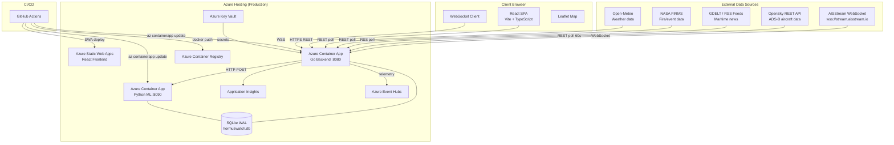
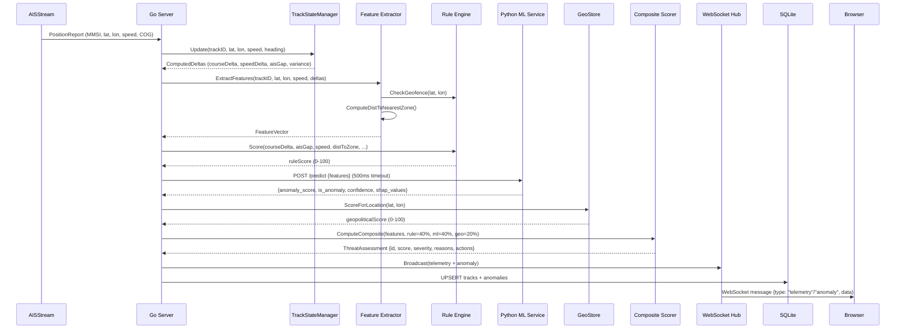
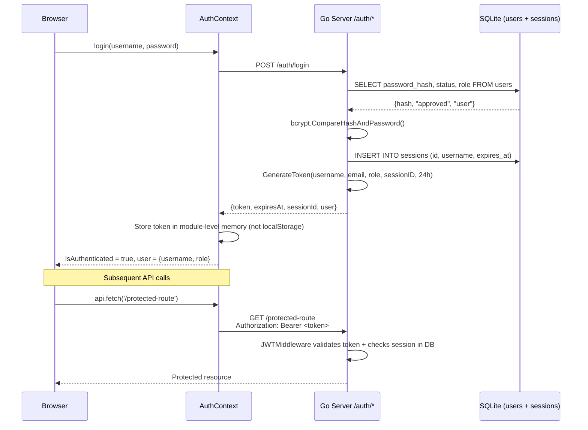
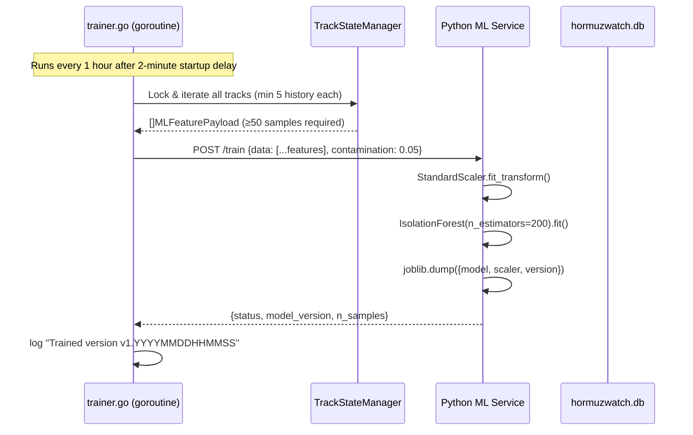
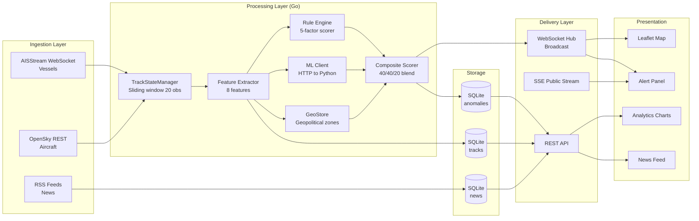
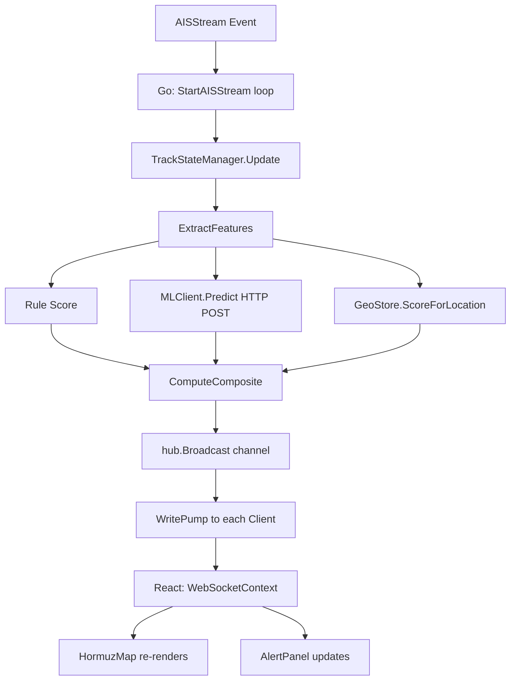

# System Architecture

## 1. Component Overview

HormuzWatch follows a **polyglot microservice** architecture with three primary runtime services and one embedded database:

| Service | Runtime | Role |
|---|---|---|
| **React SPA** | Node.js (build) / Browser | UI, maps, user interactions |
| **Go API Server** | Go 1.25 | Core backend, data ingestion, WebSocket hub, auth |
| **Python ML Service** | Python 3.11 / FastAPI | Isolation Forest inference + training |
| **SQLite** | Embedded in Go server | Persistence for tracks, anomalies, users, sessions |

---

## 2. Full Architecture Diagram



---

## 3. Service Interaction Diagrams

### 3.1 Real-Time Telemetry Pipeline



### 3.2 Authentication Flow



### 3.3 ML Training Loop



---

## 4. Frontend ↔ Backend Communication

### HTTP REST (JSON)
All authenticated requests send `Authorization: Bearer <JWT>` header.

```
Client (Vite proxy /api → :8080)
  GET  /health                     → Health check
  POST /auth/login                 → Login
  POST /auth/register              → Register
  GET  /auth/session               → Validate session
  POST /auth/logout                → Logout
  GET  /heatmap                    → Heatmap grid (30s cache)
  GET  /history/attacks            → Historical incidents
  GET  /zones/restricted           → Geofence definitions
  GET  /news                       → RSS/GDELT news
  GET  /watchlist                  → Watchlist items
  POST /watchlist/:id              → Add to watchlist
  DELETE /watchlist/:id            → Remove from watchlist
  GET  /tracks/:id/history         → Track telemetry history
  GET  /settings                   → System settings
  POST /settings                   → Update settings
  GET  /auth/users                 → [Admin] All users
  POST /auth/approve/:username     → [Admin] Approve user
  POST /auth/blacklist/:username   → [Admin] Blacklist user
```

### WebSocket (Real-Time)
```
Client → WSS /ws/stream (JWT auth required in prod)
Server → Client: {type: "telemetry", data: TelemetryPayload}
Server → Client: {type: "anomaly", data: ThreatAssessment}
```

### Server-Sent Events (Public)
```
GET /public/stream → SSE stream
  event: "traces"  data: {traces: TopTrace[], timestamp: string}
  (refreshed every 5 seconds, top 10 by anomaly score)
```

---

## 5. Data Flow Diagram



---

## 6. Request Lifecycle

### Authenticated API Request
1. React component calls `api.fetch()` (from `services/api.ts`)
2. `api.ts` retrieves the JWT from `AuthContext` (module-level memory)
3. Request issued with `Authorization: Bearer <token>`
4. Vite dev proxy forwards to `http://localhost:8080`
5. Gin router matches route
6. `JWTMiddleware()` validates token signature + expiry
7. Middleware queries SQLite to confirm session is not revoked
8. `authUser` injected into Gin context
9. Handler executes business logic
10. JSON response returned to client

### WebSocket Lifecycle
1. Client establishes WSS connection to `/ws/stream` (JWT in header or query param)
2. Server upgrades HTTP → WebSocket via `gorilla/websocket`
3. Client registered with `hub.Hub`
4. **Hydration goroutine** immediately loads last 2 hours of tracks+anomalies from SQLite → sends to client
5. Client receives continuous real-time messages as new telemetry arrives
6. On disconnect, client de-registered from hub

---

## 7. Event Flow


