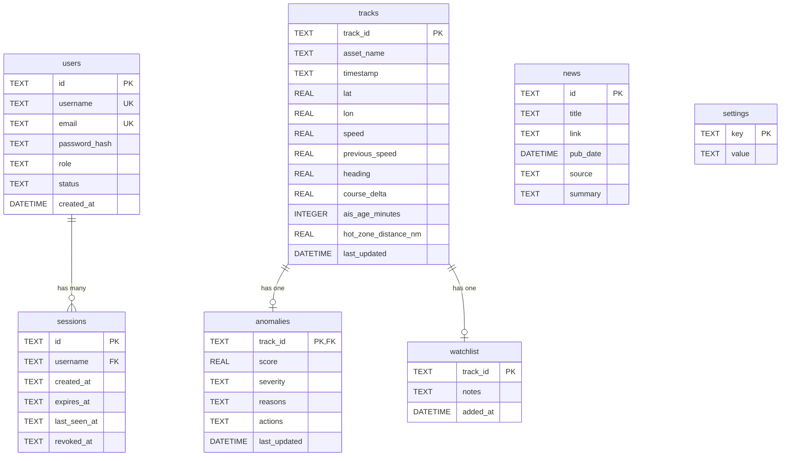

# Database Documentation

## 1. Engine & Configuration

HormuzWatch uses **SQLite** embedded directly within the Go server process (`server/internal/db/db.go`).

| Property | Value |
|---|---|
| **Driver** | `modernc.org/sqlite` (Pure Go, cross-platform without CGO) |
| **Journal Mode** | `WAL` (Write-Ahead Logging) for concurrent read/write |
| **Busy Timeout** | `5000` ms (Prevents `SQLITE_BUSY` locks under load) |
| **Connection Pool** | `SetMaxOpenConns(1)` (Single writer to prevent locks) |
| **Database File** | `server/hormuzwatch.db` |
| **Optional Target** | Environment variable `DATABASE_URL` supports Supabase/PostgreSQL via `pgx` driver |

---

## 2. Schema Overview

The database is primarily used for persisting telemetry history, anomalies, user accounts, and system configuration.

### Entity Relationship Diagram (ERD)

---

## 3. Table Definitions

### 3.1 `users`
Stores authenticated operator and administrator accounts.
* **`status`**: Can be `pending` (awaiting admin approval), `approved` (active), or `blacklisted` (access revoked).
* **`role`**: Typically `user` or `admin`.
* **Primary Admin Injection**: The system ensures one immutable admin account is always present based on `.env` configuration on startup.

### 3.2 `sessions`
Tracks active and revoked JWT sessions.
* **`id`**: Matches the `sessionId` embedded inside the JWT payload.
* **`revoked_at`**: If not null, the session is dead (logout or blacklist).

### 3.3 `tracks`
Stores the latest known telemetry state for every observed vessel and aircraft.
* Actively UPSERTed via `ON CONFLICT(track_id) DO UPDATE`.
* Functions as the system's "current snapshot" of the world.
* Cleaned up periodically based on `settings` (e.g., retention > 30 days).

### 3.4 `anomalies`
Stores the latest threat assessment output from the intelligence pipeline for a given track.
* **`reasons` / `actions`**: JSON strings representing string arrays.
* 1:1 relationship with `tracks`.

### 3.5 `watchlist`
Allows operators to manually pin tracks for closer observation.

### 3.6 `news`
Stores aggregated RSS and GDELT intelligence briefs.

### 3.7 `settings`
Key-value store for application configuration (retention periods, feature toggles).

---

## 4. Concurrency & Performance Strategy

SQLite is not naturally designed for high-concurrency writes. Since HormuzWatch ingests a continuous stream of AIS and ADS-B data, the following strategies are employed:

1. **WAL Mode**: `PRAGMA journal_mode=WAL` allows simultaneous readers alongside one writer.
2. **Single Writer Pool**: `SetMaxOpenConns(1)` forces Go to serialize database writes, preventing `SQLITE_BUSY` connection deadlocks.
3. **In-Memory Buffering**: The `TrackStateManager` ring buffer processes high-frequency deltas *before* persistence. We only UPSERT the final state periodically.
4. **Non-Blocking Reads**: The WebSocket hydration routine reads from SQLite asynchronously so it does not block the HTTP handler upgrade process.
