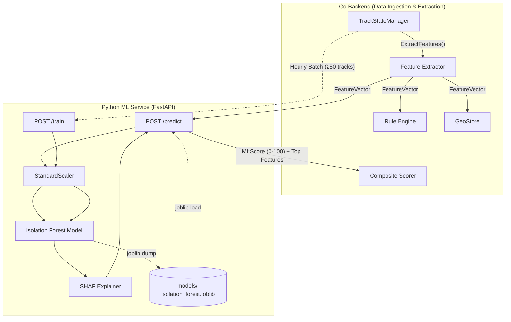

# AI & Machine Learning Architecture Deep-Dive

## 1. Executive ML Summary

HormuzWatch employs a hybrid intelligence pipeline combining a deterministic Rule Engine with an unsupervised Machine Learning model (**Isolation Forest**).

| Property | Value |
|---|---|
| **Model Type** | Unsupervised Anomaly Detection |
| **Algorithm** | Isolation Forest (`sklearn.ensemble.IsolationForest`) |
| **Framework** | Scikit-learn (Python 3.11) |
| **API Layer** | FastAPI |
| **Serialization** | `joblib` |
| **Explainability** | SHAP (`shap.TreeExplainer`) |
| **Training Paradigm** | Online/Batch Automated Retraining |
| **Inference Latency** | < 10ms per track |

The goal of the ML component is to identify latent anomalous behaviors that evade hardcoded thresholds in the rule engine (e.g., a vessel moving at a normal speed, but with unusually high variance and slightly erratic course changes).

---

## 2. ML Architecture & Lifecycle

---

## 3. Feature Engineering

The `FeatureVector` is calculated in Go (`server/internal/intelligence/features.go`) and sent to the ML service. It consists of 8 continuous numerical features.

| Feature | Type | Source | Business Logic |
|---|---|---|---|
| `course_delta` | Float | TSM | Absolute heading change (degrees) since last observation. Captures erratic steering. |
| `heading_delta` | Float | TSM | Signed heading change. Captures circular patterns or holding patterns. |
| `speed_delta` | Float | TSM | Acceleration/Deceleration magnitude. |
| `average_speed` | Float | TSM | Mean speed over the sliding window (last 20 obs). |
| `speed_variance` | Float | TSM | Variance in speed. High variance implies stop-and-go behavior (suspicious). |
| `ais_gap_minutes` | Float | TSM | Time since last ping. High gaps indicate intentional spoofing or "going dark". |
| `dist_restricted_zone`| Float | Geo | Haversine distance to the nearest declared exclusion zone boundary (NM). |
| `dist_historical_site`| Float | Geo | Distance to known past piracy/attack incident coordinates. |

*Note: Categorical data (like vessel type) is excluded from the Isolation Forest to maintain a continuous, scaled feature space.*

---

## 4. Inference Pipeline

Endpoint: `POST /api/predict`

1. **Preprocessing**: The incoming `FeatureVector` is transformed using the `StandardScaler` fitted during the last training cycle.
2. **Prediction**: The `IsolationForest.decision_function()` returns a raw anomaly score (typically [-0.5, 0.5], where negative implies anomalous).
3. **Normalization**: The raw score is mapped linearly: `[-0.3, 0.3] → [100, 0]`. A higher normalized score indicates a more severe anomaly.
4. **Explainability**: If `explain=True` is requested, `shap.TreeExplainer` calculates the marginal contribution of each of the 8 features to the final score.
5. **Response Generation**: Returns the normalized score, boolean anomaly flag, confidence metric, and the sorted top contributing features.

---

## 5. Automated MLOps & Training Pipeline

Endpoint: `POST /api/train`

To prevent concept drift, the ML model must adapt to "normal" daily traffic patterns.

1. **Trigger**: Go server `StartAutomatedTraining()` goroutine fires every 1 hour.
2. **Data Assembly**: The Go `TrackStateManager` locks its ring buffer, extracting the current `FeatureVector` for every active track with at least 5 observations.
3. **Validation**: If fewer than 50 tracks are available, training is skipped to prevent overfitting on sparse data.
4. **Training**: The Python service receives the bulk payload.
   - Fits a new `StandardScaler`.
   - Fits a new `IsolationForest(n_estimators=200, contamination=0.05, n_jobs=-1)`.
5. **Serialization**: Model + Scaler + Timestamp Version string are saved to disk (`models/isolation_forest.joblib`).
6. **Hot Swap**: The Python service automatically uses the new model for all subsequent `/predict` calls.

---

## 6. Composite Threat Scoring

The ML output is not trusted blindly. It is blended with deterministic rules and geopolitical risk factors in Go (`intelligence/composite.go`).

$$ FinalScore = (RuleScore \times 0.4) + (MLScore \times 0.4) + (GeoScore \times 0.2) $$

**Business Translation of Severity:**
- `0-29` (Low): Routine traffic.
- `30-54` (Medium): Unusual behavior or minor rule violation. Watchlist recommended.
- `55-74` (High): Clear anomaly detected by ML or rule engine. Duty officer alerted.
- `75-100` (Critical): Multi-factor violation (e.g., vessel went dark, dropped speed, and entered restricted zone). Immediate interception protocols activated.

---

## 7. Performance & Hardware Requirements

### Python ML Service
- **CPU**: Minimal during inference. Training loop utilizes all available cores (`n_jobs=-1`).
- **GPU**: None required. Isolation Forest is highly optimized for CPU operations.
- **Memory**: < 200MB RAM. The model is lightweight, containing 200 decision trees.
- **Latency**: Single inference call completes in ~5-15ms, easily handling the continuous stream of maritime telemetry.

### Failover / Graceful Degradation
The Go HTTP client wrapping the ML service has a hard `500ms` timeout. If the ML service crashes, hangs, or is overwhelmed, the Go server simply treats `MLScore = 0.0` and continues processing the vessel using the `RuleScore` and `GeoScore` alone.

---

## 8. Deployment Topology

In production, the ML service runs as an independent Azure Container App or Render web service.

- `Dockerfile` utilizes `python:3.11-slim`.
- Uses `uvicorn` / `gunicorn` for ASGI serving.
- Horizontal scaling can be achieved seamlessly since the inference API is entirely stateless (the model artifact is loaded into RAM on startup).
