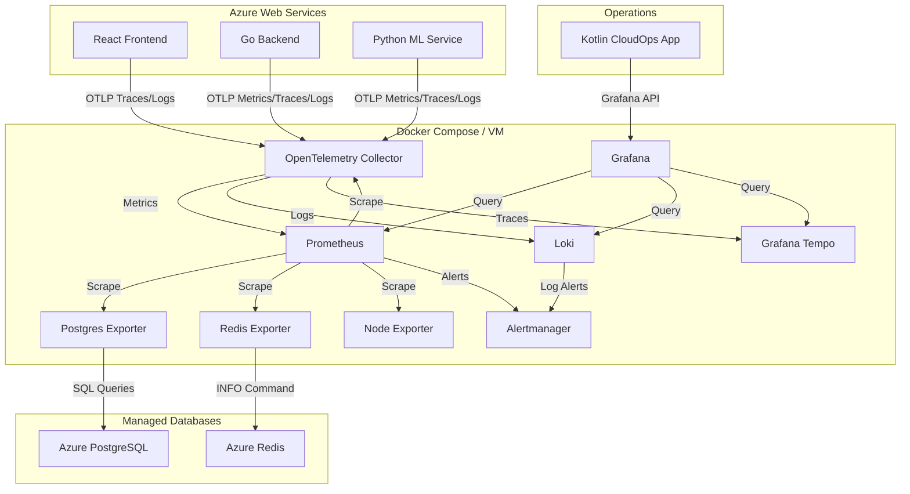
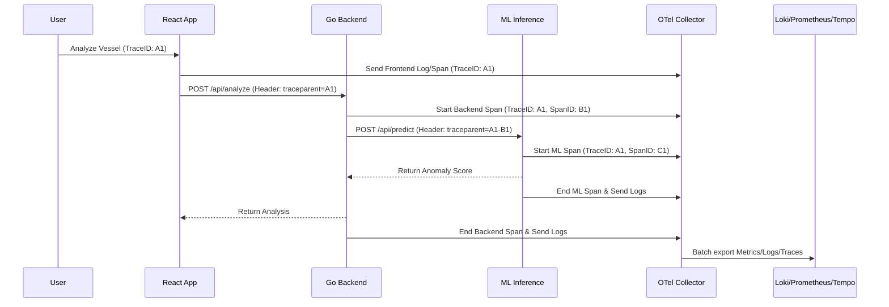

# Hormuz Analytics - Observability Architecture Redesign

As a Cloud Architect and Observability Specialist, I have redesigned the Hormuz Analytics observability stack to meet enterprise-grade requirements while strictly optimizing for cloud costs (avoiding expensive Azure Monitor/Application Insights ingestion). 

This design unifies metrics, logs, and distributed traces into a single, cohesive Grafana-centric stack, instrumented entirely via OpenTelemetry.

---

## 1. Final Architecture Diagram



---

## 2. Service Interaction Diagram



---

## 3. Logging Standard Specification

To ensure a universal schema across Go, Python, and React, every service MUST emit logs in the following JSON structure. Fluent Bit is removed, and OTel Collector natively handles log ingestion to Loki to reduce resource overhead.

### Base JSON Schema
```json
{
  "timestamp": "2026-06-12T15:20:00Z",
  "severity": "WARN",
  "service": "go-backend",
  "component": "api.handlers",
  "environment": "production",
  "trace_id": "5b8aa5a2d2c8646c14143d2",
  "span_id": "8432a5a2",
  "user_id": "usr_9481jfd",
  "operation": "AnalyzeVessel",
  "message": "High latency detected during anomaly inference",
  "error_code": "ML_TIMEOUT_01",
  "metadata": {
    "track_id": "TRACK_4921",
    "latency_ms": 1205
  }
}
```

### Log Severity Model
*   **FATAL**: Application crash or complete subsystem failure (e.g., PostgreSQL unreachable). *Action: PagerDuty / Wake up call.*
*   **CRITICAL**: Severe degradation in production (e.g., Authentication failure, ML Inference timeout). *Action: Immediate Slack Alert.*
*   **ERROR**: Non-fatal operation failure (e.g., API 500 on a specific request). *Action: Create Jira Ticket.*
*   **WARN**: Sub-optimal states (e.g., High latency, Rate limit approaching, Cache miss spike). *Action: Dashboard highlight.*
*   **NOTICE**: Significant business events (e.g., Deployment finished, Admin logged in). *Action: Audit log.*
*   **INFO**: Normal operational tracking (e.g., Processed 100 tracks). *Action: No alert.*
*   **DEBUG**: Deep troubleshooting state. *Action: Disabled in production.*
*   **TRACE**: Code-level step-through. *Action: Disabled in production.*

---

## 4. Alerting Specification

Designed for **Alertmanager** using Prometheus PromQL and Loki LogQL.

| Category | Alert Name | Trigger Condition | Severity | Escalation |
| :--- | :--- | :--- | :--- | :--- |
| **Infrastructure** | `HostHighCPU` | CPU > 85% for 5m | WARN | Email |
| **Database** | `PostgresDown` | `up{job="postgres"} == 0` for 2m | CRITICAL | PagerDuty |
| **Database** | `HighConnectionCount` | Connections > 80% capacity | WARN | Slack |
| **Application** | `HighErrorRate` | HTTP 5xx > 2% over 5m | CRITICAL | PagerDuty |
| **Application** | `ApiLatencyHigh` | p95 Latency > 1s for 5m | WARN | Slack |
| **ML Models** | `InferenceTimeout` | Predict API > 2s for 3m | ERROR | Slack |
| **Cache** | `RedisMemoryFull` | Memory utilization > 90% | CRITICAL | PagerDuty |
| **Cost** | `AzureCostExceeded` | Budget API > $50 / month | WARN | Email |

---

## 5. Dashboard Specification

Grafana will act as the unified pane of glass.

1.  **Executive Overview:**
    *   *Widgets:* Active users, Threat level gauge, Total tracked vessels, API error rate (single stat).
    *   *Drill-down:* Links to Application Performance.
2.  **Application Performance (APM):**
    *   *Widgets:* HTTP Request Rate (RPS), Latency Heatmap (p50/p90/p99), Top 5 slowest endpoints.
    *   *Logs:* Split-screen displaying ERROR logs filtered by `trace_id`.
3.  **ML Performance:**
    *   *Widgets:* Inference Latency, Anomaly Detection distribution (Low/Med/High), Scikit-learn/XGBoost CPU usage.
4.  **Infrastructure & Database Health:**
    *   *Widgets:* Node CPU/Memory, PostgreSQL Active Connections, Cache Hit Ratio.

---

## 6. OpenTelemetry (OTel) Instrumentation Strategy

Instead of relying on disparate agents (Promtail for logs, Prometheus for metrics), **OpenTelemetry** will act as the unified ingestion layer.

1.  **Go Backend**: Use `go.opentelemetry.io/otel`. Inject `traceparent` headers into outgoing HTTP requests to the ML Service. Stream logs directly to OTel via OTLP gRPC.
2.  **Python ML**: Use `opentelemetry-instrumentation-fastapi`. Extracts the `traceparent` header to continue the distributed trace. 
3.  **React Frontend**: Use `@opentelemetry/instrumentation-document-load` and `fetch` instrumentation. Send spans to the OTel HTTP receiver.
4.  **OTel Collector**: 
    *   *Receivers*: OTLP (gRPC/HTTP).
    *   *Processors*: Batch, Memory Limiter, Attributes (to inject environment tags).
    *   *Exporters*: Prometheus (metrics), Loki (logs), Tempo (traces).

---

## 7. Cost Optimization Recommendations

*   **Avoid Azure Monitor Ingestion:** By running the OTel Collector, Prometheus, and Loki on a standard Azure App Service container (or small VM), you completely bypass Azure Log Analytics ingestion fees ($2.30/GB). 
*   **Log Retention Tiering:** Loki leverages local disk storage, which is incredibly cheap. Set retention to 14 days for DEBUG/INFO logs, and offload Audit logs to Azure Blob Storage for long-term cold storage.
*   **Trace Sampling:** Configure the OTel Collector to use **Tail-based Sampling**, capturing 100% of traces with ERRORs, but only 5% of successful (HTTP 200) traces.

---

## 8. Kotlin CloudOps Application Architecture

The Kotlin Desktop/Android app empowers Cloud Engineers to monitor the stack natively without opening the browser.

### API & Authentication Strategy
*   **Grafana API Integration:** The Kotlin app will authenticate with Grafana using a **Service Account Token**. Grafana natively proxies queries to Prometheus/Loki/Tempo.
*   **Data Retrieval:**
    *   *Metrics:* Send PromQL via `GET /api/datasources/proxy/<id>/api/v1/query`
    *   *Logs:* Send LogQL via `GET /api/datasources/proxy/<id>/loki/api/v1/query_range`
*   **Authentication & RBAC:** The Kotlin app requires a Google SSO or Azure AD login. The backend verifies the JWT and ensures the user possesses the `CloudOps_Admin` role before dispensing the Grafana Service Token.

---

## 9. Portfolio-Ready Architecture Explanation (For Interviews)

**The Pitch:**
> *"For Hormuz Analytics, I engineered a highly cost-efficient, cloud-native observability pipeline. Recognizing that managed services like Datadog or Azure Monitor can incur prohibitive data-ingestion costs, I deployed a self-hosted OpenTelemetry (OTel) Collector to intercept 100% of telemetry. I implemented distributed tracing across the Go APIs and Python ML inference engine, propagating W3C trace headers to isolate latency bottlenecks. By routing metrics to Prometheus, logs to Loki, and traces to Tempo, I created a deeply correlated Grafana dashboard ecosystem. Ultimately, this architecture delivers enterprise-grade APM and alerting while maintaining near-zero licensing and ingestion costs."*
