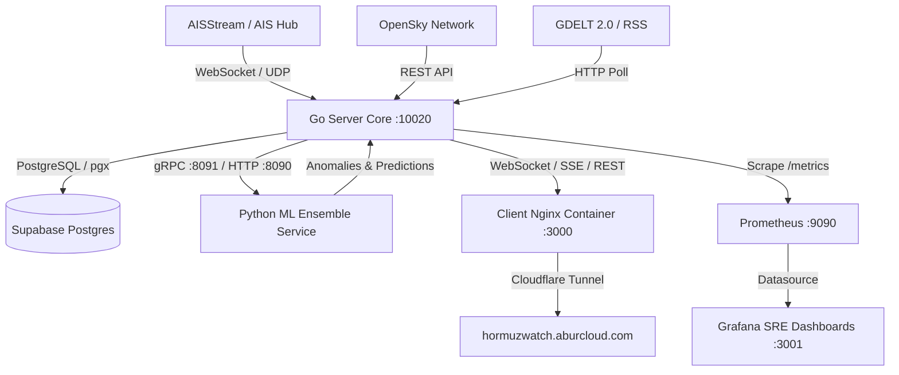

# 🏛️ HormuzWatch Architecture Specification

## 1. Overview
HormuzWatch is an open-source, defense-grade maritime & geospatial intelligence platform engineered for real-time tracking, risk modeling, and threat classification across the Strait of Hormuz.

---

## 2. Core Subsystems

### 2.1 Backend Ingestion & State Manager (Go)
- **Track State Manager (TSM)**: Thread-safe in-memory cache tracking vessel trajectories, velocities, course deviations, and ETA estimates.
- **Circuit Breaker**: Automatic failover protecting backend latency if the ML inference cluster experiences load spikes.
- **LaTeX Reporting Engine**: Dynamically compiles comprehensive PDF dossiers containing MapLibre map captures, anomaly plots, and threat summaries.

### 2.2 Machine Learning Anomaly Ensemble (Python)
- Asynchronous FastAPI & gRPC worker loaded with 6 specialized machine learning models (Vessel Kinematics, Airspace Corridors, Traffic Density, News Sentiment, Transit Bottlenecks, Blockade Classifiers).

### 2.3 Single-Page Application (React & Vite)
- Built with React 19 and React Router v7 in SPA mode (`ssr: false`).
- Rendered via GPU-accelerated MapLibre GL and Leaflet layers.
- Deployed concurrently via Docker Nginx (`hormuzwatch.aburcloud.com`) and edge-replicated Vercel (`hormuzwatch.vercel.app`).

### 2.4 Reliability & Observability Layer
- **Prometheus**: Automated scraping of native `/metrics` endpoints.
- **Grafana**: Provisioned SRE dashboards for real-time system vital signs.
- **SRE Tool**: Built-in Go CLI for multi-tier healthchecks, fault-tolerance load testing, and colorized log streaming.
