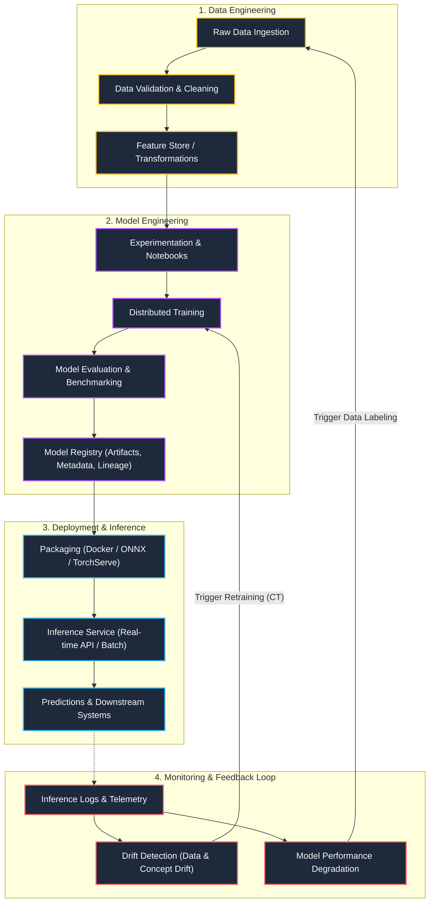
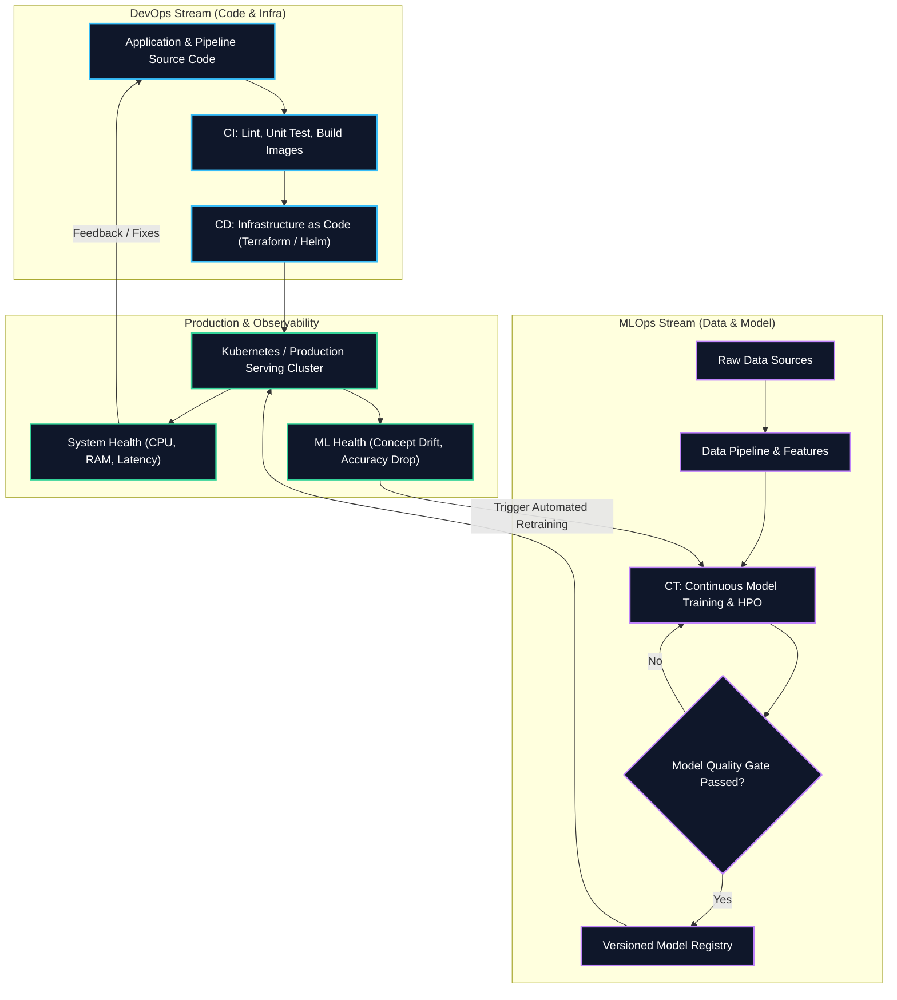

# DevOps and MLOps Architecture & Lifecycle Diagrams

This document outlines the lifecycles, pipelines, and architectural differences between traditional **DevOps** and **MLOps** using Mermaid diagrams.

---

## 1. DevOps Lifecycle (The CI/CD Loop)

DevOps focuses on continuous software delivery through iterative code changes, automated testing, building, deployment, and operational monitoring.

```mermaid
flowchart LR
    %% DevOps Loop
    subgraph Development ["Development & CI"]
        PLAN["Plan & Backlog"] --> CODE["Code & Version Control (Git)"]
        CODE --> BUILD["Build & Containerize (Docker)"]
        BUILD --> TEST["Automated Tests (Unit/Integration)"]
    end

    subgraph Operations ["Delivery & CD"]
        RELEASE["Release / Registry"] --> DEPLOY["Deploy (K8s / Cloud)"]
        DEPLOY --> OPERATE["Operate & Orchestrate"]
        OPERATE --> MONITOR["Monitor & Logging (APM)"]
    end

    TEST --> RELEASE
    MONITOR -->|Bug reports & Feature feedback| PLAN

    classDef dev fill:#1e293b,stroke:#38bdf8,stroke-width:2px,color:#fff;
    classDef ops fill:#1e293b,stroke:#4ade80,stroke-width:2px,color:#fff;
    class PLAN,CODE,BUILD,TEST dev;
    class RELEASE,DEPLOY,OPERATE,MONITOR ops;
```

---

## 2. MLOps Lifecycle (Continuous Training & Model Operations)

MLOps extends DevOps by managing the lifecycle of **Code**, **Data**, and **Machine Learning Models**. It introduces Continuous Training (CT) alongside continuous deployment and drift detection.

---

## 3. Integrated Architecture: DevOps & MLOps Convergence

This diagram illustrates how traditional **DevOps** (application code and infrastructure) and **MLOps** (data, experiments, and model pipelines) converge within a production ecosystem.

---

## 4. Key Comparative Summary

| Dimension | DevOps | MLOps |
|---|---|---|
| **Core Artifact** | Code, Binaries, Container Images | Code + Data + Machine Learning Models |
| **Pipeline Types** | CI (Continuous Integration), CD (Continuous Deployment) | CI, CD, and **CT (Continuous Training)** |
| **Versioning** | Git commits, SemVer tags | Code commits + Data snapshots + Model weights & hyperparameters |
| **Testing** | Unit tests, Integration tests, Regression tests | Data validation, Model validation, Fairness/bias tests, Code tests |
| **Primary Monitoring Focus** | Latency, throughput, errors, CPU/memory | Data drift, concept drift, feature skew, model performance decay |
