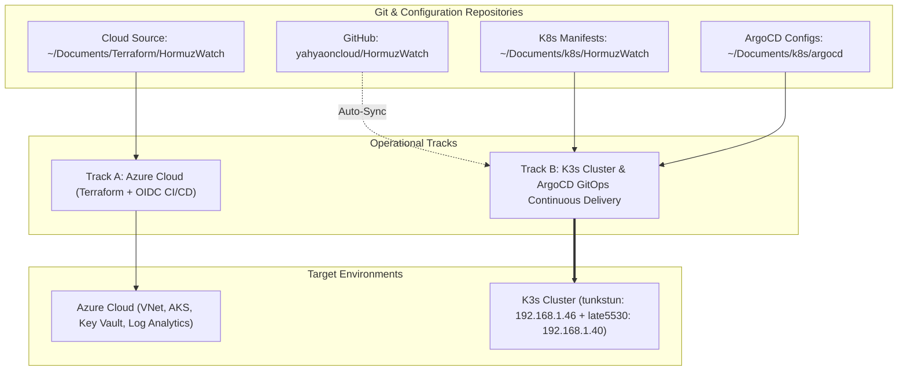

# HormuzWatch — Complete DevOps, Terraform & Kubernetes GitOps Track

> **Official Engineering Record & Infrastructure Track**  
> Tracks Cloud Infrastructure as Code (`/Documents/Terraform/HormuzWatch`) and Kubernetes GitOps (`k8s/` / `/Documents/k8s/HormuzWatch`).

---

## 1. Executive Summary & Architecture Overview

HormuzWatch runs a robust, hybrid infrastructure pipeline supporting both multi-environment cloud scalability on Microsoft Azure via **Terraform** and on-premises/edge bare-metal Kubernetes deployment via **K3s and ArgoCD GitOps**.

---

## 2. Track 1: Cloud Infrastructure as Code (Terraform)

* **Repository Location**: `~/Documents/Terraform/HormuzWatch` on `tunkstun`
* **Target Provider**: `hashicorp/azurerm`

### Structure & Modules
1. **`modules/networking`**: Virtual Network (`10.0.0.0/16`), compute subnet, ingress subnet, private endpoints, NSG security policies.
2. **`modules/compute_aks`**: Azure Kubernetes Service cluster, system and user node pools, auto-scaling, Azure CNI.
3. **`modules/security`**: Azure Key Vault, User-Assigned Managed Identity, RBAC role assignments.
4. **`modules/monitoring`**: Centralized Log Analytics Workspace, diagnostic log streaming, alerting rules.
5. **`bootstrap/`**: Initializer for remote Azure Blob storage backend with blob lease locking.
6. **`.github/workflows/`**: Zero-secret CI/CD using GitHub Actions OIDC federation with Microsoft Entra ID.

---

## 3. Track 2: Kubernetes & GitOps Engine (K3s + ArgoCD)

* **Repository Location**: `k8s/` in project root and mirrored to `~/Documents/k8s/HormuzWatch` / `~/Documents/k8s/argocd` on `tunkstun`
* **GitOps Controller**: **ArgoCD v3.5.3**

### Cluster Nodes:
* **Control Plane (`tunkstun` - `192.168.1.46`)**: K3s Server, CoreDNS, Local-Path Storage, Metrics Server.
* **Worker Node (`late5530` - `192.168.1.40`)**: ArgoCD Suite, PostgreSQL 16 StatefulSet, FastAPI ML Service, Node.js API, React Client Web UI.

### Workload Inventory (`hormuzwatch-prod`):
| Workload | Kind | Replicas | Strategy / Autoscaling |
| :--- | :--- | :--- | :--- |
| `hormuzwatch-postgres` | StatefulSet | 1 | Persistent Volume Claim (`local-path`) |
| `hormuzwatch-ml` | Deployment | 1–5 | HPA (75% CPU target), `/health` probes |
| `hormuzwatch-server` | Deployment | 1–10 | HPA (75% CPU target), RollingUpdate |
| `hormuzwatch-client` | Deployment | 1 | High-efficiency static Nginx delivery |
| `hormuzwatch-ingress` | Ingress | - | Traefik reverse proxy routing |

---

## 4. Key Endpoints & Credentials

* **ArgoCD Web Dashboard**: `http://192.168.1.40:30088` (or `http://192.168.1.46:30088`)
  * **User**: `admin`
  * **Initial Password**: `T6kZsycKyxijRONx`
* **Production Application**: `https://hormuzwatch.aburcloud.com/`
* **Internal Ingress**: `http://192.168.1.40:30080`
* **Documentation Hub (Portfolio)**: `SHARED/Projects/Portfolio/HormuzWatch/docs/`
