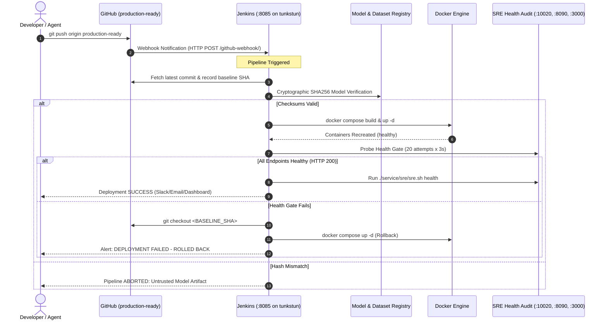

# 🚀 HormuzWatch Jenkins Continuous Deployment (CD) Pipeline

> **Objective**: Fully automated, zero-downtime deployment of HormuzWatch workloads on remote server `tunkstun` triggered by Git commits to `production-ready`, backed by cryptographic model verification and automated rollback gates.

---

## 🏗️ End-to-End Architecture



---

## ⚙️ Remote Server Jenkins Architecture (`tunkstun`)

Jenkins is deployed as an isolated Docker container running directly on the workload host `tunkstun` (`192.168.1.51`).

### Deployment Specifications:
| Parameter | Value | Description |
| :--- | :--- | :--- |
| **Container Name** | `hormuzwatch-jenkins` | Managed via `service/jenkins/docker-compose.yml` |
| **HTTP Port** | `8085:8080` | Jenkins Web UI & Webhook ingress |
| **Agent Port** | `50000:50000` | Jenkins JNLP build agent port |
| **User ID & GID** | `1000:127` | Matches user `yahya` and host `docker` group GID |
| **Docker Socket** | `/var/run/docker.sock` | Mounted to control host Docker without nested virtualization |
| **Project Workspace** | `/home/yahya/SHARED/Projects/HormuzWatch` | Target directory for builds and service restarts |
| **Network** | `hormuzwatch-dev-network` | Direct connectivity to backend, ML service, and database |

---

## 🛠️ Step-by-Step Jenkins Server Deployment

### Step 1: Start Jenkins on `tunkstun`
From workstation or via SSH on `tunkstun`:
```bash
ssh tunkstun
cd /home/yahya/SHARED/Projects/HormuzWatch
docker compose -f service/jenkins/docker-compose.yml up -d --build
```

### Step 2: Retrieve Initial Admin Password
```bash
docker exec -it hormuzwatch-jenkins cat /var/jenkins_home/secrets/initialAdminPassword
```

### Step 3: Complete Web Setup
1. Open your browser to: `http://192.168.1.51:8085`
2. Paste the initial admin password.
3. Click **"Install suggested plugins"**.
4. Create your primary administrator account.

### Step 4: Install Required Plugins
Navigate to **Manage Jenkins** ➔ **Plugins** ➔ **Available plugins** and install:
- **Git Plugin** & **GitHub Plugin** (for webhooks & SCM triggers)
- **Pipeline** & **Pipeline: Stage View**
- **AnsiColor** (colorized console outputs)
- **Generic Webhook Trigger** (flexible webhook parsing)

---

## 📋 Configuring the Deployment Pipeline Job

1. On the Jenkins dashboard, click **"New Item"**.
2. Enter item name: `hormuzwatch-cd-pipeline`.
3. Select **"Pipeline"** and click **OK**.
4. Configure Job Details:
   - **Build Triggers**:
     - Check `GitHub hook trigger for GITScm polling`.
     - Check `Poll SCM` and set schedule to `H/5 * * * *` (polls every 5 mins if webhooks are unreachable).
   - **Pipeline Definition**:
     - Select **"Pipeline script from SCM"**.
     - **SCM**: `Git`.
     - **Repository URL**: `https://github.com/Yahya-al-Hajji/HormuzWatch.git` (or your private git mirror).
     - **Branch Specifier**: `*/production-ready`.
     - **Script Path**: `Jenkinsfile`.
5. Click **Save**.

---

## 🔗 Configuring GitHub Webhook for Automatic Commits

To trigger the pipeline the instant you push code:

1. Navigate to your GitHub repository: **Settings** ➔ **Webhooks** ➔ **Add webhook**.
2. **Payload URL**:
   - If using Cloudflare Tunnel or public IP:
     `https://jenkins.hormuzwatch.aburcloud.com/github-webhook/`
   - Or local LAN router port forward:
     `http://<PUBLIC_IP>:8085/github-webhook/`
3. **Content type**: Select `application/json`.
4. **Which events would you like to trigger this webhook?**:
   - Select **"Just the push event"**.
5. Click **Add webhook**.

> [!TIP]
> If your server is on a private network without inbound ports, the `pollSCM('H/5 * * * *')` directive in the `Jenkinsfile` automatically checks GitHub every 5 minutes and triggers builds whenever new commits appear.

---

## 🔍 Detailed Walkthrough of `Jenkinsfile` Stages

The declarative pipeline in [`Jenkinsfile`](file:///home/tp24/SHARED/Projects/HormuzWatch/Jenkinsfile) executes the following sequence:

### 1. `Initialize & Record Rollback Baseline`
- Captures the currently running commit hash (`PREV_COMMIT = git rev-parse HEAD`).
- Fetches latest commits from remote `origin/production-ready`.
- Performs a clean hard reset to ensure working tree integrity.

### 2. `Artifacts & Models Provenance Audit`
- Executes `python3 scripts/model_registry.py verify`.
- Guarantees that all 8 production ML models (`vessel_ensemble.joblib`, `aviation_ensemble.joblib`, etc.) have not been corrupted or tampered with before rebuilding containers.

### 3. `Build Container Images`
- Executes `docker compose -f docker-compose.dev.yml build`.
- Supports the `FORCE_REBUILD` parameter for clean `--no-cache` builds.

### 4. `Zero-Downtime Rollout`
- Executes `docker compose -f docker-compose.dev.yml up -d --remove-orphans`.
- Docker Compose recreates only the containers whose image or environment changed. The database (`hormuzwatch-postgres-dev`) remains untouched and uninterrupted.

### 5. `Automated SRE Health Gate Verification`
- Runs a 60-second polling loop probing:
  - Backend health: `http://localhost:10020/health/live`
  - ML service health: `http://localhost:8090/health`
  - Web client SPA: `http://localhost:3000`
- If all three return HTTP 200 within 60 seconds, deployment passes. If not, triggers pipeline failure.

### 6. `Automated Rollback (Post Action on Failure)`
- If the build, container start, or health checks fail, the `post { failure { ... } }` block triggers automatically:
  ```bash
  git checkout ${PREV_COMMIT}
  docker compose -f docker-compose.dev.yml up -d --build
  ```
- The cluster is immediately restored to the last known healthy state without manual intervention.

---

## 🔒 Security Best Practices

1. **Least-Privilege Docker GID**:
   The Jenkins container runs as user `1000:127` matching the host `yahya:docker` credentials. It does not run as root.
2. **Environment Variable Protection**:
   Production secrets (`DATABASE_URL`, `OPENROUTER_API_KEY`) are stored in `/home/yahya/SHARED/Projects/HormuzWatch/.env` on the host and are never committed to git.
3. **Model Integrity Enforced**:
   Untrusted or unhashed models cannot enter production without passing `model_registry.py verify`.
