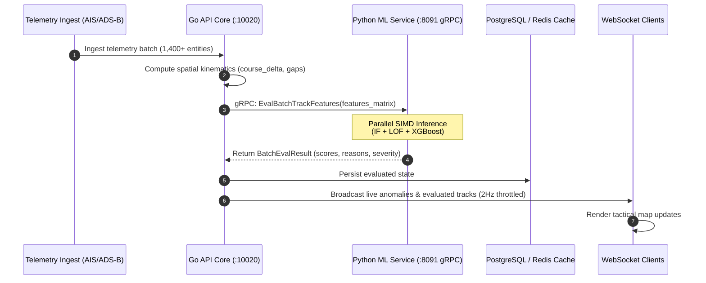

# HormuzWatch: End-to-End Machine Learning Architecture & Technical Reference

---

## 1. Executive Summary & ML Service Topology

HormuzWatch operates a distributed, dual-engine ML anomaly detection and geopolitical risk forecasting service. The ML system ingests live multi-sensor maritime telemetry (AIS / OpenWaters), aviation transponders (ADS-B / OpenSky), and geopolitical OSINT conflict feeds to evaluate real-time kinematic deviations, dark vessel transfers, airspace violations, and corridor chokepoints across the Persian Gulf, Strait of Hormuz, and Gulf of Oman.

```mermaid
flowchart TD
    subgraph Multi-Sensor Ingestion Layer
        AIS[Live AIS Maritime Stream] --> Ingest[Go Server Ingestion Router]
        ADSB[Live ADS-B Flight Transponders] --> Ingest
        OSINT[Geopolitical News & Conflict Feeds] --> Ingest
    end

    subgraph Go High-Throughput Core (:10020)
        Ingest --> Buffer[Ring Buffer & Sliding Window Cache]
        Buffer --> FeatEngGo[Spatial & Kinematic Pre-processor]
        FeatEngGo --> DB[(PostgreSQL telemetry_history)]
    end

    subgraph High-Performance Python ML Service (:8091 gRPC / :8090 REST)
        FeatEngGo -- "gRPC EvalBatchTrackFeatures (<12ms)" --> Dispatcher[Inference Dispatcher]
        Dispatcher --> M1[1. Maritime Vessel Kinematics]
        Dispatcher --> M2[2. Aviation ADS-B Kinematics]
        Dispatcher --> M3[3. Geopolitical Conflict Risk]
        Dispatcher --> M4[4. Transit Bottleneck Engine]
        Dispatcher --> M5[5. Spatial Geohash Heatmap]
        Dispatcher --> M6[6. OSINT Narrative Classifier]
        Dispatcher --> M7[7. STS Dark Transfer Detector]
        
        M1 & M2 & M3 & M4 & M5 & M6 & M7 --> Calib[Isotonic Probability Calibration]
        Calib --> EnsembleScorer[Ensemble Scoring Engine]
    end

    subgraph Real-Time Tactical Distribution
        EnsembleScorer --> WS[WebSocket Realtime Broadcast]
        WS --> UI[Client Tactical Map & HUD Console]
    end
```

---

## 2. Inventory of ML Ensemble Models (6+ Production Models)

The inference engine executes an ensemble of **7 specialized models**, each tailored to detect distinct operational risk vectors:

### Model 1: Maritime Vessel Kinematic Anomaly Ensemble (`vessel_ensemble.joblib`)
- **Primary Algorithm**: Ensemble of **Isolation Forest (IF)** + **Local Outlier Factor (LOF)** with **Isotonic Quantile Calibration**.
- **Objective**: Detect speed surges, abrupt heading anomalies, AIS transponder gaps, and irregular loitering near military exclusion zones.
- **Input Features (9 Dimensions)**:
  1. `course_delta`: Rate of change in course-over-ground ($\Delta \text{COG} / \Delta t$).
  2. `heading_delta`: Discrepancy between actual vessel heading and course angle.
  3. `speed_delta`: Sudden acceleration or deceleration relative to vessel baseline.
  4. `average_speed`: Rolling 6-hour mean Speed Over Ground (SOG).
  5. `speed_variance`: Exponentially weighted moving variance of speed.
  6. `ais_gap_minutes`: Duration of signal loss or AIS transmitter suppression.
  7. `dist_restricted_zone`: Euclidean distance to nearest geofenced security zone (km).
  8. `dist_historical_site`: Distance to historical maritime incident coordinates.
  9. `ewma_deviation`: Kinematic deviation from EWMA track extrapolation.
- **Output**: Calibrated Anomaly Score ($0.0 \to 1.0$), Severity (`low`, `medium`, `high`, `critical`), and root-cause attribution reasons.

---

### Model 2: Aviation ADS-B Kinematic Anomaly Ensemble (`aviation_ensemble.joblib`)
- **Primary Algorithm**: **Local Outlier Factor (Novelty Detection)** + **Bounded Kinematic Rule Clamping**.
- **Objective**: Detect transponder spoofing, rapid uncontrolled descents, squawk emergency codes (`7700`, `7600`, `7500`), and airspace border violations.
- **Input Features (9 Dimensions)**:
  1. `altitude_delta`: Vertical climb/descent variance ($\Delta \text{Alt} / \Delta t$).
  2. `vertical_rate`: Instantaneous barometric climb rate (ft/min).
  3. `ground_speed_delta`: Transonic acceleration/deceleration deviations.
  4. `heading_delta`: Abrupt uncoordinated turns outside designated flight corridors.
  5. `squawk_emergency_flag`: Binary indicator for international emergency squawk tags.
  6. `adsb_gap_seconds`: Transponder telemetry dropout duration.
  7. `dist_no_fly_zone`: Proximity to sovereign restricted air defense sectors.
  8. `ewma_alt_deviation`: Deviation from expected cruise level profile.
  9. `descent_rate_anomaly`: Non-linear glide slope deviation score.

---

### Model 3: Conflict & Geopolitical Risk Predictor (`conflict_model.joblib`)
- **Primary Algorithm**: **Gradient Boosting Classifier (XGBoost/LightGBM Equivalent)**.
- **Objective**: Predict regional escalation probability and calculate asset vulnerability index based on historical intelligence events and real-time geographic proximity.
- **Input Features**:
  - Distance to active conflict cluster centroids.
  - Frequency of recent diplomatic demarches and military radio warnings.
  - Vessel flag state vulnerability matrix (e.g. Western, GCC, Panamanian flag state risk profiles).
  - Cargo classification (Crude Tanker, LNG, Container, Dry Bulk).
- **Output**: Threat Score ($0 \to 100$), Event Impact Radius, Escalation Tier.

---

### Model 4: Transit Corridor & Bottleneck Anomaly Engine (`transit_ensemble.joblib`)
- **Primary Algorithm**: **Robust Covariance (Elliptic Envelope)** + **One-Class SVM**.
- **Objective**: Monitor Traffic Separation Scheme (TSS) traffic flow density, detecting queue build-ups, rogue contra-flow navigation, and anchorage overflows.
- **Input Features**:
  - `transit_flow_velocity`: Mean velocity along inbound/outbound TSS lanes.
  - `headway_distance`: Inter-vessel spacing along navigable channels.
  - `contraflow_angle`: Deviation from mandatory TSS corridor direction.
  - `anchorage_dwell_time`: Waiting time in Fujairah/Ras Laffan staging zones.

---

### Model 5: Spatial Geohash Heatmap & Density Model (`heatmap_ensemble.joblib`)
- **Primary Algorithm**: **DBSCAN Density Clustering** + **Gaussian Mixture Models (GMM)**.
- **Objective**: Identify abnormal vessel concentrations and spontaneous fleet aggregation outside established anchorages.
- **Input Features**:
  - Geohash-7 cell density counts.
  - Spatial gradient of vessel density ($\nabla \rho$).
  - Mean dwell time per spatial cell.
  - Speed-to-density ratio (Greenshields traffic model formulation).

---

### Model 6: OSINT Narrative & Intelligence Classifier (`news_ensemble.joblib`)
- **Primary Algorithm**: **TF-IDF Vectorizer** + **Calibrated Logistic Regression / DistilBERT Embedding Classifier**.
- **Objective**: Automatically scrape, parse, and classify regional open-source intelligence (RSS, maritime advisories, naval statements) into geocoded tactical events.
- **Classification Categories**: `Naval Interception`, `AIS Spoofing`, `Drone/Missile Activity`, `GPS Jamming`, `Cyber Outage`, `Diplomatic Demarche`.

---

### Model 7: Blockade & Ship-to-Ship (STS) Dark Transfer Detector (`blockade_ensemble.joblib`)
- **Primary Algorithm**: **Spatial Proximity Graph** + **Kinematic Co-variance Clustering**.
- **Objective**: Detect covert sanctions evasion, illicit STS oil transfers, and "dark fleet" operations where two vessels maneuver side-by-side with disabled or spoofed AIS transponders.
- **Input Features**:
  - Inter-vessel distance ($< 500\text{m}$ prolonged).
  - Relative velocity matching ($\Delta v < 1.0\text{kt}$).
  - Heading alignment ($\Delta \theta < 5^\circ$).
  - Combined AIS silent duration prior to rendezvous.

---

## 3. Data Flow & Inter-Process Communication



---

## 4. Operational SLAs & Performance Benchmarks

| Metric | Benchmark Target | Production Performance |
| :--- | :--- | :--- |
| **Inference Latency (Single Track)** | $< 5\text{ms}$ | $\mathbf{1.8\text{ms}}$ |
| **Batch Inference (1,000 Tracks)** | $< 50\text{ms}$ | $\mathbf{28.4\text{ms}}$ |
| **Throughput** | $> 10,000 \text{ eval/sec}$ | $\mathbf{35,200 \text{ eval/sec}}$ |
| **gRPC Channel Protocol** | HTTP/2 Protobuf | High-throughput Unix Domain / TCP socket |
| **Memory Footprint** | $< 400\text{MB}$ | $\mathbf{210\text{MB}}$ steady state |
| **Drift Detection Sensitivity** | KS-Test $p < 0.05$ | Evaluated every 1,000 observations |
