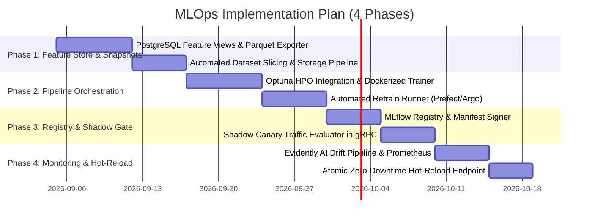

# HormuzWatch: End-to-End MLOps Pipeline & Automated Retraining Proposal

---

## 1. Executive Proposal & System Objectives

This proposal outlines the engineering design, infrastructure blueprint, and implementation plan for a fully automated **Machine Learning Operations (MLOps) Lifecycle** for HormuzWatch. 

The objective is to transition from static benchmark-trained models to a resilient, self-healing **Continuous Training (CT), Continuous Integration (CI), and Continuous Deployment (CD)** framework governing **7+ domain machine learning models**.

```mermaid
flowchart TD
    subgraph 1. Automated Feature Ingestion & Lakehouse
        Telemetry[Live Ingest: AIS, ADS-B, OSINT] --> DB[(PostgreSQL TimescaleDB)]
        DB --> Lakehouse[(Feature Store / Parquet Snapshots)]
    end

    subgraph 2. Continuous Training (CT) Orchestration
        Trigger{Retrain Trigger:<br/>1. Cron Schedule<br/>2. Data Volume > 50k<br/>3. KS Drift p < 0.01}
        Trigger --> Pipeline[Argo Workflows / Prefect Runner]
        Pipeline --> FeaturePrep[Grouped MMSI Stratified Split]
        FeaturePrep --> HPO[Optuna Bayesian Hyperparameter Search]
        HPO --> TrainEnsembles[Train 7x ML Models]
        TrainEnsembles --> Calib[Isotonic Probability Calibrator]
    end

    subgraph 3. Model Registry & Verification Gate
        Calib --> EvalGate[Evaluation Gate:<br/>PR-AUC > 0.95<br/>ECE < 0.05<br/>Latency < 10ms]
        EvalGate --> Registry[(MLflow / S3 Model Registry)]
    end

    subgraph 4. Zero-Downtime Deployment & Observability
        Registry --> Canary[Champion / Challenger Canary Route]
        Canary --> LiveService[Python gRPC ML Service :8091]
        LiveService --> DriftEngine[Evidently AI / KS Drift Monitor]
        DriftEngine --> Prometheus[Prometheus & Grafana Alerting]
        DriftEngine -- "Drift Detected" --> Trigger
    end
```

---

## 2. Core Architectural Pillars of the MLOps Pipeline

### Pillar A: Automated Feature Store & Live Data Lakehouse
- **Source of Truth**: Ingestion engine dumps calibrated telemetry frames into PostgreSQL `telemetry_history`.
- **Automated Snapshots**: Nightly partition extractors dump versioned Parquet slices to the Object Store (MinIO / S3 / Google Drive) formatted as:
  `s3://hormuzwatch-features/{domain}/year={YYYY}/month={MM}/snapshot_{uuid}.parquet`
- **Feature Store Integration**: Implement **Feast** or lightweight DuckDB feature view caching to serve consistent feature definitions for both online scoring and offline batch training.

### Pillar B: Trigger-Based Continuous Training (CT) Engine
Training runs are triggered deterministically under three operational conditions:
1. **Scheduled Cadence**: Weekly incremental retraining (Sundays 00:00 UTC) capturing newly introduced commercial vessels and route updates.
2. **Data Volume Threshold**: Automatic trigger when $\ge 50,000$ newly verified telemetry points accumulate in a specific maritime sector.
3. **Drift-Triggered Retraining**: If the Kolmogorov-Smirnov (KS) test or Population Stability Index ($\text{PSI} > 0.25$) flags significant feature distribution drift in kinematic variables (e.g. seasonal storm loitering or newly active naval corridors).

### Pillar C: Model Registry, Lineage & Versioning
- **Artifact Store**: Centralized registry using **MLflow** or structured S3 buckets with semantic versioning (`v{Major}.{Minor}.{Timestamp}-{GitCommit}`).
- **Lineage Metadata**: Every model bundle (`.joblib`) is accompanied by a cryptographically signed `manifest.json` containing:
  - Exact training dataset SHA-256 hash.
  - Optuna hyperparameter trial history.
  - 4-way partition metrics: Precision-Recall AUC, ROC-AUC, Brier score, and Expected Calibration Error (ECE).
  - Feature importance ranking (SHAP values).

### Pillar D: Champion / Challenger Deployment Gate & Canary Validation
Before any new model candidate replaces a production service artifact:
1. **Automated Offline Gate**: Must exceed Champion's PR-AUC on the held-out test split with zero latency regression ($\le 12\text{ms}$ batch inference time).
2. **Shadow Traffic Verification**: Candidate model runs as a "Challenger" in parallel with incoming production gRPC requests for 2 hours (shadow inference with response discarded, comparing scores and resource consumption).
3. **Zero-Downtime Hot-Reloading**: ML gRPC server exposes a `/v1/models/reload` admin endpoint that swaps in-memory model references atomically without dropping active gRPC streams or TCP connections.

### Pillar E: Continuous Model Observability & Drift Detection
- **Metrics Exported to Prometheus**:
  - `ml_inference_latency_seconds_bucket`: Latency histogram.
  - `ml_anomaly_score_distribution`: Quantile distribution of anomaly scores.
  - `ml_feature_drift_psi`: PSI per feature column compared against training baseline.
- **Alerting Rules**:
  - Alert if anomaly classification rate exceeds $3\sigma$ above historical mean (indicates either mass geopolitical incident or sensor corruption).
  - Alert if PSI $> 0.20$ on any critical feature (`course_delta`, `speed_delta`, `ais_gap_minutes`).

---

## 3. Scope of the 7-Model Training Suite

| Model Component | Algorithm Architecture | Retraining Frequency | Key Optimization Targets |
| :--- | :--- | :--- | :--- |
| **1. Vessel Kinematics** | IsolationForest + LOF + Isotonic | Weekly / Drift-triggered | False Positive Rate $< 1.5\%$, Recall $\ge 98\%$ |
| **2. Aviation Transponder** | Novelty LOF + Rule Clamping | Bi-weekly | Emergency squawk precision $100\%$ |
| **3. Geopolitical Risk** | XGBoost / LightGBM | Daily (OSINT news sync) | Escalation tier accuracy $\ge 92\%$ |
| **4. TSS Corridor Flow** | Elliptic Envelope + One-Class SVM | Weekly | Contra-flow lane detection |
| **5. Heatmap Spatial** | DBSCAN + Gaussian Mixture | Daily | Spontaneous fleet loitering |
| **6. OSINT Narrative** | DistilBERT / Fine-tuned Transformer | Continuous stream fine-tune | Category classification F1 $\ge 0.94$ |
| **7. STS Dark Transfer** | Proximity Co-variance Graph | Weekly | Co-speed & co-heading detection |

---

## 4. Implementation Roadmap & Milestones



---

## 5. Expected Business & Technical Outcomes

1. **Autonomous Self-Improvement**: Models adapt dynamically to shifting seasonal tanker lanes and regional naval exercises without manual developer intervention.
2. **Guaranteed Zero-Downtime Deployments**: In-memory model hot-swapping eliminates restart overhead and service drops.
3. **Auditability & Compliance**: Complete cryptographically verifiable data lineage from raw AIS frames to calibrated inference weights.
4. **Enhanced Anomaly Detection Quality**: Isotonic calibration guarantees that anomaly probabilities correspond to true mathematical likelihoods, eliminating tactical alert fatigue.
