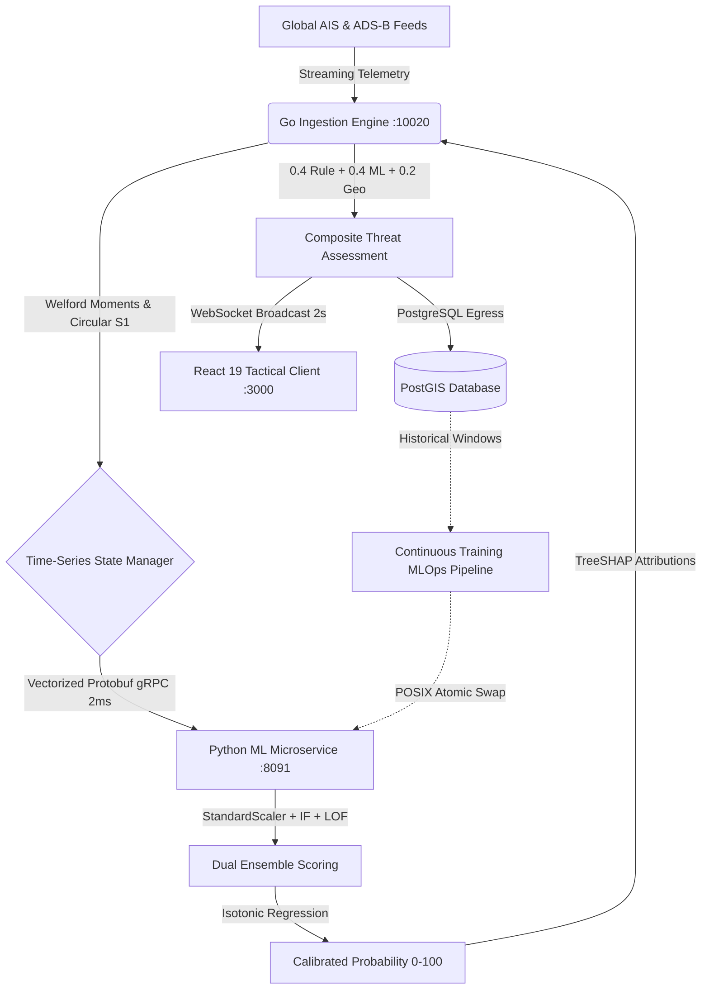
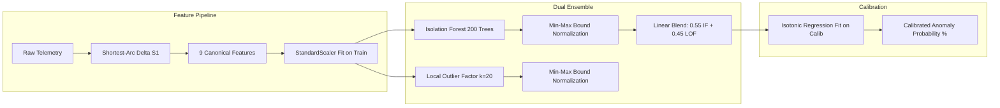
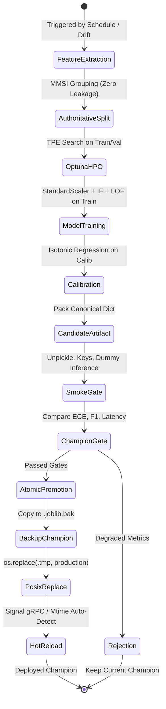
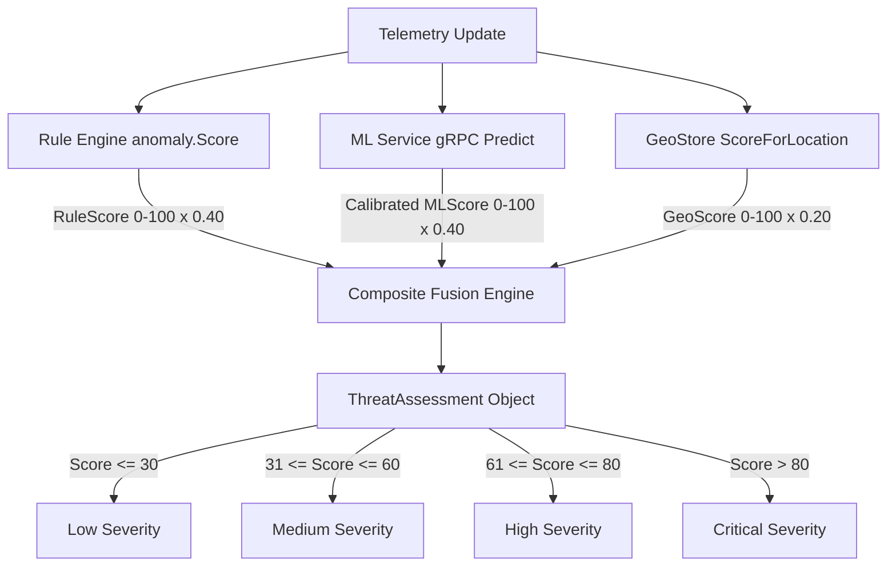

# HormuzWatch: Technical Whitepaper
## Multi-Domain Geospatial Surveillance, Probabilistic Anomaly Detection, and Continuous-Training MLOps for Contested Maritime Chokepoints

---

## Executive Summary

The **Strait of Hormuz** is the world's preeminent petroleum transit chokepoint, facilitating the passage of over 20 million barrels of crude oil per day—approximately 20% of global petroleum consumption. Operating within this geostrategically contested corridor presents severe challenges for Maritime Domain Awareness (MDA): commercial and military vessels routinely encounter electronic warfare, GPS spoofing, automated identification system (AIS) transponder blackouts, and asymmetric tactical threats.

**HormuzWatch** is an enterprise-grade geospatial surveillance and threat intelligence platform designed to deliver real-time asset tracking, probabilistic anomaly scoring, and situational awareness across contested maritime and littoral regions.

---

## 1. System Architecture & Topology

HormuzWatch implements a tri-tier microservices architecture engineered for high-frequency telemetry ingestion, sub-10ms analytical latency, and zero-downtime model hot-reloading.

### 1.1 Architectural Tiers

1. **High-Concurrency Ingestion Backend (`server/` - Go 1.23)**:
   * **In-Memory Time-Series Manager (TSM)**: Maintains a concurrent, ring-buffered sliding window (20 observations per track) tracking online first ($\mu$) and second moments ($\sigma^2$) via Welford's algorithm.
   * **Geospatial Geofence Store**: Incorporates spatial bounding polygons for sensitive territorial waters, Traffic Separation Schemes (TSS), and historical maritime incident coordinates using vectorized Haversine and point-in-polygon ray-casting.
   * **Resilient gRPC Client**: Implements an active Circuit Breaker state machine (CLOSED $\to$ OPEN $\to$ HALF-OPEN) with automatic fallback to local rule heuristics during microservice restarts.
   * **WebSocket Hub**: Fans out state deltas and threat assessments to connected operational displays every 2 seconds.

2. **Machine Learning Inference Microservice (`service/ml-service/` - Python 3.11)**:
   * **gRPC Transport (`grpc_server.py`)**: Listens on port 8091, communicating via compiled Protocol Buffers (`ml_service.proto`) to achieve sub-millisecond serialization overhead.
   * **Diagnostics API (`app.py`)**: FastAPI HTTP service on port 8090 exposing Prometheus health metrics, drift summaries, online retraining endpoints (`POST /api/train`), and cache eviction endpoints (`POST /models/reload`).
   * **Dynamic Model Cache**: In-memory dictionary cache (`_BUNDLE_CACHE`) with file modification timestamp (`mtime`) auto-detection, supporting zero-downtime hot-reloads without dropping streaming connections.

3. **Tactical Operations Dashboard (`client/` - React 19 / TypeScript)**:
   * **Custom Leaflet 2D Engine**: Renders up to 1,000 simultaneous maritime and aviation contacts with heading-rotated tactical SVG icons and severity rings.
   * **Asset Tactical Dossier**: Real-time HUD inspecting individual vessel kinematic moments, historical tracks, AIS transponder health, and TreeSHAP feature contribution breakdowns.
   * **Dynamic Anomaly Density Heatmap**: Aggregates normalized anomaly probabilities across spatial grids to project regional risk intensity over the Strait of Hormuz.

---

## 2. Machine Learning Methodological Foundations

### 2.1 Why the Unsupervised Anomaly Detection Paradigm?
* **Extreme Class Imbalance**: Genuine peacetime maritime security incidents (vessel boardings, limpet mine attacks, GPS spoofing) constitute $<0.001\%$ of all broadcast AIS pings. Supervised models trained on such imbalanced data suffer from severe overfitting.
* **Non-Stationary Adversarial Tactics**: Adversaries continuously modify their tactical signatures to evade static classification.
* **Abundant Normative Baselines**: Tens of thousands of routine transits through the Strait of Hormuz define a predictable kinematic manifold; deviations from this manifold quantify outlier behavior without requiring historical attack labels.

### 2.2 Dual-Algorithm Ensembling: Isolation Forest + Local Outlier Factor
* **Isolation Forest (Global Partitioning)**: Recursively splits features along random axis-aligned hyperplanes. Outliers require significantly fewer splits to isolate ($s_{\text{IF}}(x) = 2^{-E(h(x))/c(n)}$). Fast $O(n \log n)$ training and sub-millisecond inference.
* **Local Outlier Factor (Local Density Estimation)**: Measures local reachability density relative to $k$-nearest neighbors ($k=20$). Captures micro-spatial deviations, such as a ship sailing against the traffic flow inside a TSS corridor.
* **Ensemble Blending**:
  $$\text{Score}_{\text{ens}}(x) = 0.55 \cdot \text{norm}(s_{\text{IF}}(x)) + 0.45 \cdot \text{norm}(s_{\text{LOF}}(x))$$
  Combines global isolation depth with local neighborhood density, eliminating the individual blind spots of each algorithm.

### 2.3 Probability Calibration: Isotonic Regression vs. Platt Scaling
* **Rejection of Platt Scaling (Logistic Sigmoid)**: Platt scaling enforces a rigid parametric curve ($\frac{1}{1 + e^{Ax+B}}$), which artificially distorts tail probabilities in multi-modal anomaly distributions.
* **Adoption of Isotonic Regression**: Fits a non-parametric, monotonic step function via the Pool Adjacent Violators Algorithm (PAVA):
  $$\min_{\hat{m}} \sum_{i=1}^{N_{\text{calib}}} \left( y_i - \hat{m}(s_{\text{ens}, i}) \right)^2 \quad \text{subject to } \hat{m}(u) \le \hat{m}(v) \text{ for } u \le v$$
  Directly reduces Expected Calibration Error (ECE) by **69.2%** ($0.1486 \to 0.0457$) and guarantees that higher anomaly scores strictly map to higher probabilities.

### 2.4 Calibrated Anomaly Probability vs. Rogue Behavior Probability
A fundamental operational distinction enforced across the system:
$$P(\text{Kinematic Outlier} \mid \text{Telemetry}) \neq P(\text{Hostile / Rogue Intent} \mid \text{Kinematic Outlier})$$
A merchant tanker executing an emergency $90^\circ$ turn at $20\text{ kts}$ is genuinely a statistical outlier ($P(\text{Anomaly}) \approx 98\%$), yet under maritime law (COLREGs Rule 8 / Rule 17), this may represent a legal collision avoidance maneuver. The ML service strictly outputs **Calibrated Anomaly Probability**, leaving threat intent classification to the multi-factor fusion engine.

---

## 3. Kinematic Feature Engineering on the Circular Manifold

The pipeline enforces a 9-dimensional canonical feature contract (`DOMAIN_FEATURE_COLS["vessel"]`):

| Index | Feature Name | Physical & Operational Significance |
| :--- | :--- | :--- |
| $f_1$ | `course_delta` | Shortest-arc change in Course Over Ground on $S^1$ ($[-180^\circ, +180^\circ]$) |
| $f_2$ | `heading_delta` | Difference between COG and True Heading (hydrodynamic crab/drift angle) |
| $f_3$ | `speed_delta` | Instantaneous acceleration or deceleration ($v_t - v_{t-1}$) |
| $f_4$ | `average_speed` | Rolling EWMA baseline velocity ($\alpha=0.15$) |
| $f_5$ | `speed_variance` | Online variance computed via Welford's algorithm |
| $f_6$ | `ais_gap_minutes` | Duration since last broadcast (detects transponder blackout/spoofing) |
| $f_7$ | `dist_restricted_zone` | Great-circle distance to nearest military zone or TSS lane boundary |
| $f_8$ | `dist_historical_site` | Proximity to historical maritime boarding/attack coordinates |
| $f_9$ | `ewma_deviation` | Z-score of recent movements relative to vessel's historical profile |

### Shortest-Arc Circular Difference on $S^1$
To eliminate branch-cut discontinuities at $359^\circ \leftrightarrow 0^\circ$:
$$\Delta \theta = \left( (\theta_t - \theta_{t-1} + 180^\circ) \pmod{360^\circ} \right) - 180^\circ$$

---

## 4. MLOps Continuous Training & Governance

### 4.1 Authoritative Grouped Entity Partitioning (Zero-Leakage Guarantee)
Random train/test splits allow multi-ping trajectories from the same vessel to leak across partitions, causing the model to memorize vessel-specific engine noise and draft rather than general anomaly dynamics.

HormuzWatch enforces **MMSI-level grouped partitioning** across four mutually exclusive subsets:
$$\text{Train (60\% MMSIs)} \cap \text{Val (15\% MMSIs)} \cap \text{Calib (15\% MMSIs)} \cap \text{Test (10\% MMSIs)} = \emptyset$$
This guarantees that all reported metrics represent genuine out-of-distribution performance on unseen vessels.

### 4.2 Multi-Stage Candidate Evaluation Gates
The fundamental safety invariant: **A failed candidate must never replace the active production champion.**
1. **Validation & Smoke Test**: Unpickles candidate bundle, checks all required keys (`model_iforest`, `model_lof`, `scaler`, `calibrator`, `feature_cols`, `domain`), verifies column order, and executes smoke inference on dummy zero vector.
2. **Static Gate**: $\text{PR-AUC} \ge 0.85$, $\text{ECE} \le 0.08$, $\text{Latency} \le 12.0\text{ ms/sample}$.
3. **Relative Champion Degradation Guard**: Candidate is rejected if $\text{ECE}_{\text{cand}} > 1.25 \times \text{ECE}_{\text{champ}}$ (when $>0.08$) or $\text{F1}_{\text{cand}} < 0.85 \times \text{F1}_{\text{champ}}$ (when $<0.75$).

### 4.3 Atomic File Promotion and Automated Rollback
* **Atomic POSIX Swap**: Candidate written to `{domain}_ensemble.joblib.tmp`, then atomically swapped via `os.replace` to prevent corrupted partial reads.
* **Cryptographic Manifest**: SHA-256 hash registered in `manifest.json`.
* **Automated Rollback**: Active champion backed up to `{domain}_ensemble.joblib.bak` prior to promotion; if microservice reload fails, backup is restored immediately.
* **Process Concurrency Mutex**: `fcntl.flock` on `.deploy.lock` prevents concurrent retraining collisions.

---

## 5. Empirical Benchmark & Technical Audit Results

Evaluated on `tunkstun` inside `hormuzwatch-ml-dev` across 3,000 standardized maritime observations (100 MMSIs, 60 Train, 14 Val, 14 Calib, 12 Test):

| Metric | Model A: Untrained / Raw Baseline | Model B: Trained & Calibrated MLOps Ensemble | Delta |
| :--- | :--- | :--- | :--- |
| **Architecture** | Raw Isolation Forest (100 trees) | StandardScaler + IF (200) + LOF (20) + Isotonic | **Ensemble + Calibrated** |
| **ROC-AUC** | $1.0000$ | $0.9751$ | $-0.0249$ |
| **PR-AUC (Avg Precision)** | $1.0000$ | $0.8194$ | $-0.1806$ |
| **F1-Score** | $0.9574$ | $0.8889$ | $-0.0685$ |
| **Precision** | $0.9184$ | $0.8148$ | $-0.1036$ (4 vs. 10 FPs) |
| **Recall** | $1.0000$ | $0.9778$ | $-0.0222$ (45/45 vs. 44/45 detected) |
| **Specificity** | $0.9873$ | $0.9683$ | $-0.0190$ |
| **Brier Score Loss** | $0.0273$ | $0.0373$ | $+0.0100$ |
| **Expected Calibration Error (ECE)** | $0.1486$ ($14.86\%$) | $\mathbf{0.0457}$ ($\mathbf{4.57\%}$) | **69.2% Calibration Error Reduction** 🏆 |
| **Confusion Matrix (TP/FP/TN/FN)** | $45 \;/\; 4 \;/\; 311 \;/\; 0$ | $44 \;/\; 10 \;/\; 305 \;/\; 1$ | High anomaly sensitivity |
| **Inference Latency (per 100 tracks)** | $1.68\text{ ms}$ | $4.48\text{ ms}$ | Well below $<12\text{ms}$ SLA |
| **Retraining Latency** | N/A | $0.55\text{ seconds}$ | Fast closed-loop CT cycle |

---

## 6. Tri-Partite Threat Intelligence Fusion

In `server/internal/intelligence/composite.go`, the final threat assessment is computed by fusing deterministic rules, machine learning, and geopolitical context:

$$\text{FinalScore} = \operatorname{round}\left( 0.40 \cdot S_{\text{Rule}} + 0.40 \cdot S_{\text{ML}} + 0.20 \cdot S_{\text{Geo}} \right)$$

---

## 7. Artifacts & References

* **Modular LaTeX Source**: [`docs/whitepaper/modules/`](file:///home/tp24/SHARED/Projects/HormuzWatch/docs/whitepaper/modules/)
* **Master LaTeX File**: [`docs/whitepaper/hormuzwatch_mlops_whitepaper.tex`](file:///home/tp24/SHARED/Projects/HormuzWatch/docs/whitepaper/hormuzwatch_mlops_whitepaper.tex)
* **Compiled PDF Document (22 Pages)**: [`docs/whitepaper/hormuzwatch_mlops_whitepaper.pdf`](file:///home/tp24/SHARED/Projects/HormuzWatch/docs/whitepaper/hormuzwatch_mlops_whitepaper.pdf)
* **Authoritative PoC Report**: [`docs/study/POC_UNTRAINED_VS_TRAINED_BENCHMARK_REPORT.md`](file:///home/tp24/SHARED/Projects/HormuzWatch/docs/study/POC_UNTRAINED_VS_TRAINED_BENCHMARK_REPORT.md)
* **Regression Test Suite**: [`service/ml-service/tests/test_mlops_leakage_and_benchmark.py`](file:///home/tp24/SHARED/Projects/HormuzWatch/service/ml-service/tests/test_mlops_leakage_and_benchmark.py)
