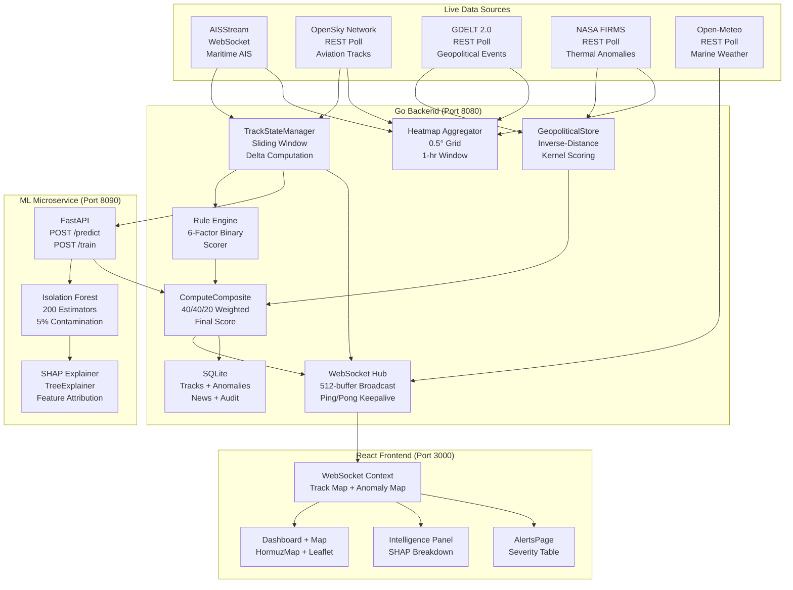

# HormuzWatch: Strategic Intelligence Platform
**Whitepaper — Technical Edition**
*Date: June 2026 · Revision 3*

---

## 1. Executive Summary

HormuzWatch is a multi-domain intelligence and geospatial surveillance platform providing real-time asset tracking, composite anomaly detection, and situational awareness across strategic maritime and geographic regions. The platform monitors the Strait of Hormuz and the broader Middle East maritime corridor — one of the world's most critical chokepoints through which approximately 20% of global oil transit flows.

The system has advanced beyond its original containerized MVP into a **production-grade, cloud-native intelligence engine** with five integrated data sources, a dedicated machine learning microservice, Terraform-managed Azure infrastructure, and automated CI/CD pipelines. HormuzWatch delivers a three-layer composite threat score — combining deterministic rule-based analysis, statistical machine learning inference, and real-time geopolitical event fusion — and broadcasts intelligence to connected analysts via a sub-two-second WebSocket channel.

This whitepaper documents the platform's current architecture, intelligence pipeline, cloud infrastructure, operational posture, and future roadmap. It reflects the actual implementation as of June 2026.

---

## 2. Introduction & Problem Statement

The Strait of Hormuz is the world's most strategically significant maritime chokepoint. In an increasingly volatile geopolitical environment, the ability to monitor vessel behavior, detect anomalies, and fuse multi-domain intelligence in real time is critical for maritime security, supply chain resilience, and threat assessment.

**The Challenge:**
- Inability to rapidly synthesize high-frequency telemetry from multiple heterogeneous data sources (maritime AIS, aviation, thermal, geopolitical events).
- High latency between raw data ingestion and actionable threat visualization.
- Manual evaluation of complex behavioral anomalies — course deviations, transponder spoofing, formation tactics, proximity to restricted zones.
- Fragmented intelligence: maritime data exists in isolation from aviation tracks, active conflict events, and historical attack patterns.
- Lack of explainability: existing tools produce risk scores without articulating *which behavioral features* drove the assessment.

**The Solution:**
HormuzWatch addresses these challenges through a composable, low-latency intelligence pipeline that:
1. Ingests telemetry from five live data sources simultaneously.
2. Computes behavioral deltas per track using an in-memory state manager with a sliding observation window.
3. Scores each track through a **three-layer composite model**: deterministic rules (40%), Isolation Forest ML inference (40%), and geopolitical proximity weighting (20%).
4. Provides per-decision **SHAP-based explainability** on the ML component, surfacing the exact feature contributions that drove a threat score.
5. Broadcasts intelligence instantly via WebSocket to all connected analyst sessions.

---

## 3. Core Features & Capabilities

### 3.1 Real-Time Multi-Domain Telemetry

HormuzWatch simultaneously ingests from five live, external data sources:

| Source | Protocol | Coverage | Update Frequency |
|---|---|---|---|
| **AISStream** | WebSocket (persistent) | Maritime vessels, Strait of Hormuz (22°N–30°N, 48°E–60°E) | Continuous (~2s) |
| **OpenSky Network** | REST polling | Aircraft within Middle East bounding box | Every 60 seconds |
| **GDELT 2.0 GEO API** | REST polling | Geopolitical conflict events, GeoJSON format | Every 15 minutes |
| **NASA FIRMS** | REST polling | Active thermal anomalies (fires, explosions) from satellite | Every 10 minutes |
| **Open-Meteo Marine** | REST polling | Wave height, swell period, marine weather severity | Every 5 minutes |

Each integration runs as an independent goroutine with reconnect logic, exponential backoff, and graceful degradation when external APIs are unavailable.

### 3.2 Three-Layer Composite Threat Scoring

The core intelligence capability is a **weighted composite scoring engine** combining three independent signals:

```
FinalScore = (RuleScore × 0.40) + (MLScore × 0.40) + (GeoScore × 0.20)
```

All component scores are normalized to 0–100 before composition.

**Layer 1 — Rule-Based Engine (40%):** A deterministic, multi-factor scoring function evaluating six behavioral heuristics: course deviation, kinematic anomalies (speed drop), AIS signal staleness, hot-zone proximity, restricted zone incursion, and historical attack site proximity.

**Layer 2 — ML Inference Engine (40%):** An Isolation Forest model served via a dedicated Python FastAPI microservice. The model operates on an 8-dimensional feature vector extracted from the TrackStateManager's sliding window. When requested, the service returns SHAP feature importance scores, identifying which behavioral dimensions are most anomalous for a given track.

**Layer 3 — Geopolitical Proximity Score (20%):** A real-time event store populated by GDELT (conflict events, weight=1.0) and NASA FIRMS (thermal/explosion events, weight=2.0). Each track's score is computed using inverse-distance spatial weighting with temporal decay — events within the last hour and within ~120 nautical miles contribute, with closer and more recent events weighted higher.

### 3.3 Track State Management

A thread-safe, in-memory **TrackStateManager** maintains a sliding window of up to 20 observations per track. For each incoming telemetry update, it computes:
- `CourseDelta`: absolute angular heading change (shortest arc, degrees)
- `HeadingDelta`: signed heading change
- `SpeedDelta`: speed change since last observation (knots)
- `AverageSpeed` & `SpeedVariance`: statistical moments over the full observation window
- `AISGapMinutes`: time elapsed since last observation

These computed deltas are the primary input to both the rule engine and the ML feature vector. Stale tracks (no update in 2 hours) are automatically purged by a background goroutine.

### 3.4 ML Microservice (Isolation Forest + SHAP)

An independent Python **FastAPI** microservice (`ml-service/`) implements the ML inference layer:

- **Model:** Scikit-learn `IsolationForest` (200 estimators, 5% contamination, random seed 42)
- **Scaler:** `StandardScaler` — features are Z-score normalized before inference
- **Explainability:** `shap.TreeExplainer` generates per-prediction SHAP values, returned as a ranked list of features by anomaly contribution
- **Inference Timeout:** The Go backend enforces a 500ms hard timeout on ML calls — if the service is unavailable or slow, the rule engine and geo score continue independently (graceful degradation)
- **Training API:** `POST /train` accepts historical feature arrays and retrains the model in-place, persisting to `models/isolation_forest.joblib`
- **Feature Vector (8 dimensions):** `course_delta`, `heading_delta`, `speed_delta`, `average_speed`, `speed_variance`, `ais_gap_minutes`, `dist_restricted_zone`, `dist_historical_site`

### 3.5 Geospatial Intelligence

- **4 Restricted Zones:** Abu Musa Island, Greater Tunb Island, Bandar Abbas Naval Base, Jask Naval Base — each with radius-based geofence detection
- **Historical Attack Database:** JSON dataset of documented maritime attack locations, loaded at startup with 0.1° (~6 nm) proximity detection
- **Dynamic Threat Heatmap:** A 0.5° grid aggregator with a 1-hour sliding window accumulates telemetry density from all five data sources, generating the threat heatmap overlaid on the map

### 3.6 Interactive Dashboard & Frontend

- **Framework:** React 19 with TypeScript, bundled via Vite
- **Routing:** React Router v7 — 7-page application: Dashboard, Analytics, Alerts, Health, Audit, Insights, Docs
- **Map:** Leaflet with OpenStreetMap tiles, marker clustering, severity-based color coding, SHAP explanation popups
- **WebSocket Client:** Persistent connection with automatic reconnection and exponential backoff; processes `telemetry`, `anomaly`, and `heatmap` message types
- **State Management:** URL-based state (React Router search params) enables deep-linking to specific tracks and persists analyst context across refreshes
- **Intelligence Panel:** Per-track panel surfacing telemetry, composite score breakdown (rule/ML/geo), SHAP feature contributions, recommended actions, and severity classification
- **Dark Mode:** Built-in theme toggle optimized for command-center and low-light environments

---

## 4. System Architecture

### 4.1 High-Level Architecture



### 4.2 Backend: Go 1.23 (Gin)

The backend is structured as a single binary with a clean internal package hierarchy:

| Package | Responsibility |
|---|---|
| `internal/api` | REST handlers: `/telemetry`, `/analyze`, `/heatmap`, `/ws/stream`, `/health` |
| `internal/anomaly` | Rule-based scorer, severity mapping, reason & action generation, geofence engine |
| `internal/intelligence` | TrackStateManager, feature extraction, ML client, GeopoliticalStore, composite scoring |
| `internal/integrations` | Five goroutine-based data source clients (AISStream, OpenSky, GDELT, FIRMS, Weather) |
| `internal/websocket/hub` | WebSocket hub: client registry, 512-buffer broadcast channel, heartbeat |
| `internal/heatmap` | Thread-safe 0.5° grid aggregator with 1-hour sliding window |
| `internal/db` | SQLite initialization, schema migrations, connection singleton |
| `internal/auth` | JWT middleware, rate limiter (120 req/60s per IP) |
| `internal/config` | Environment variable loading, configuration struct |
| `internal/geo` | Haversine distance utilities |

### 4.3 ML Microservice: Python FastAPI

The ML service is a separate, independently deployable service with its own Dockerfile and container lifecycle:

```
ml-service/
├── app.py          # FastAPI application, /predict and /train endpoints
├── model.py        # AnomalyModel class: IsolationForest + SHAP + StandardScaler
├── schemas.py      # Pydantic request/response schemas
├── requirements.txt
└── models/
    └── isolation_forest.joblib  # Persisted model artifact
```

The Go backend's `MLClient` enforces a **500ms timeout** on all prediction calls. On timeout or service unavailability, the composite scorer uses a zero ML score and continues — the platform never blocks on ML availability.

### 4.4 Frontend: React 19 + TypeScript

The frontend is a multi-page React application:

- **7 Routes:** Dashboard, Analytics, Alerts, Health, Audit, Insights, Docs
- **WebSocket Context:** Global provider managing the persistent WS connection, track state map, and anomaly map
- **HormuzMap Component:** Leaflet-based interactive map with marker clustering, severity badges, heatmap layer toggle, and per-track intelligence popups
- **Intelligence Panel:** Full per-track view including raw telemetry, composite score, rule/ML/geo breakdown, SHAP feature contributions, severity badge, and recommended actions

### 4.5 Observability Stack

A companion `infra-observability/` docker-compose environment provides:

| Component | Role |
|---|---|
| **OpenTelemetry Collector** | OTLP receiver (gRPC + HTTP), forwards traces to Jaeger |
| **Jaeger** | Distributed tracing UI |
| **Prometheus** | Metrics scraping |
| **Fluent Bit** | Log aggregation and forwarding |

---

## 5. Anomaly Detection & Scoring Engine

### 5.1 Rule-Based Layer (40% weight)

The deterministic scorer evaluates six behavioral factors in sequence:

| Factor | Trigger Condition | Points | Notes |
|---|---|---|---|
| **Course Deviation** | `courseDelta ≥ 45°` | +34 | Computed from TrackStateManager heading delta |
| **AIS Staleness** | `aisGapMinutes ≥ 15` | +26 | Computed from inter-observation time delta |
| **Speed Drop** | `speed ≤ 3 kts AND prevSpeed - speed ≥ 5 kts` | +22 | Both conditions required |
| **Restricted Zone** | Inside any of 4 named geofence zones | +30 | Radius + ray-casting polygon check |
| **Historical Attack Site** | Within 0.1° (~6 nm) of a documented incident | +15 | JSON dataset, loaded at startup |
| **Hot Zone Proximity** | `hotZoneDistanceNm ≤ 8` | +18 | Distance to nearest defined hot zone |

Maximum theoretical rule score: **145 → capped at 100**.

Severity tiers map the final composite score:

| Score | Severity | Frontend Color |
|---|---|---|
| 75–100 | `critical` | `#ef4444` (red) |
| 55–74 | `high` | `#b87333` (copper) |
| 30–54 | `medium` | `#d97706` (amber) |
| 0–29 | `low` | `#22c55e` (green) |

### 5.2 ML Layer (40% weight)

The Isolation Forest is an unsupervised anomaly detection algorithm that assigns anomaly scores based on how quickly a sample can be isolated in a random partition tree. Samples requiring few partitions (easily isolated) score high — they are statistically unusual relative to the training population.

**8-Feature Input Vector:**
1. `course_delta` — absolute heading change (°)
2. `heading_delta` — signed heading change (°)
3. `speed_delta` — speed change since prior observation (kts)
4. `average_speed` — mean speed over observation window (kts)
5. `speed_variance` — speed variance over observation window
6. `ais_gap_minutes` — time since last observation (min)
7. `dist_restricted_zone` — distance to nearest restricted zone (nm)
8. `dist_historical_site` — distance to nearest historical attack site (nm)

The raw Isolation Forest `decision_function` output (negative = anomaly, typical range `[-0.5, 0.5]`) is normalized to a 0–100 scale: `score = max(0, min(100, (0.3 - raw_score) / 0.6 × 100))`.

**SHAP Explainability:** When requested (`explain=true`), the service computes `shap.TreeExplainer` values for the prediction, returning a ranked list of features with their signed SHAP contributions and `anomalous`/`normal` direction labels.

### 5.3 Geopolitical Layer (20% weight)

The `GeopoliticalStore` accumulates timestamped geographic events from GDELT and NASA FIRMS. For each track location, a score is computed as:

```
score = min(100, Σ [weight × spatialFactor × timeFactor])

where:
  spatialFactor = 1 / (1 + dist × 10)   # Inverse-distance, ~120nm influence radius
  timeFactor    = 1 - (age_minutes / 60) # Linear temporal decay over 1 hour
  weight        = 1.0 (GDELT) | 2.0 (FIRMS)
```

10+ weighted events in proximity within the last hour produces a score of 100.

---

## 6. Data Integrations

### 6.1 AISStream (Maritime)

- **Protocol:** Persistent WebSocket (`wss://stream.aisstream.io/v0/stream`)
- **Coverage:** Strait of Hormuz bounding box (22°N–30°N, 48°E–60°E)
- **Message Filter:** `PositionReport` only
- **Output:** MMSI as TrackID, vessel name, lat/lon, Speed-over-Ground, Course-over-Ground
- **Reconnect:** Automatic, 10-second backoff on disconnect or error

### 6.2 OpenSky Network (Aviation)

- **Protocol:** REST polling (`/api/states/all` with bounding box)
- **Coverage:** Same Middle East bounding box as AIS
- **Update Rate:** Every 60 seconds (respects OpenSky anonymous rate limits)
- **Output:** ICAO24 as TrackID (prefixed `FLIGHT-`), callsign, lat/lon, velocity, heading
- **Auth:** Optional HTTP Basic auth for registered users (higher rate limit)

### 6.3 GDELT 2.0 (Geopolitical Events)

- **Protocol:** REST polling (GeoJSON API endpoint)
- **Update Rate:** Every 15 minutes
- **Usage:** Event coordinates added to GeopoliticalStore (weight=1.0) and heatmap (×5 intensity multiplier)

### 6.4 NASA FIRMS (Thermal Anomalies)

- **Protocol:** REST polling (CSV format)
- **Update Rate:** Every 10 minutes
- **Coverage:** Active fire/explosion thermal detections
- **Usage:** Events added to GeopoliticalStore (weight=2.0, higher than GDELT), heatmap (×3 intensity multiplier), and broadcast as telemetry tracks

### 6.5 Open-Meteo Marine (Weather)

- **Protocol:** REST polling
- **Update Rate:** Every 5 minutes
- **Derived Data:** Wave height, swell period, marine weather severity classification
- **Usage:** Broadcast as contextual intelligence; severe weather events contribute to environmental threat context

---

## 7. Cloud Infrastructure

HormuzWatch is being migrated to Azure using Terraform-managed infrastructure as code. The Terraform workspace is organized as a modular monorepo:

```
terraform/
├── main.tf                  # Root: wires all modules together
├── variables.tf / outputs.tf
├── provider.tf              # AzureRM + Azure AD providers
├── backend.tf               # Remote state backend (Azure Blob)
└── modules/
    ├── networking/           # VNet, subnets, NSGs, private DNS zones
    ├── security/             # Azure Key Vault, private endpoints
    ├── monitoring/           # Log Analytics Workspace, Application Insights, alerts
    ├── storage/              # Azure Blob (ML model artifacts, logs)
    ├── event_hubs/           # Azure Event Hubs namespace (streaming at scale)
    ├── app/                  # Azure Static Web Apps (frontend), Container Apps
    └── ai-services/          # Azure AI/OpenAI Cognitive Services
```

### Azure Services Provisioned

| Service | Purpose | Module |
|---|---|---|
| **Azure Container Apps** | Hosts Go backend + ML microservice | `app` |
| **Azure Static Web Apps** | Hosts React frontend (Free tier) | `app` |
| **Azure Container Registry (ACR)** | Private Docker image registry | `app` |
| **Azure Key Vault** | Secrets management (API keys, JWT secrets) | `security` |
| **Azure Log Analytics** | Centralized log aggregation | `monitoring` |
| **Application Insights** | APM, distributed tracing | `monitoring` |
| **Azure Event Hubs** | High-throughput telemetry ingestion (future scale) | `event_hubs` |
| **Azure Blob Storage** | ML model artifact persistence | `storage` |
| **Azure AI Services** | Cognitive services endpoint | `ai-services` |
| **Virtual Network + Private DNS** | Network isolation, private endpoints | `networking` |

### Naming Convention

All resources follow the pattern: `{type}-{project}-{environment}` (e.g., `ca-hormuzwatch-prod-api`, `rg-hormuzwatch-prod`).

---

## 8. CI/CD Pipelines

Four GitHub Actions workflows automate the build, test, security scan, and deployment lifecycle:

| Workflow | Trigger | Action |
|---|---|---|
| `deploy-backend.yml` | Push to `main` (server/ or ml-service/) | Build + push both images to ACR, deploy to Azure Container Apps |
| `deploy-frontend.yml` | Push to `main` (client/) | Build React app, deploy to Azure Static Web Apps |
| `security-scan.yml` | On push | Container vulnerability scanning |
| `web-ci.yml` | On PR | Lint, type-check, test |

The backend and ML service are treated as a **single deployment unit** — changes to either trigger a joint build-and-deploy cycle to maintain version compatibility between the Go API and the Python ML service.

---

## 9. Security Architecture

| Control | Implementation |
|---|---|
| **Authentication** | JWT middleware on all protected routes; structured for Azure Entra ID (JWKS) integration |
| **Rate Limiting** | 120 requests / 60 seconds per IP, implemented at the Gin middleware layer |
| **CORS** | Enforced at middleware level; allowlist-only origin policy |
| **Data Validation** | Pydantic schemas (ML service), Gin binding (Go API) |
| **Secrets Management** | API keys (AISStream, FIRMS, OpenSky) and JWT secrets referenced from Azure Key Vault in production |
| **Network Isolation** | All Azure backend services accessed via private endpoints; frontend is the only public surface |
| **Container Hardening** | Alpine-based multi-stage Docker builds; non-root container execution |

---

## 10. Operational Posture

### 10.1 Resilience Design

- **Graceful Degradation on ML Failure:** If the ML microservice is unreachable, times out, or returns an error, the composite scorer sets `mlScore = 0.0` and continues with the rule and geo components. The platform never blocks on ML availability.
- **Integration Independence:** Each of the five data source goroutines is independent. The failure of any single source (e.g., GDELT rate limit, OpenSky outage) does not affect the others.
- **WebSocket Reconnect:** The AISStream client implements infinite reconnect with a 10-second backoff. The frontend WebSocket client also reconnects with exponential backoff.
- **Track Hydration:** On new WebSocket client connections, the backend replays the last 2 hours of SQLite data to instantly populate the analyst's view.

### 10.2 Performance Characteristics

| Metric | Value |
|---|---|
| WebSocket broadcast latency | < 100ms (512-buffer hub) |
| UI telemetry update frequency | Every 2 seconds (AIS) |
| ML inference timeout | 500ms (hard deadline) |
| Track state window | 20 observations, 2-hour stale threshold |
| Heatmap grid resolution | 0.5° × 0.5° (~55km × 55km) |
| Heatmap time window | 1 hour sliding |

### 10.3 Known Limitations (Current Sprint)

- **SQLite persistence:** Production deployment will migrate to PostgreSQL (via Azure Database for PostgreSQL Flexible Server). SQLite is retained in the local development environment.
- **Hot-zone distance computation:** The `HotZoneDistanceNm` field defaults to `0` in the ingestion layer, causing the hot-zone proximity factor (+18 points) to fire for all tracks. A fix computing actual distance to defined hot zones is planned before production launch.
- **ML model bootstrap:** The Isolation Forest requires a minimum of 50 historical samples to train. Before sufficient data accumulates, the ML layer returns a neutral score and gracefully falls back to the rule + geo layers.
- **Azure Entra ID:** JWT authentication is implemented and middleware-ready; Azure AD JWKS integration is a pre-production task.

---

## 11. Roadmap & Future Vision

HormuzWatch executes against a structured phased roadmap. Phases 1 and 2 are complete. Phase 3 is in active development.

### Phase 1: Foundation ✅ Complete
Local MVP — React + TypeScript frontend, Go REST API, simulated telemetry, basic anomaly scoring.

### Phase 2: Containerized MVP ✅ Complete
Go backend with WebSocket hub, React Router v7 frontend, Docker Compose orchestration, heatmap aggregation.

### Phase 3: Production Infrastructure (Active)
- Terraform-managed Azure deployment (Container Apps, Static Web Apps, ACR, Key Vault)
- Live data feeds: AISStream, OpenSky, GDELT, NASA FIRMS, Open-Meteo ✅ Implemented
- Intelligence pipeline: TrackStateManager, composite scoring, ML microservice ✅ Implemented
- GitHub Actions CI/CD ✅ Implemented
- PostgreSQL migration (replacing SQLite)
- Azure Entra ID authentication integration
- Hot-zone distance computation fix

### Phase 4: Advanced Intelligence
- Azure OpenAI integration for natural language threat summarization ("Analyst Briefing" feature)
- GDELT sentiment scoring and event classification by conflict type
- Pattern-of-life modeling: per-track behavioral baseline learning over days/weeks

### Phase 5: Predictive Analytics
- Route deviation prediction: anticipate likely future positions vs. historical corridors
- Fleet-level correlation: detect coordinated behavior across multiple tracks
- Automated daily Regional Risk Index reports with trend analysis

### Phase 6: Enterprise Polish
- Full RBAC and audit logging
- Chaos engineering tests (Chaos Monkey for ACA)
- Security audit and penetration test
- FinOps validation and cost-optimized auto-scaling configuration
- Architecture Decision Records (ADRs) for all major design choices
- Comprehensive test coverage (unit, integration, load)

---

## 12. Technology Stack Summary

| Layer | Technology |
|---|---|
| **Backend Language** | Go 1.23 |
| **Backend Framework** | Gin HTTP |
| **ML Language** | Python 3.11 |
| **ML Framework** | FastAPI, Scikit-learn, SHAP, Joblib |
| **Frontend Framework** | React 19, TypeScript, Vite |
| **Frontend Routing** | React Router v7 |
| **Map Rendering** | Leaflet.js, OpenStreetMap |
| **WebSocket** | Gorilla WebSocket (Go), native browser WS (React) |
| **Persistence** | SQLite (dev) → Azure PostgreSQL Flexible Server (prod) |
| **Containerization** | Docker, Docker Compose (dev), Azure Container Apps (prod) |
| **Infrastructure as Code** | Terraform (AzureRM provider) |
| **CI/CD** | GitHub Actions |
| **Observability** | OpenTelemetry, Jaeger, Prometheus, Fluent Bit |
| **Cloud Platform** | Microsoft Azure |
| **Auth** | JWT, Azure Entra ID (JWKS, pending) |

---

## 13. Conclusion

HormuzWatch has evolved from a containerized MVP into a genuine multi-domain intelligence platform with a production-grade data pipeline and a three-layer composite threat scoring system that goes significantly beyond simple rule-based detection. The addition of the ML microservice with SHAP explainability, the TrackStateManager for real delta computation across all five live data sources, and the Terraform-managed Azure infrastructure represent a qualitative leap in the platform's analytical capability and operational maturity.

The platform is designed for explainability and transparency: every threat assessment surfaces not just a final score, but the individual rule contributions, the ML score with its driving features, and the geopolitical context — giving analysts the full reasoning chain rather than an opaque number. This positions HormuzWatch as an analyst-augmentation tool rather than a black-box alert system.

As the platform completes its Phase 3 Azure deployment and progresses toward Phase 4 OpenAI integration and Phase 5 predictive analytics, it will stand as a comprehensive demonstration of modern cloud-native intelligence engineering: real-time data fusion, machine learning with explainability, cloud-native infrastructure, and operator-focused design.
