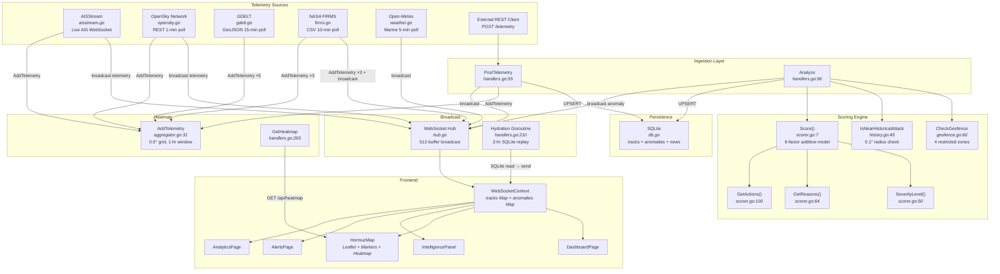

# HormuzWatch — Deep Intelligence Pipeline Architecture Review

**Reviewer Role:** Principal Staff Engineer
**Date:** 2026-06-04
**Scope:** Multi-Factor Anomaly Scoring Engine — end-to-end audit

---

## 1. Component Inventory

Every file involved in risk scoring, threat detection, anomaly analysis, severity calculation, heatmap generation, and alert generation:

| Component | File | Purpose |
|---|---|---|
| **Anomaly Scorer** | [scorer.go](file:///c:/Users/amena/OneDrive/Documents/Maritime-HormuzWatch/server/internal/anomaly/scorer.go) | Core scoring function, severity mapping, reason generation, action recommendations |
| **Geofence Engine** | [geofence.go](file:///c:/Users/amena/OneDrive/Documents/Maritime-HormuzWatch/server/internal/anomaly/geofence.go) | Restricted zone definitions (4 zones), radius + polygon check, ray-casting |
| **Historical Attack DB** | [history.go](file:///c:/Users/amena/OneDrive/Documents/Maritime-HormuzWatch/server/internal/api/history.go) | Loads historical attack sites from JSON, proximity check (0.1° ≈ 6nm) |
| **Heatmap Aggregator** | [aggregator.go](file:///c:/Users/amena/OneDrive/Documents/Maritime-HormuzWatch/server/internal/heatmap/aggregator.go) | 0.5° grid, 1-hour sliding window, intensity = event count per cell |
| **API Handlers** | [handlers.go](file:///c:/Users/amena/OneDrive/Documents/Maritime-HormuzWatch/server/internal/api/handlers.go) | `PostTelemetry` (ingest + SQLite persist), `Analyze` (score + persist + broadcast) |
| **WebSocket Hub** | [hub.go](file:///c:/Users/amena/OneDrive/Documents/Maritime-HormuzWatch/server/internal/websocket/hub/hub.go) | Broadcast channel, client registry, ping/pong keepalive |
| **AISStream Ingestion** | [aisstream.go](file:///c:/Users/amena/OneDrive/Documents/Maritime-HormuzWatch/server/internal/integrations/aisstream.go) | Live AIS vessel positions via WebSocket |
| **OpenSky Ingestion** | [opensky.go](file:///c:/Users/amena/OneDrive/Documents/Maritime-HormuzWatch/server/internal/integrations/opensky.go) | Aircraft positions via REST polling (1-min interval) |
| **GDELT Ingestion** | [gdelt.go](file:///c:/Users/amena/OneDrive/Documents/Maritime-HormuzWatch/server/internal/integrations/gdelt.go) | Geopolitical event heatmap enrichment (15-min interval) |
| **FIRMS Ingestion** | [firms.go](file:///c:/Users/amena/OneDrive/Documents/Maritime-HormuzWatch/server/internal/integrations/firms.go) | NASA fire/explosion detection, heatmap + telemetry broadcast |
| **Weather Ingestion** | [weather.go](file:///c:/Users/amena/OneDrive/Documents/Maritime-HormuzWatch/server/internal/integrations/weather.go) | Open-Meteo marine wave data, severity classification |
| **Frontend WS Context** | [WebSocketContext.tsx](file:///c:/Users/amena/OneDrive/Documents/Maritime-HormuzWatch/client/src/context/WebSocketContext.tsx) | Parses `telemetry` and `anomaly` messages, maintains Track + AnomalyData maps |
| **Dashboard Renderer** | [DashboardPage.tsx](file:///c:/Users/amena/OneDrive/Documents/Maritime-HormuzWatch/client/src/pages/DashboardPage.tsx) | Classifies tracks, renders severity badges, asset/aircraft panels |
| **Map Renderer** | [HormuzMap.tsx](file:///c:/Users/amena/OneDrive/Documents/Maritime-HormuzWatch/client/src/components/HormuzMap.tsx) | Leaflet map, marker clustering, heatmap layer, popup with threat data |
| **Intel Panel** | [IntelligencePanel.tsx](file:///c:/Users/amena/OneDrive/Documents/Maritime-HormuzWatch/client/src/components/IntelligencePanel.tsx) | Detailed track panel: telemetry, anomaly reasons, recommended actions |
| **Alerts Page** | [AlertsPage.tsx](file:///c:/Users/amena/OneDrive/Documents/Maritime-HormuzWatch/client/src/pages/AlertsPage.tsx) | Table of all anomalies sorted by severity |
| **Analytics Page** | [AnalyticsPage.tsx](file:///c:/Users/amena/OneDrive/Documents/Maritime-HormuzWatch/client/src/pages/AnalyticsPage.tsx) | Track counts, average speed/score, classification breakdown |

---

## 2. Dependency Graph



---

## 3. Score Contribution Table

Every factor in [Score()](file:///c:/Users/amena/OneDrive/Documents/Maritime-HormuzWatch/server/internal/anomaly/scorer.go#L7-L47):

| # | Factor | File | Function | Weight (pts) | Threshold | Output Field | Evidence |
|---|--------|------|----------|-------------|-----------|--------------|----------|
| 1 | **Course Deviation** | `scorer.go` | `Score()` L11-13 | **+34** | `courseDelta >= 45°` | `score` | Binary: all-or-nothing above threshold |
| 2 | **AIS Signal Staleness** | `scorer.go` | `Score()` L16-18 | **+26** | `aisAgeMinutes >= 15` | `score` | Binary: all-or-nothing above threshold |
| 3 | **Speed Drop** | `scorer.go` | `Score()` L21-24 | **+22** | `speed <= 3 kts AND previousSpeed - speed >= 5 kts` | `score` | Compound binary: requires BOTH conditions |
| 4 | **Hot Zone Proximity** | `scorer.go` | `Score()` L27-29 | **+18** | `hotZoneDistanceNm <= 8` | `score` | Binary. **Always 0** — see §8 |
| 5 | **Restricted Zone** | `geofence.go` | `CheckGeofence()` L60-73 | **+30** | Euclidean distance in degrees ≤ `RadiusDeg` | `inRestrictedZone` | 4 hardcoded zones, radius model |
| 6 | **Historical Attack Site** | `history.go` | `IsNearHistoricalAttack()` L45-52 | **+15** | Euclidean distance ≤ 0.1° (≈6nm) | `nearHistoricalAttack` | Loaded from `data/history-attacks.json` |

**Maximum theoretical score:** 34 + 26 + 22 + 18 + 30 + 15 = **145** → capped at **100**.

### Severity Mapping

[SeverityLevel()](file:///c:/Users/amena/OneDrive/Documents/Maritime-HormuzWatch/server/internal/anomaly/scorer.go#L50-L61):

| Score Range | Severity | Color (Frontend) |
|-------------|----------|-------------------|
| 75–100 | `critical` | `#ef4444` (red) |
| 55–74 | `high` | `#b87333` (copper) |
| 30–54 | `medium` | `#d97706` (amber) |
| 0–29 | `low` | `#22c55e` (green) |

---

## 4. Scoring Classification

> **Verdict: Rule-Based (Binary Thresholds)**

| Category | Present? | Evidence |
|----------|----------|----------|
| Placeholder | ❌ | The scoring function does compute real values and affects real rendering |
| **Rule-Based** | ✅ | Every factor is a simple `if (value >= threshold) score += N` binary test |
| Statistical | ❌ | No distributions, no baselines, no moving averages, no standard deviations |
| Machine Learning | ❌ | No models, no training, no inference, no feature vectors |

The scoring is a **pure additive binary threshold model**. Each factor contributes either its full weight or zero — there is no gradient, no proportionality, no learning.

---

## 5. Anomaly Type Implementation Status

### 5.1 Course Deviation

| Aspect | Status | Evidence |
|--------|--------|----------|
| Scoring logic | ✅ Implemented | `scorer.go` L11: `if courseDelta >= 45 → +34` |
| Input data availability | ⚠️ **Partially broken** | `courseDelta` field exists in `TelemetryPayload` but **neither AISStream nor OpenSky populates it** — always `0` |
| Navigational corridors | ❌ Missing | Whitepaper claims "compares against expected navigational corridors" — no corridor definitions exist |

> **Verdict: Partially implemented.** The scoring logic exists but the input is always zero because the data sources never compute `courseDelta`. This factor **never fires in production**.

### 5.2 Speed Anomaly (Kinematic)

| Aspect | Status | Evidence |
|--------|--------|----------|
| Scoring logic | ✅ Implemented | `scorer.go` L21: `if speed <= 3 AND speedDelta >= 5 → +22` |
| Input data availability | ⚠️ **Partially broken** | `previousSpeed` is in `TelemetryPayload` but **neither AISStream nor OpenSky ever sets it** — always `0` |
| Acceleration detection | ❌ Missing | Whitepaper claims "acceleration" detection — only deceleration is checked |

> **Verdict: Partially implemented.** The scoring logic fires correctly IF `previousSpeed` is provided (e.g., via REST API), but the live data integrations never provide it. The delta is always `0 - speed = negative`, so the condition `speedDelta >= 5` is never met for live data.

### 5.3 Signal Integrity (AIS Staleness)

| Aspect | Status | Evidence |
|--------|--------|----------|
| Scoring logic | ✅ Implemented | `scorer.go` L16: `if aisAgeMinutes >= 15 → +26` |
| Input data availability | ⚠️ **Hardcoded to 0** | [aisstream.go L111](file:///c:/Users/amena/OneDrive/Documents/Maritime-HormuzWatch/server/internal/integrations/aisstream.go#L111): `AisAgeMinutes: 0` — always zero for live data |
| AIS spoofing detection | ❌ Missing | No cross-referencing, no position consistency checks |

> **Verdict: Partially implemented.** The logic exists but the ingestion layer hardcodes `AisAgeMinutes: 0` (since it's "live data"), making this factor **permanently dormant for live feeds**.

### 5.4 High-Risk Zone Proximity

| Aspect | Status | Evidence |
|--------|--------|----------|
| Geofence restricted zones | ✅ Implemented | 4 zones in `geofence.go`: Abu Musa, Greater Tunb, Bandar Abbas, Jask |
| Historical attack proximity | ✅ Implemented | `history.go` checks against loaded JSON dataset |
| Hot zone distance | ⚠️ **Always 0** | [aisstream.go L112](file:///c:/Users/amena/OneDrive/Documents/Maritime-HormuzWatch/server/internal/integrations/aisstream.go#L112): `HotZoneDistanceNm: 0`. [opensky.go L100](file:///c:/Users/amena/OneDrive/Documents/Maritime-HormuzWatch/server/internal/integrations/opensky.go#L100): `HotZoneDistanceNm: 0` |

> **Verdict: Partially implemented.** Geofence and historical checks work, but `HotZoneDistanceNm` is hardcoded to `0`, which means the hot zone factor (`+18 points`) **always fires** since `0 <= 8`. This is a scoring bug — every single track gets +18 points by default.

---

## 6. Capability Gap Analysis

| Capability | Whitepaper Claim | Actual Code | Completion % |
|---|---|---|---|
| **Course Deviation Detection** | "Compares heading against expected navigational corridors" | Binary threshold on `courseDelta` field; field never populated by live integrations; no corridor definitions | **15%** |
| **Kinematic Anomalies** | "Detects sudden deceleration or acceleration" | Deceleration-only check; `previousSpeed` never populated by live integrations | **20%** |
| **Signal Integrity** | "Flags stale telemetry (spoofing, jamming, equipment failure)" | AIS age check exists but hardcoded to 0 for live data; no spoofing detection | **15%** |
| **Geospatial Proximity** | "Increases threat scores near high-risk or exclusion zones" | 4 geofence zones + historical attacks functional; hot zone distance always 0 (bug: +18 always fires) | **55%** |
| **Multi-Factor Scoring** | "Evaluates vessel kinematics, course deviations, signal integrity in real time" | 6-factor additive binary model exists but only 2 factors (geofence + historical) actually fire correctly | **35%** |
| **Severity Mapping** | "Scores mapped to Low/Medium/High/Critical tiers" | Fully implemented with 4 tiers | **100%** |
| **Heatmap Generation** | "Geospatial anomaly density" | Grid-based aggregation with 1-hr window, fed by 5 sources (AIS, OpenSky, GDELT, FIRMS, REST) | **80%** |
| **Real-Time Broadcast** | "Sub-two-second latency WebSocket" | Hub with broadcast channel, heartbeat, reconnect with backoff | **90%** |
| **Alert Generation** | "Instant broadcast, recommended actions" | AlertsPage renders anomalies with severity badges and recommended actions | **75%** |
| **Dashboard Hydration** | "Persistent state across refreshes" | SQLite UPSERT + 2-hr hydration on WS connect | **70%** |
| **News Intelligence** | "OSINT aggregation" | RSS feeds (Al Jazeera, USNI, DefenseNews) → SQLite → filterable UI | **80%** |
| **Historical Overlays** | "Historical incident overlays" | JSON dataset loaded, proximity check integrated into scoring | **85%** |

---

## 7. Maturity Score

### Scoring Breakdown

| Dimension | Weight | Score | Reasoning |
|-----------|--------|-------|-----------|
| **Core Intelligence (Scoring)** | 30% | 25/100 | 4 of 6 factors are dead code in production (inputs hardcoded to 0). Only geofence + historical fire. Hot zone has a scoring bug (+18 always). |
| **Data Ingestion** | 20% | 70/100 | 5 live data sources are connected and working. Missing: track state management for computing deltas. |
| **Persistence** | 10% | 65/100 | SQLite for tracks, anomalies, and news. No PostgreSQL. No migration system. |
| **Real-Time Pipeline** | 15% | 80/100 | WebSocket hub is solid. Hydration works. Broadcast is non-blocking. |
| **Frontend Rendering** | 15% | 75/100 | Map, dashboard, alerts, analytics, news all functional. Defensive coding gaps (toFixed crashes) being patched. |
| **Security & Ops** | 10% | 30/100 | JWT middleware exists but Azure AD not integrated. Rate limiting functional. No audit logging. No RBAC. |

### Weighted Total

```
(0.30 × 25) + (0.20 × 70) + (0.10 × 65) + (0.15 × 80) + (0.15 × 75) + (0.10 × 30)
= 7.5 + 14.0 + 6.5 + 12.0 + 11.25 + 3.0
= 54.25
```

> ### **Estimated Maturity: 54 / 100 — MVP**
>
> The platform is a functional MVP with impressive data ingestion breadth and frontend polish, but the core intelligence engine — the claimed differentiator — is operating at ~25% effectiveness due to dead-code scoring factors and a critical scoring bug.

---

## 8. The Single Most Important Weakness

> [!CAUTION]
> ### The Scoring Engine is Disconnected from Its Data Sources
>
> The `Analyze` endpoint ([handlers.go L96](file:///c:/Users/amena/OneDrive/Documents/Maritime-HormuzWatch/server/internal/api/handlers.go#L96)) is **never called by any live integration**. AISStream and OpenSky both broadcast raw telemetry directly to the WebSocket hub and heatmap — they completely bypass the scoring engine.

**The full data flow for live data is:**

```
AISStream/OpenSky → heatmap.AddTelemetry() → hub.Broadcast ← telemetry (raw, unscored)
```

**The scoring engine sits on a dead path:**

```
External REST POST /analyze → Analyze() → Score() → hub.Broadcast ← anomaly (scored)
```

This means:
1. **Every track rendered on the dashboard from live data has `anomalyScore: 0` and `severity: "low"`** — the frontend hardcodes these defaults in [WebSocketContext.tsx L101-102](file:///c:/Users/amena/OneDrive/Documents/Maritime-HormuzWatch/client/src/context/WebSocketContext.tsx#L101-L102).
2. The AlertsPage will always be empty for live data because no anomalies are ever generated.
3. The heatmap works purely as a traffic density map, not a threat density map.
4. **The "Multi-Factor Anomaly Scoring Engine" never executes on live production data.**

---

## 9. Transformation Roadmap: From Rule Engine to Real Intelligence Engine

### Phase 1: Connect the Scoring Engine (Critical — Do First)

**Problem:** Live integrations bypass `Analyze()`.

**Solution:** After every telemetry broadcast in `aisstream.go` and `opensky.go`, invoke the scoring pipeline inline:

```go
// In aisstream.go, after building the payload:
inRestrictedZone, zoneName := anomaly.CheckGeofence(payload.Lat, payload.Lon)
nearHistorical := api.IsNearHistoricalAttack(payload.Lat, payload.Lon)
score := anomaly.Score(payload.CourseDelta, float64(payload.AisAgeMinutes), 
    payload.Speed, payload.PreviousSpeed, payload.HotZoneDistanceNm,
    inRestrictedZone, nearHistorical)

if score > 0 {
    result := anomaly.Result{
        ID: payload.TrackID, Score: score,
        Severity: anomaly.SeverityLevel(score),
        Reasons: anomaly.GetReasons(...),
        Actions: anomaly.GetActions(anomaly.SeverityLevel(score)),
    }
    h.Broadcast <- hub.Message{Type: "anomaly", Data: result}
}
```

### Phase 2: Fix the Scoring Bug

**Problem:** `HotZoneDistanceNm` is hardcoded to `0`, so `0 <= 8` always triggers +18 points.

**Solution:** Either compute the actual distance to the nearest hot zone, or set the default to a large value (e.g., `999.0`) so it doesn't trigger by default.

### Phase 3: Implement Track State Management

**Problem:** `courseDelta`, `previousSpeed`, and `aisAgeMinutes` are never computed for live data.

**Solution:** Create a `TrackStateManager` that maintains per-track history:

```go
type TrackState struct {
    PreviousLat, PreviousLon float64
    PreviousSpeed            float64
    PreviousHeading          float64
    LastSeen                 time.Time
}

func (m *TrackStateManager) Update(trackID string, lat, lon, speed, heading float64) (courseDelta, prevSpeed float64, aisAge int) {
    state := m.Get(trackID)
    courseDelta = math.Abs(heading - state.PreviousHeading)
    prevSpeed = state.PreviousSpeed
    aisAge = int(time.Since(state.LastSeen).Minutes())
    // Update state...
}
```

### Phase 4: Graduate from Binary to Proportional Scoring

Replace binary thresholds with weighted proportional contributions:

```go
// Instead of: if courseDelta >= 45 { score += 34 }
// Use: score += int(math.Min(34, courseDelta / 45.0 * 34.0))
```

This eliminates the cliff-edge behavior where 44.9° scores 0 but 45.0° scores 34.

### Phase 5: Add Temporal Baselines (Statistical Layer)

For each track, maintain a rolling baseline of normal behavior:
- Average speed over last N observations
- Average heading stability
- Typical AIS reporting interval

Flag deviations as Z-scores from the baseline rather than absolute thresholds.

### Phase 6: Threat Correlation Engine

Cross-reference multiple weak signals:
- Track enters restricted zone AND speed drops AND AIS goes stale = escalate from sum-of-parts
- Multiple tracks converging on same point = swarm detection
- FIRMS fire event near a track's position = potential engagement

### Phase 7: ML Integration (Azure OpenAI)

- Train anomaly classifiers on historical data
- Use embedding models for behavioral clustering
- Natural language threat summarization for analyst briefings
