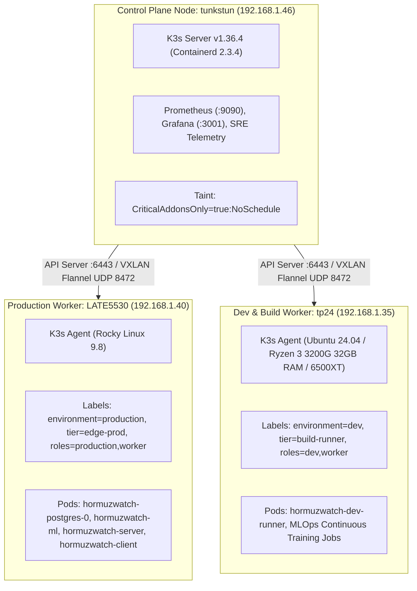

# HormuzWatch — Multi-Node Kubernetes (K3s) Cluster Runbook

## 1. Architectural Topology

The HormuzWatch Kubernetes cluster employs a hardened 3-node distribution designed for extreme hardware heterogeneity:



---

## 2. Node Specifications & Roles

| Node Name | Physical Host | IP Address | OS & Kernel | Role & Workloads |
| :--- | :--- | :--- | :--- | :--- |
| **`tunkstun`** | AMD/Intel 8-Core Workstation | `192.168.1.46` | Ubuntu 24.04.4 LTS (Kernel 7.0.0) | **Kubernetes Control Plane** (`k3s server`), Prometheus, Grafana |
| **`late5530`** | Dell Latitude E5530 (2C/4T, 7.4GB) | `192.168.1.40` | Rocky Linux 9.8 (Kernel 5.14.0) | **Production Worker** (`environment=production`), Live API & ML |
| **`tp24`** | AMD Ryzen 3 3200G (4C/4T, 32GB RAM) | `192.168.1.35` | Ubuntu 24.04 LTS | **Dev Worker** (`environment=dev`), Heavy builds, Optuna MLOps |

---

## 3. Production Workloads Status (`hormuzwatch-prod`)

All core production workloads are running on `late5530`:

```bash
$ kubectl get pods -n hormuzwatch-prod -o wide
NAME                                  READY   STATUS    RESTARTS   AGE   IP           NODE
hormuzwatch-postgres-0                1/1     Running   0          2m    10.42.1.9    late5530
hormuzwatch-ml-666b48bff8-cn4zl       1/1     Running   0          2m    10.42.1.8    late5530
hormuzwatch-server-57db46c99d-4986l   1/1     Running   0          1m    10.42.1.11   late5530
hormuzwatch-client-559dfdc994-f8nlx   1/1     Running   0          1m    10.42.1.13   late5530
```

### Exposed Endpoints & NodePorts on `LATE5530`
- **Frontend SPA (Nginx):** `http://192.168.1.40:30000/` (HTTP 200 OK)
- **Go API Server:** `http://192.168.1.40:30020/health` (HTTP 200 OK, `"circuit":"CLOSED"`)
- **Prometheus Metrics:** `http://192.168.1.40:30020/metrics`

---

## 4. One-Click Join for `tp24` (Dev Worker)

When `tp24` is powered on / awake:

```bash
# On tp24:
ssh tp24@192.168.1.35
cd ~/SHARED/Projects/HormuzWatch
sudo bash k8s/scripts/join_tp24_worker.sh
```

Or execute directly from `tunkstun`:
```bash
ssh tp24@192.168.1.35 'sudo bash -s' < k8s/scripts/join_tp24_worker.sh
kubectl label node tp24 node-role.kubernetes.io/worker=true node-role.kubernetes.io/dev=true
```

Once `tp24` joins, Kubernetes scheduler automatically binds `hormuzwatch-dev-runner` to `tp24`.

---

## 5. Verification Commands

```bash
# Cluster overview
bash k8s/scripts/verify_cluster.sh

# Live node resource utilization
kubectl top nodes

# Live pod resource utilization
kubectl top pods -A
```
