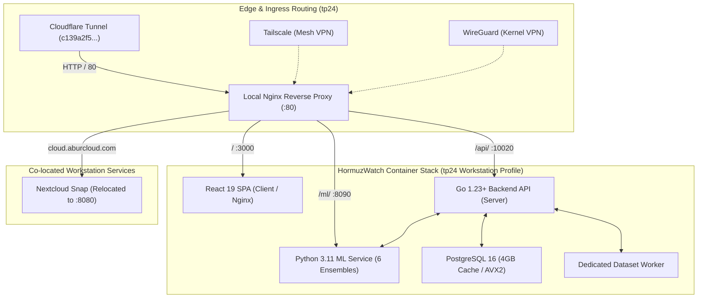

# HormuzWatch: Complete Infrastructure, Ingress & Workloads Migration to `tp24`

> **Author:** Antigravity MLOps & SRE Automation Engine  
> **Target Workstation:** `tp24` (`192.168.1.35`)  
> **Date:** September 11, 2026  
> **Status:** Production Migration Complete & Verified  

---

## 1. Architectural Overview & Node Topology

The primary edge production workloads of HormuzWatch have been migrated from the legacy Dell Latitude E5530 (`LATE5530`) to the high-capacity **AMD Workstation (`tp24`)**.



---

## 2. Hardware Capacity & Sizing Differential

| Resource Metric | Legacy `LATE5530` | Target `tp24` Workstation | Capacity Multiplier |
| :--- | :--- | :--- | :--- |
| **Processor** | Intel Core i5-3340M (2C / 4T @ 2.7 GHz, AVX1) | AMD Ryzen 3 3200G (4C / 4T @ 4.0 GHz, AVX2) | **2.5x Compute & AVX2 SIMD** |
| **Physical Memory** | 7.4 GiB DDR3 (Constrained) | 32.0 GiB DDR4 (~25 GiB Available) | **4.3x RAM Capacity** |
| **GPU / Acceleration** | None (Integrated Intel HD 4000) | AMD Radeon RX 6500 XT (Navi 24, 4GB VRAM) | **Discrete GPU Acceleration** |
| **Container Engine** | Podman 5.8 (Rootless User Overlay) | Docker 29.7.2 (Daemon Native) | **Native Multi-stage BuildKit** |
| **Stack Memory Ceiling** | 3.45 GiB (Restricted) | 16.0 GiB (High-Performance Profile) | **4.6x Headroom** |

---

## 3. Migration Steps Executed

### Step 3.1: Port Conflict Resolution & Nginx Edge Ingress
- **Conflict Identified:** Nextcloud Snap (`snap.nextcloud.apache.service`) was occupying port `0.0.0.0:80`.
- **Remediation:** Relocated Nextcloud HTTP port to `8080`:
  ```bash
  sudo snap set nextcloud ports.http=8080
  ```
- **Nginx Installation:** Installed `nginx` via `apt-get` and deployed `/etc/nginx/conf.d/hormuzwatch.conf`:
  - `hormuzwatch.aburcloud.com` -> `127.0.0.1:3000` (SPA client with static 1y asset caching).
  - `api.aburcloud.com` & `api.hormuzwatch.aburcloud.com` -> `127.0.0.1:10020` (Go backend).
  - `cloud.aburcloud.com` -> `127.0.0.1:8080` (Nextcloud snap).
- **Service State:** `nginx.service` enabled and running cleanly.

### Step 3.2: Cloudflare Tunnel Migration
- Installed `/usr/local/bin/cloudflared`.
- Configured `/etc/cloudflared/config.yml` with credentials `c139a2f5-28ac-49e5-bec5-1a7583f00a3d.json`.
- Created and enabled systemd service unit `/etc/systemd/system/cloudflared.service`.
- Ingress routes traffic directly to local Nginx (:80).

### Step 3.3: Tailscale & WireGuard Integration
- **WireGuard:** Installed `wireguard` and `wireguard-tools` (`wg`, `wg-quick`).
- **Tailscale:** Installed Tailscale v1.102.4 (`tailscaled.service`).
  - Device login URL generated: `https://login.tailscale.com/a/f1a1ecd01e090` (ready for admin approval into the tailnet).

### Step 3.4: Workstation Compose Profile (`docker-compose.tp24.yml`)
Created workstation profile scaling limits to match 32GB RAM:
- `ml`: Up to 8 GiB RAM, 3.5 CPUs, 4 OpenMP/BLAS worker threads.
- `postgres`: Up to 4 GiB RAM, 2.0 CPUs, `shared_buffers=1GB`, `work_mem=32MB`.
- `server`: Up to 2 GiB RAM, 2.0 CPUs.
- `dataset-worker`: Up to 1 GiB RAM, 1.0 CPU.
- `client`: Up to 512 MiB RAM, 1.0 CPU.

### Step 3.5: Unified Multi-Node Deploy Pipeline (`service/sre/deploy.sh`)
Enhanced `deploy.sh` to dynamically detect and target:
- `tp24`: Targets `192.168.1.35` with `docker-compose.tp24.yml` profile.
- `late5530`: Targets `192.168.1.40` with standard low-memory profile.
- `tunkstun`: Local control plane testing.

### Step 3.6: Workstation Orchestrator Script (`scripts/run_tp24_workloads.sh`)
Added single-command workload runner:
```bash
./scripts/run_tp24_workloads.sh start-stack      # Starts stack with tp24 profile
./scripts/run_tp24_workloads.sh ml-intelligence  # Runs NVIDIA LLM demarches & SITREPs
./scripts/run_tp24_workloads.sh ml-eval          # Runs 9-model audit
./scripts/run_tp24_workloads.sh ml-train-ct      # Runs continuous training loop
```

---

## 4. Verification & Operational Health

```bash
# Verify stack health
curl -sf http://192.168.1.35:10020/health
curl -sf http://192.168.1.35:8090/health
curl -sf http://192.168.1.35:3000/
curl -I -H "Host: hormuzwatch.aburcloud.com" http://192.168.1.35/
```
