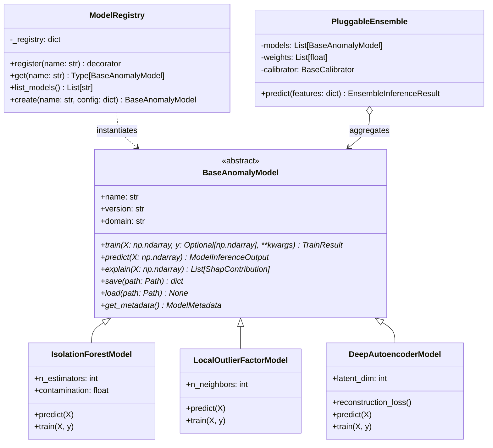

# 🧩 Pluggable Python ML Service Architecture (Open-Closed Extensibility)

> **Date:** September 5, 2026  
> **Status:** Architecture Specification & Implementation Standard  
> **Target Module:** `service/ml-service/core/`  

---

## 1. Problem Statement & Motivation

Currently, the ML service (`service/ml-service/app.py`, `grpc_server.py`, `lib/scoring.py`) hardcodes assumptions about model structure:
* It expects a specific dictionary schema containing `{"model_iforest", "model_lof", "scaler", "calibrator"}`.
* In order to test or deploy a new model (such as a Deep PyTorch Autoencoder, a Graph Neural Network, or an XGBoost classifier), an engineer must modify `_load_bundle`, `scoring.py`, `app.py`, `grpc_server.py`, and the protobuf mappings.
* This violates the **Open-Closed Principle (OCP)** (software entities should be open for extension, but closed for modification).

**The Solution:** Build a concrete, extensible base framework using the **Model Registry Pattern**, **Standardized Abstract Base Classes (ABC)**, and a **Pluggable Ensemble Pipeline**. Adding any new model in the future requires creating exactly one new file with zero modifications to existing serving or network code.

---

## 2. Architectural Blueprint



---

## 3. Core Interface Specifications

### 3.1. `BaseAnomalyModel` Abstract Contract
```python
# service/ml-service/core/base_model.py
from abc import ABC, abstractmethod
from dataclasses import dataclass, field
from pathlib import Path
from typing import Any, Dict, List, Optional
import numpy as np

@dataclass(frozen=True)
class ModelMetadata:
    name: str
    version: str
    domain: str
    feature_names: List[str]
    created_at: str
    model_type: str
    sha256: Optional[str] = None
    parameters: Dict[str, Any] = field(default_factory=dict)

@dataclass
class ModelInferenceOutput:
    raw_score: float             # Unbounded or model-native anomaly score
    normalized_score: float      # Standardized to [0.0, 1.0] or [0, 100]
    is_anomaly: bool             # Binary decision based on decision threshold
    confidence: float            # Predictive certainty [0.0, 1.0]
    metadata: Optional[Dict[str, Any]] = None

@dataclass
class FeatureAttribution:
    feature: str
    value: float
    contribution: float          # Impact on score (e.g. SHAP value)
    direction: str               # 'anomalous' or 'normal'

class BaseAnomalyModel(ABC):
    """
    Unified abstract base class for all anomaly detection models in HormuzWatch.
    Any new algorithmic paradigm must inherit from this base class.
    """
    def __init__(self, name: str, domain: str, version: str = "v1.0.0"):
        self.name = name
        self.domain = domain
        self.version = version
        self.is_fitted = False

    @abstractmethod
    def train(self, X: np.ndarray, y: Optional[np.ndarray] = None, **kwargs) -> Dict[str, Any]:
        """Fit model on feature matrix X. Optional labels y for semi-supervised training."""
        pass

    @abstractmethod
    def predict(self, X: np.ndarray) -> ModelInferenceOutput:
        """Execute single-sample or batch inference."""
        pass

    @abstractmethod
    def explain(self, X: np.ndarray) -> List[FeatureAttribution]:
        """Compute feature attribution explanations (SHAP / Gradients / Residuals)."""
        pass

    @abstractmethod
    def save(self, destination: Path) -> Path:
        """Persist model artifact to disk."""
        pass

    @abstractmethod
    def load(self, source: Path) -> None:
        """Deserialize model artifact from disk."""
        pass

    def get_metadata(self) -> ModelMetadata:
        """Return structured model metadata."""
        return ModelMetadata(
            name=self.name,
            version=self.version,
            domain=self.domain,
            feature_names=[],
            created_at="",
            model_type=self.__class__.__name__,
        )
```

### 3.2. Dynamic `ModelRegistry`
```python
# service/ml-service/core/registry.py
import importlib
import pkgutil
from pathlib import Path
from typing import Callable, Dict, Type
from core.base_model import BaseAnomalyModel

class ModelRegistry:
    """Thread-safe catalog of registered anomaly detection models."""
    _registry: Dict[str, Type[BaseAnomalyModel]] = {}

    @classmethod
    def register(cls, name: str) -> Callable[[Type[BaseAnomalyModel]], Type[BaseAnomalyModel]]:
        """Decorator to register a new model class."""
        def decorator(subclass: Type[BaseAnomalyModel]) -> Type[BaseAnomalyModel]:
            key = name.lower().strip()
            if key in cls._registry:
                raise ValueError(f"Model '{key}' already registered to {cls._registry[key]}")
            cls._registry[key] = subclass
            return subclass
        return decorator

    @classmethod
    def get(cls, name: str) -> Type[BaseAnomalyModel]:
        key = name.lower().strip()
        if key not in cls._registry:
            raise KeyError(f"Model '{key}' not found. Available: {list(cls._registry.keys())}")
        return cls._registry[key]

    @classmethod
    def auto_discover(cls, package_path: Path):
        """Dynamically load all model modules in package to trigger registration."""
        for _, module_name, _ in pkgutil.iter_modules([str(package_path)]):
            importlib.import_module(f"models.{module_name}")
```

### 3.3. How to Add a New Model (Example: PyTorch Autoencoder)
To introduce a new deep learning model to HormuzWatch, create `service/ml-service/models/autoencoder.py`:

```python
from core.base_model import BaseAnomalyModel, ModelInferenceOutput, FeatureAttribution
from core.registry import ModelRegistry
import numpy as np

@ModelRegistry.register("deep_autoencoder")
class DeepAutoencoderAnomalyModel(BaseAnomalyModel):
    def __init__(self, domain: str = "vessel", latent_dim: int = 6):
        super().__init__(name="deep_autoencoder", domain=domain)
        self.latent_dim = latent_dim
        # Initialize network architecture...

    def train(self, X: np.ndarray, y: Optional[np.ndarray] = None, **kwargs) -> dict:
        # Standard PyTorch training loop...
        self.is_fitted = True
        return {"epochs": 50, "final_loss": 0.012}

    def predict(self, X: np.ndarray) -> ModelInferenceOutput:
        # Forward pass -> compute reconstruction MSE loss ||x - x_hat||^2
        recon_loss = 0.045
        normalized = min(100.0, recon_loss * 1000.0)
        return ModelInferenceOutput(
            raw_score=recon_loss,
            normalized_score=normalized,
            is_anomaly=normalized > 60.0,
            confidence=0.92
        )

    def explain(self, X: np.ndarray):
        # Attribute anomaly to features with highest reconstruction error
        return []

    def save(self, destination): ...
    def load(self, source): ...
```
**Impact:** Zero lines of code changed in `app.py` or `grpc_server.py`. The model is immediately available via config!

---

## 4. Config-Driven Pluggable Ensemble

The ensemble composition is declared via JSON or YAML configuration:
```json
{
  "domain": "vessel",
  "calibrator": "isotonic",
  "aggregation": "weighted_average",
  "models": [
    { "type": "isolation_forest", "weight": 0.40, "path": "models/vessel_if.joblib" },
    { "type": "local_outlier_factor", "weight": 0.30, "path": "models/vessel_lof.joblib" },
    { "type": "deep_autoencoder", "weight": 0.30, "path": "models/vessel_ae.pt" }
  ]
}
```
The runtime automatically loads each model from the registry, executes inference concurrently or sequentially, applies probabilistic calibration, and returns the unified assessment.
