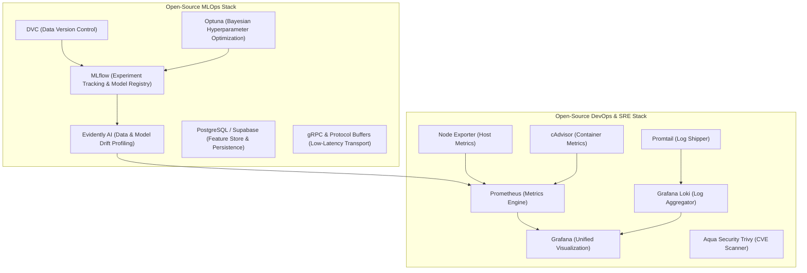
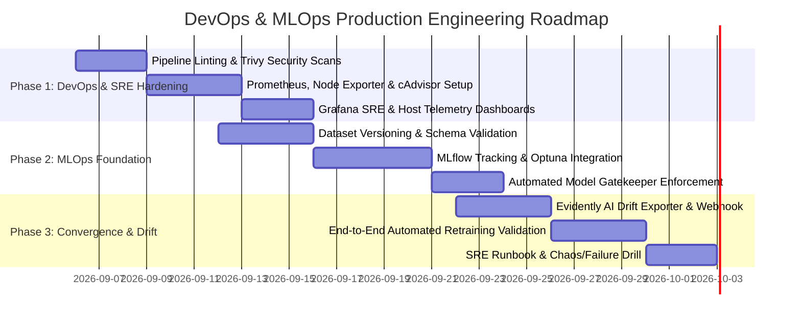

# DevOps & MLOps Dual-Track Engineering Mindmap & Planning Specification
## Production-Grade CI/CD/CT, Observability, Remote Monitoring & SRE Architecture

**Date**: September 2026  
**Status**: Planning Phase (Architectural Design & Blueprint)  
**Target Environment**: Dual-tier deployment (Local/Edge Workstation `tunkstun` & Multi-cloud/Cloudflare Edge)  
**Primary References**:
- *The DevOps Handbook (2nd Edition)* — Gene Kim, Jez Humble, Patrick Debois, John Willis, Nicole Forsgren
- *Designing Machine Learning Systems* — Chip Huyen
- [Production Requirements Specification](file:///run/media/tp24/SHARED1/Projects/HormuzWatch/books/PRODUCTION_DEVOPS_AND_MLOPS_PIPELINE_REQUIREMENTS.md)

---

## 1. Executive Summary & Dual-Track Separation

To achieve production-grade velocity, reliability, and maintainability, the infrastructure is bifurcated into two distinct, peer engineering tracks that converge in the production runtime mesh:

```
                               ┌────────────────────────────────────────────────────────┐
                               │           PRODUCTION RUNTIME & INGRESS MESH            │
                               │        (Cloudflare Tunnel ──► tunkstun Workstation)    │
                               └───────────────────────────┬────────────────────────────┘
                                                           │
                        ┌──────────────────────────────────┴──────────────────────────────────┐
                        ▼                                                                     ▼
         ┌──────────────────────────────┐                                      ┌──────────────────────────────┐
         │     TRACK 1: DEVOPS & SRE    │                                      │       TRACK 2: MLOPS & CT    │
         ├──────────────────────────────┤                                      ├──────────────────────────────┤
         │ • Code & Infrastructure      │                                      │ • Data, Models & Hyperparams │
         │ • Deterministic Logic        │                                      │ • Statistical & Probabilistic│
         │ • CI/CD Deployment Mesh      │                                      │ • Continuous Training (CT)   │
         │ • System Observability (APM) │                                      │ • Drift Monitoring & MLflow  │
         │ • Host Health & Remote SRE   │                                      │ • Model Quality Gatekeeper   │
         └──────────────────────────────┘                                      └──────────────────────────────┘
```

---

## 2. Assessment of Existing Pipelines & Infrastructure

### 2.1 Current State Audit

| Workflow File | Current Purpose | Strengths | Gaps & Technical Debt |
| :--- | :--- | :--- | :--- |
| [deploy.yml](file:///run/media/tp24/SHARED1/Projects/HormuzWatch/.github/workflows/deploy.yml) | Master Monolithic On-Prem Deploy | Validates Node, Go, Python; performs health checks; automated rollback to `PREV_COMMIT`. | Long build times; lacks Docker layer caching (`type=gha`); no vulnerability scanning before deploy. |
| [server-pipeline.yml](file:///run/media/tp24/SHARED1/Projects/HormuzWatch/.github/workflows/server-pipeline.yml) | Go API Backend CI/CD | Fast execution; targeted path filtering (`server/**`); automated SSH container rebuild. | Lacks race detector in CI; lacks container image vulnerability scan (Trivy); no metrics push to APM. |
| [ml-service-pipeline.yml](file:///run/media/tp24/SHARED1/Projects/HormuzWatch/.github/workflows/ml-service-pipeline.yml) | Python Inference Engine CI/CD | Path scoped; pytest execution; container recreation on `tunkstun`. | `pytest || true` masks test failures; does not verify gRPC protocol schema consistency before rollout. |
| [ml-continuous-training.yml](file:///run/media/tp24/SHARED1/Projects/HormuzWatch/.github/workflows/ml-continuous-training.yml) | MLOps Continuous Training (CT) | Automated weekly schedule + drift webhook trigger; executes Bayesian HPO; hot-reloads models. | Dataset snapshot not cryptographically tied to DVC/S3 in workflow; no model registry promotion state tracking. |
| [service-pipeline.yml](file:///run/media/tp24/SHARED1/Projects/HormuzWatch/.github/workflows/service-pipeline.yml) | Ingress & Cloudflared Sync | Validates YAML syntax; syncs config to `/etc/cloudflared/`. | Requires manual sudo permissions on host; lacks tunnel status probe check after service restart. |
| [client-pipeline.yml](file:///run/media/tp24/SHARED1/Projects/HormuzWatch/.github/workflows/client-pipeline.yml) | React Vite Frontend SPA | Typechecking and production Vite build; Vercel deployment capability. | Lacks end-to-end Playwright UI tests in pipeline; lacks automated Lighthouse performance budget gate. |

---

## 3. The Grand Architectural Mindmap

```text
===================================================================================================================
                                      HORMUZWATCH ENGINEERING MINDMAP
===================================================================================================================

├── 1. TRACK A: DEVOPS & SITE RELIABILITY ENGINEERING (SRE)
│   │
│   ├── A.1 Continuous Integration (CI - Flow & Quality)
│   │   ├── Linting & Formatting: gofmt, golangci-lint, biome check, ruff
│   │   ├── Security & DevSecOps: TruffleHog (Secrets), govulncheck, npm audit, Trivy (Container CVEs)
│   │   ├── Automated Test Pyramid: Unit tests (fast, parallel), Integration tests (DB + Redis mocks)
│   │   └── Build & Packaging: Multi-stage Dockerfiles, Docker Buildx with GitHub Actions cache (type=gha)
│   │
│   ├── A.2 Continuous Delivery & Deployment (CD - Low-Risk Releases)
│   │   ├── Target Host Architecture: Remote workstation 'tunkstun' (Ubuntu/Mint, Docker 29, NVIDIA GPU)
│   │   ├── Deployment Transport: Appleboy SSH Action with Ed25519 authentication
│   │   ├── Release Strategies: Rolling container restart with health gate (15 attempts x 3s = 45s window)
│   │   └── Safety Mechanisms: Pre-deploy commit capture (PREV_COMMIT), automated rollback on health probe failure
│   │
│   └── A.3 Remote Host Observability & Monitoring (SRE Feedback)
│       ├── Node Level Metrics: Prometheus Node Exporter (:9100) -> CPU, RAM, NVMe I/O, Disk, Thermal
│       ├── Container Level Metrics: Google cAdvisor (:8080) -> Per-container CPU/Memory quotas, restarts
│       ├── Service Telemetry: Go Backend Prometheus metrics (:10020/metrics) -> HTTP latencies, WS drops
│       ├── Central Dashboards: Grafana (:3001) with alerting rules
│       ├── Centralized Log Aggregation: Grafana Loki + Promtail for structured container logs
│       └── Site Reliability Engineering (SRE):
│           ├── SLI/SLO Framework: API 99.9% uptime, p95 latency <= 50ms, WS drop rate < 0.01%
│           └── Error Budget & Andon Cord: Block CD deployments if error budget < 10%
│
└── 2. TRACK B: MACHINE LEARNING OPERATIONS (MLOPS)
    │
    ├── B.1 DataOps & Feature Engineering Pipeline
    │   ├── Ingestion & Extraction: Real-time AIS/ADS-B + historical Supabase PostgreSQL pooling
    │   ├── Data Contracts & Validation: Schema enforcement, range validation, null assertions
    │   ├── Leakage Prevention: Strict Chronological Splitting (Train 70%, Val 15%, Test 15%) + Lookback Warmup
    │   └── Versioning & Storage: Snappy Parquet exports + DVC (Data Version Control) with SHA-256 metadata
    │
    ├── B.2 Experimentation, Tracking & Continuous Training (CT)
    │   ├── Experiment Management: MLflow Tracking Server (runs, hyperparameters, loss curves, artifacts)
    │   ├── Automated HPO: Optuna Bayesian Hyperparameter Optimization (contamination, tree depth)
    │   ├── Candidate Benchmarking: Offline evaluation against historical golden test slices
    │   └── Triggering Mechanisms:
    │       ├── 1. Schedule: Weekly cron (Sundays at 02:00 UTC)
    │       ├── 2. Event-Driven: repository_dispatch [data-drift-detected]
    │       └── 3. Manual: workflow_dispatch with domain selection (all, vessel, aircraft)
    │
    ├── B.3 Model Registry & Quality Gatekeeping
    │   ├── Model Registry Stages: Candidate -> Staging -> Champion (Production) -> Archived
    │   ├── Packaged Artifact Bundle: Model weights, fitted scalers, TreeSHAP explainer, metadata.json
    │   └── Quality Gatekeeper Assertion (Hard Gate):
    │       ├── Metric 1: PR-AUC >= 0.90
    │       ├── Metric 2: False Positive Rate <= 0.05
    │       ├── Metric 3: Dual-path inference p95 latency <= 12ms
    │       └── Metric 4: Must meet or exceed incumbent Champion score
    │
    └── B.4 Model Deployment, Serving & Drift Feedback Loop
        ├── Serving Protocol: Dual-interface Python service (FastAPI :8090 for REST, gRPC :8091 for streaming)
        ├── High-Availability Integration: Go Backend 3-state Circuit Breaker (CLOSED -> OPEN -> HALF-OPEN)
        ├── Zero-Downtime Hot-Reload: POST /models/reload for atomic pointer swap in memory
        ├── Drift Detection Telemetry:
        │   ├── Covariate Drift: Population Stability Index (PSI) & Wasserstein distance on sensor inputs
        │   ├── Concept Drift: Prediction probability distribution shifts
        │   └── Tooling: Evidently AI / Prometheus drift metrics exporter
        └── Autonomous Retraining Trigger: Drift alerts dispatch automated GitHub Actions CT workflow
===================================================================================================================
```

---

## 4. Open-Source Toolchain Architecture

To ensure zero vendor lock-in and production grade reliability, we select established open-source tools:



### Tool Allocation Matrix:

| Operational Need | Selected Open-Source Tool | Rationale & Trade-offs |
| :--- | :--- | :--- |
| **Host Telemetry** | `prometheus/node_exporter` | Lightweight, zero-overhead C/Go binary exposing CPU, memory, NVMe disk I/O, network. |
| **Container Telemetry** | `google/cadvisor` | Direct integration with Docker engine socket; measures per-container resource throttling. |
| **Unified Visualization** | `grafana/grafana` | Industry-standard dashboarding for both systems telemetry and MLOps drift metrics. |
| **Log Management** | `grafana/loki` + `promtail` | LogQL syntax identical to PromQL; indexes metadata rather than full text, lowering memory cost. |
| **Security Scanning** | `aquasecurity/trivy` | Fast vulnerability scanner for OS packages and container layers; integrates natively into GitHub Actions. |
| **Experiment Tracking** | `mlflow/mlflow` | Model registry, experiment tracking, and artifact logging with minimal operational footprint. |
| **Hyperparameter Search**| `optuna/optuna` | State-of-the-art Bayesian TPE sampler with early stopping pruning for rapid convergence. |
| **Drift Detection** | `evidentlyai/evidently` | Production calculation of PSI, KS-tests, Wasserstein distance, and statistical data profiling. |

---

## 5. Remote Host (`tunkstun`) Observability & Monitoring Plan

The remote deployment server `tunkstun` is the production edge node. It requires dedicated observability services running alongside the application containers.

### 5.1 Remote Monitoring Docker Compose Overlay (`docker-compose.monitoring.yml`)

```yaml
version: '3.8'

services:
  # Host hardware & OS metrics
  node-exporter:
    image: prom/node-exporter:latest
    container_name: hormuzwatch-node-exporter
    restart: unless-stopped
    volumes:
      - /proc:/host/proc:ro
      - /sys:/host/sys:ro
      - /:/rootfs:ro
    command:
      - '--path.procfs=/host/proc'
      - '--path.rootfs=/rootfs'
      - '--path.sysfs=/host/sys'
      - '--collector.filesystem.mount-points-exclude=^/(sys|proc|dev|host|etc)($$|/)'
    ports:
      - "127.0.0.1:9100:9100"
    networks:
      - hormuzwatch-monitoring

  # Container memory, CPU & network metrics
  cadvisor:
    image: gcr.io/cadvisor/cadvisor:latest
    container_name: hormuzwatch-cadvisor
    restart: unless-stopped
    volumes:
      - /:/rootfs:ro
      - /var/run:/var/run:ro
      - /sys:/sys:ro
      - /var/lib/docker/:/var/lib/docker:ro
      - /dev/disk/:/dev/disk:ro
    ports:
      - "127.0.0.1:8080:8080"
    networks:
      - hormuzwatch-monitoring

  # Prometheus metrics store
  prometheus:
    image: prom/prometheus:latest
    container_name: hormuzwatch-prometheus
    restart: unless-stopped
    volumes:
      - ./service/monitoring/prometheus.yml:/etc/prometheus/prometheus.yml:ro
      - prometheus_data:/prometheus
    ports:
      - "127.0.0.1:9090:9090"
    networks:
      - hormuzwatch-monitoring
      - hormuzwatch-dev

  # Grafana dashboard
  grafana:
    image: grafana/grafana:latest
    container_name: hormuzwatch-grafana
    restart: unless-stopped
    environment:
      - GF_SECURITY_ADMIN_PASSWORD=${GRAFANA_ADMIN_PASSWORD:-admin}
    volumes:
      - grafana_data:/var/lib/grafana
      - ./service/monitoring/dashboards:/etc/grafana/provisioning/dashboards
    ports:
      - "127.0.0.1:3001:3000"
    networks:
      - hormuzwatch-monitoring

networks:
  hormuzwatch-monitoring:
    driver: bridge
  hormuzwatch-dev:
    external: true

volumes:
  prometheus_data:
  grafana_data:
```

---

## 6. SRE Framework: SLI, SLO, SLA & Error Budgets

To align engineering effort with system resilience, we define concrete service level objectives:

### 6.1 Service Level Indicators (SLIs) & Objectives (SLOs)

| Service Domain | Service Level Indicator (SLI) | Target (SLO) | Measurement Method |
| :--- | :--- | :--- | :--- |
| **Go API Gateway** | Success rate of non-5xx requests | $\ge 99.9\%$ over 30 days | `sum(rate(http_requests_total{status!~"5.."}[5m])) / sum(rate(http_requests_total[5m]))` |
| **Go API Latency** | Request duration for `/api/v1/tracks` | $p95 \le 50\text{ ms}$ | `histogram_quantile(0.95, rate(http_request_duration_seconds_bucket[5m]))` |
| **WebSocket Hub** | Ingestion-to-broadcast drop rate | $< 0.01\%$ dropped frames | `rate(ws_messages_dropped_total[5m]) / rate(ws_messages_received_total[5m])` |
| **ML Inference Mesh** | gRPC dual-path inference response | $p95 \le 12\text{ ms}$ | `histogram_quantile(0.95, rate(grpc_inference_duration_seconds_bucket[5m]))` |
| **ML Reliability** | Circuit breaker availability | $100\%$ uptime (closed or fallback) | `rate(circuit_breaker_trips_total[1h]) == 0` |
| **ML Drift Tolerance** | Population Stability Index (PSI) | $\text{PSI} \le 0.20$ | Weekly drift evaluation batch job |

### 6.2 Error Budget Policy (The Andon Cord)
* Each service is allocated an **Error Budget** equal to $1 - \text{SLO}$ (e.g., $0.1\%$ monthly budget for the API Gateway).
* **Policy**:
  1. If $>50\%$ of the monthly error budget is burned within 48 hours, deployments to `production-ready` are paused for non-critical features.
  2. If the error budget is exhausted ($100\%$ burned), all feature work halts, and engineering shifts entirely to reliability, root-cause remediation, and test hardening.

---

## 7. Phased Implementation Roadmap



### Phase 1: DevOps & SRE Core (Week 1)
- Deploy `docker-compose.monitoring.yml` on `tunkstun` to enable node, container, and API telemetry.
- Add Trivy container security scans and `govulncheck` to GitHub Actions pipelines.
- Standardize health probes across all services.

### Phase 2: MLOps Foundation & Model Governance (Week 2)
- Deploy MLflow tracking server on `tunkstun` for experiment logging.
- Codify automated dataset generation into reproducible DVC/Parquet steps.
- Implement strict Gatekeeper assertions in `pipeline/deploy_candidate.py`.

### Phase 3: Observability Convergence & Drift-Driven Retraining (Week 3)
- Connect Evidently AI drift detection metrics into Prometheus.
- Verify autonomous GitHub Actions trigger on drift detection (`repository_dispatch`).
- Codify blameless incident runbooks and verify zero-downtime rollback capabilities.
