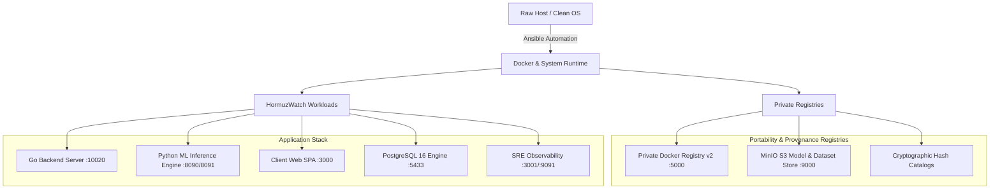

# 🌐 HormuzWatch System Portability & Cold-Start Framework

> **Mission**: Guarantee that the entire HormuzWatch intelligence & surveillance platform can be cleanly migrated, provisioned, and deployed on **any physical or virtual machine** (Ubuntu, Debian, cloud VMs, local workstations) in under 5 minutes with zero configuration drift.

---

## 🏗️ Architecture Overview

The portability layer consists of four interlocking subsystems:



---

## 📑 Portability Documentation Index

| Guide | Description | Primary Tooling |
| :--- | :--- | :--- |
| [**ANSIBLE_QUICKSTART.md**](./ANSIBLE_QUICKSTART.md) | Single-command server bootstrapping on any node | Ansible 2.16+, `deploy_portable.sh` |
| [**DOCKER_REGISTRY.md**](./DOCKER_REGISTRY.md) | Private Docker v2 registry deployment and image distribution | Docker Registry v2, `scripts/registry/` |
| [**MODEL_REGISTRY.md**](./MODEL_REGISTRY.md) | ML model versioning, staging, and S3 artifact registry | MinIO, `scripts/model_registry.py` |
| [**DATASET_REGISTRY.md**](./DATASET_REGISTRY.md) | Maritime & aviation telemetry dataset versioning | SHA256 catalogs, `scripts/dataset_registry.py` |
| [**COLD_START_RUNBOOK.md**](./COLD_START_RUNBOOK.md) | Emergency recovery & cold start SOP from blank hardware | Complete step-by-step checklist |

---

## 🚀 Quick Commands Cheat Sheet

### 1. Fresh Node Bootstrapping (Ansible)
```bash
# Bootstrap remote server (e.g. 192.168.1.51)
./ansible/deploy_portable.sh --target 192.168.1.51 --user yahya --key ~/.ssh/id_ed25519_tnkstn

# Bootstrap current workstation locally
./ansible/deploy_portable.sh --local
```

### 2. Private Registries (Docker & MinIO)
```bash
# Launch registries (Docker :5000, MinIO :9000/:9001)
./scripts/registry/registry_ctl.sh start

# Build and push images to private registry
./scripts/registry/push_images.sh localhost:5000

# Pull images from private registry
./scripts/registry/pull_images.sh localhost:5000
```

### 3. ML Models & Datasets
```bash
# Audit and verify ML model cryptographic hashes
python3 scripts/model_registry.py verify

# Audit and verify dataset hashes
python3 scripts/dataset_registry.py list
python3 scripts/dataset_registry.py verify dataset_vessel_20260902_2200_20260903_2200
```

### 4. Health Verification
```bash
# Execute SRE health audit
./service/sre/sre.sh health
```
