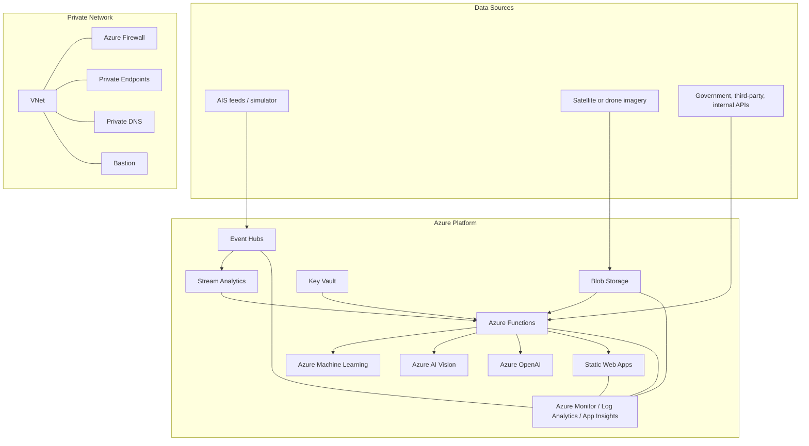

# Architecture Diagram

```mermaid
flowchart TB
  subgraph Edge["Data Sources"]
    AIS["AIS feeds / simulator"]
    SAT["Satellite or drone imagery"]
    API["Government, third-party, internal APIs"]
  end

  subgraph Azure["Azure Platform"]
    EH["Event Hubs"]
    ST["Blob Storage"]
    ASA["Stream Analytics"]
    FN["Azure Functions"]
    KV["Key Vault"]
    ML["Azure Machine Learning"]
    CV["Azure AI Vision"]
    AOAI["Azure OpenAI"]
    SWA["Static Web Apps"]
    MON["Azure Monitor / Log Analytics / App Insights"]
  end

  subgraph Network["Private Network"]
    VNET["VNet"]
    FW["Azure Firewall"]
    PE["Private Endpoints"]
    DNS["Private DNS"]
    BAS["Bastion"]
  end

  AIS --> EH --> ASA --> FN
  SAT --> ST --> FN
  API --> FN
  FN --> ML
  FN --> CV
  FN --> AOAI
  FN --> SWA
  KV --> FN
  EH --- MON
  ST --- MON
  FN --- MON
  SWA --- MON
  VNET --- FW
  VNET --- PE
  VNET --- DNS
  VNET --- BAS
```
