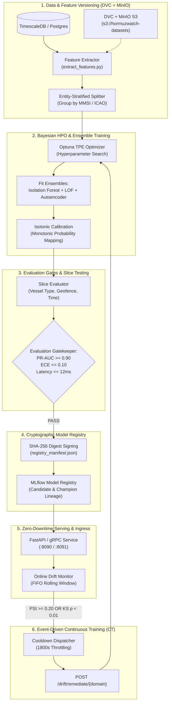
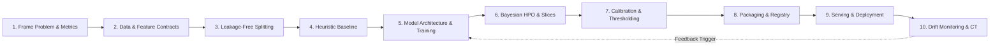

# 📘 MLOps Architecture & Lifecycle — HormuzWatch

## 1. Executive Overview
In real-time maritime and geospatial intelligence systems like **HormuzWatch**, machine learning models operate in non-stationary, adversarial environments. Maritime traffic patterns shift due to geopolitical escalations, GPS spoofing, AIS transponder disabling ("dark vessels"), seasonal shamal winds, and commercial rerouting around the Strait of Hormuz. Traditional "train-once, deploy-forever" ML paradigms fail catastrophically in such settings due to **concept drift** and **data drift**.

**MLOps (Machine Learning Operations)** bridges the chasm between ML development and production operations. It enforces software engineering discipline (CI/CD, version control, cryptographic gating, testing) onto data engineering and machine learning workflows, yielding an autonomous, self-healing continuous training loop.

---

## 2. The 6-Pillar Closed-Loop Architecture



---

## 3. Deep-Dive: The Six Pillars

### Pillar 1: Data & Feature Versioning (DVC + MinIO S3)
- **Immutable Storage**: Raw observations (AIS maritime or ADS-B radar) are snapshot into Apache Parquet matrices. Datasets are versioned with **DVC** and stored on self-hosted **MinIO S3** (`s3://hormuzwatch-datasets`).
- **Data Leakage Elimination via Entity Stratification**: Random train/test splits corrupt time-series models because consecutive pings of the same vessel leak between folds. Splits are strictly grouped by `MMSI` (vessels) and `ICAO_HEX` (aircraft):
  - **Train (60%)**: Fits Isolation Forests, LOF, and deep autoencoders.
  - **Validation (15%)**: Guides Optuna objective evaluation.
  - **Calibration (15%)**: Monotonically maps anomaly outputs to probabilities.
  - **Test (10%)**: Out-of-sample holdout for strict promotion gating.

### Pillar 2: Bayesian HPO & Deep Autoencoder Training
- **Optuna TPE Optimization**: Automatically searches the hyperparameter landscape:
  - Estimator count ($50 \to 200$)
  - Contamination factor ($0.01 \to 0.10$)
  - Subsampling ratio ($0.5 \to 1.0$)
- **Corridor Reconstruction Autoencoder**: Unsupervised deep neural network trained strictly on nominal corridor transits. Anomaly scores are derived from Mean Squared Reconstruction Error ($MSE > \text{Threshold}_{p95}$).
- **Isotonic Probability Calibration**: Uncalibrated tree path lengths are mapped into true probabilities ($P \in [0.0, 1.0]$) via non-parametric monotonic step functions.

### Pillar 3: Fine-Grained Slice Evaluation
Aggregate metrics (global ROC-AUC) mask failures in critical operational pockets.
- Evaluates models across three critical sub-populations:
  1. **Entity Slice**: Tankers vs Cargo vs Military vs Fishing.
  2. **Geofence Slice**: Strait of Hormuz vs Bab el-Mandeb vs Malacca Strait.
  3. **Temporal Slice**: Nighttime loitering vs Daytime transit.
- **Strict Quality Gating**: A candidate model is rejected if any critical slice degrades, regardless of aggregate score.

### Pillar 4: Cryptographic Model Registry
- **SHA-256 Digesting**: Every candidate artifact is digested and recorded in `service/ml-service/models/registry_manifest.json`.
- **Fail-Closed Loading Guard (`CODE-02`)**: The serving container verifies the artifact's SHA-256 checksum before execution:
  ```python
  computed_sha = hashlib.sha256(artifact_path.read_bytes()).hexdigest()
  if computed_sha != expected_manifest_sha:
      raise ValueError(f"Integrity check failed for {model_name}!")
  model = joblib.load(artifact_path)
  ```

### Pillar 5: Zero-Downtime Serving & Hot-Reloading
- **Dual Transport**:
  - **gRPC (`:8091`)**: High-throughput protobuf stream for live Go server pipeline processing ($\le 2\text{ms}$ latency).
  - **REST (`:8090`)**: Administrative queries, drift health reports, and CT triggers.
- **Atomic Hot-Reload**: Live model pointers are swapped in-memory under mutex lock via `POST /api/models/reload`, eliminating 502/503 windows during weights refreshment.

### Pillar 6: Real-Time Drift Detection & Event-Driven CT Loop
- **Statistical Tests**:
  - **Population Stability Index (PSI)**: $PSI \ge 0.20$ signals severe distributional shift.
  - **Kolmogorov-Smirnov (KS) Test**: Two-sample test rejecting identical distributions when $p\text{-value} < 0.01$.
- **Cooldown-Throttled Automated Retraining**:
  - Critical drift triggers the background dispatcher (`remediation_cooldown_seconds=1800`).
  - Calls `POST /drift/remediate/{domain}` to launch an asynchronous continuous training cycle (`mlops/pipeline/orchestrator.py`), automatically validating and promoting the replacement champion model.

---

## 4. Production MLOps Execution Runbook

```bash
# 1. Verify cryptographic integrity of all 9 registered models
python3 scripts/model_registry.py verify

# 2. Extract features and train with Optuna Bayesian optimization
python3 mlops/pipeline/train_and_evaluate.py vessel

# 3. Train the semi-supervised corridor autoencoder
python3 mlops/pipeline/train_autoencoder.py

# 4. Run fine-grained slice evaluation
python3 mlops/models/evaluations/slice_evaluator.py

# 5. Evaluate real-time statistical drift per domain
curl -s http://localhost:8090/drift/evaluate/vessel | jq .

# 6. Manually trigger an event-driven continuous training remediation cycle
curl -X POST http://localhost:8090/drift/remediate/vessel | jq .
```

---

## 5. The 10-Step Universal Blueprint: How to Build Any Production ML Model

This standardized 10-step engineering lifecycle translates operational objectives into resilient, calibrated mathematical models in production.



### Step 1: Problem Framing & Metric Selection
- Determine the learning paradigm: Supervised (Classification/Regression), Unsupervised (Density/Outlier), or Self-Supervised (Autoencoders).
- Align business risk with mathematical loss: On imbalanced datasets, reject raw Accuracy; optimize **Precision-Recall AUC (PR-AUC)**, **Brier Score**, and **Expected Calibration Error (ECE)**.

### Step 2: Data Engineering & Schema Contracts
- Enforce strict Pydantic schemas specifying allowed numeric ranges, physical units, and non-null invariants before ingestion.
- Standardize features ($\frac{x - \mu}{\sigma}$) and encode categorical metadata canonically.

### Step 3: Leakage-Free Data Splitting
- Never use random k-fold splits on temporal or entity telemetry.
- Execute entity-stratified 4-way splits grouped by entity identity (`MMSI` / `ICAO_HEX`):
  - **Train (60%)**: Fits model parameters.
  - **Validation (15%)**: Guides hyperparameter search and early stopping.
  - **Calibration (15%)**: Fits non-parametric probability calibrators on unseen scores.
  - **Test (10%)**: Strictly held out for final gate verification.

### Step 4: Simple Heuristic Baseline
- Before training complex architectures, establish a rule-based or linear benchmark.
- Complex ML models must decisively outperform heuristic rules to justify deployment and operational maintenance.

### Step 5: Model Family Selection & Training
- Select model families suited to the data geometry:
  - Tabular features $\to$ Gradient Boosted Trees (XGBoost/LightGBM) or Isolation Forests.
  - Spatial Corridors $\to$ Deep Manifold Reconstruction Autoencoders ($MSE$).
  - High-dimensional Density $\to$ Local Outlier Factor ($k$-NN reachability).

### Step 6: Bayesian Hyperparameter Optimization & Slice Testing
- Employ Tree-structured Parzen Estimator (TPE) via Optuna to optimize hyperparameters under multi-objective constraints.
- Evaluate candidate models across fine-grained operational slices (e.g. speed tiers, night vs day, restricted zones) to prevent localized degradation.

### Step 7: Probability Calibration & Threshold Tuning
- Uncalibrated tree decision margins must be transformed into true posterior probabilities ($P \in [0.0, 1.0]$) via Isotonic Regression.
- Tune decision thresholds based on real operational costs of False Positives vs False Negatives.

### Step 8: Serialization, Metadata & Cryptographic Registry
- Package weights, scalers, and feature schemas into immutable artifacts (`.joblib` / `ONNX`).
- Compute and verify SHA-256 cryptographic digests in a central registry manifest.

### Step 9: Low-Latency Serving & Zero-Downtime Hot-Reloading
- Serve via dual transport: gRPC for sub-millisecond stream processing, REST for management.
- Implement thread-safe in-memory pointer swapping (`POST /api/models/reload`) to eliminate downtime during weight refreshes.

### Step 10: Drift Monitoring & Automated Continuous Training (CT)
- Track distribution shifts in real-time via Population Stability Index ($PSI \ge 0.20$) and Kolmogorov-Smirnov tests ($p < 0.01$).
- Automatically trigger asynchronous retraining cycles to restore performance when severe drift occurs.

