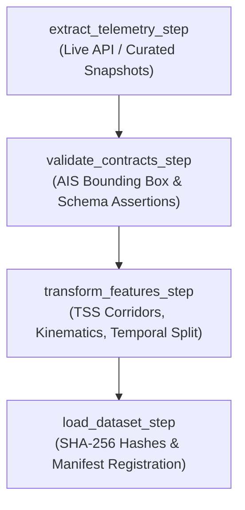
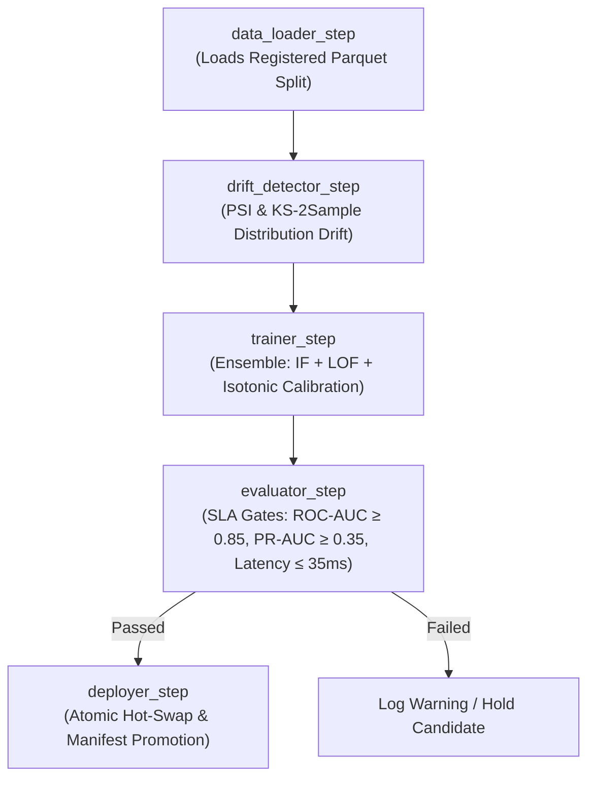

# ⚡ Pipeline Orchestration with ZenML — HormuzWatch MLOps & ETL

## 1. Why ZenML?
Many workflow orchestrators (Airflow, Kubeflow, Luigi) enforce vendor lock-in with complex YAML DSLs, rigid task graphs, or low-level Kubernetes CRDs.
**ZenML** provides an extensible, Python-first pipeline framework perfectly aligned with HormuzWatch's mission-critical maritime/aviation tracking needs:
- **Code Portability**: The exact same pipeline code runs seamlessly in local development, inside Docker Compose/Podman microservices, or in remote Kubernetes clusters without altering step logic.
- **Stack Decoupling**: Orchestration, artifact storage, experiment tracking, and model registries are configured as swappable components in an active "Stack".
- **Contract Enforcement & Quality Gates**: Integrates directly with schema assertion data contracts (Huyen Ch. 3) and sub-population slice evaluators (Huyen Ch. 6) to prevent data corruption and aggregate metric masking (Simpson's Paradox).
- **Graceful Fallback Execution**: HormuzWatch includes `zenml_compat.py`, enabling pipelines to execute natively on a provisioned ZenML Stack OR in zero-dependency standalone mode during air-gapped CI/CD builds or offline edge deployments.

---

## 2. The ZenML Stack Architecture
```
ZenML Stack: "hormuzwatch-stack"
├── Orchestrator:        Local / Docker / Podman
├── Artifact Store:      MinIO S3 (s3://hormuzwatch-models) or Local Parquet Storage
├── Experiment Tracker:  MLflow Tracking Server (http://localhost:5001)
└── Model Registry:      MLflow Model Registry / HormuzWatch Atomic Registry
```

---

## 3. Pipeline Topologies

### A. Data Engineering & ETL Pipeline (`hormuz_etl_pipeline`)
Encapsulates real-time telemetry extraction, contract validation, kinematic feature engineering, and cryptographic persistence:



### B. Continuous Training (CT) & Drift Pipeline (`hormuz_continuous_training_pipeline`)
Monitors feature distribution shifts and trains calibrated anomaly models:



### C. Unified End-to-End MLOps Pipeline (`hormuz_e2e_pipeline`)
Coordinates the entire lifecycle in a single automated graph:
```
[Extract] ➔ [Validate Contracts] ➔ [Transform & Chokepoints] ➔ [Persist & Hash]
    ➔ [Drift Check] ➔ [Train Ensemble] ➔ [SLA Gate Evaluation] ➔ [Promote to Production]
```

---

## 4. ZenML Step Implementation Directory
All steps and pipelines are versioned under `mlops/pipeline/zenml/`:
- **Compatibility Layer**: [`mlops/pipeline/zenml/zenml_compat.py`](file:///home/yahya/SHARED/Projects/HormuzWatch/mlops/pipeline/zenml/zenml_compat.py)
- **ETL Steps**: [`mlops/pipeline/zenml/steps/etl_steps.py`](file:///home/yahya/SHARED/Projects/HormuzWatch/mlops/pipeline/zenml/steps/etl_steps.py)
- **Data Ingestion Step**: [`mlops/pipeline/zenml/steps/data_loader_step.py`](file:///home/yahya/SHARED/Projects/HormuzWatch/mlops/pipeline/zenml/steps/data_loader_step.py)
- **Drift Detection Step**: [`mlops/pipeline/zenml/steps/drift_detector_step.py`](file:///home/yahya/SHARED/Projects/HormuzWatch/mlops/pipeline/zenml/steps/drift_detector_step.py)
- **Trainer Step**: [`mlops/pipeline/zenml/steps/trainer_step.py`](file:///home/yahya/SHARED/Projects/HormuzWatch/mlops/pipeline/zenml/steps/trainer_step.py)
- **Evaluator Step**: [`mlops/pipeline/zenml/steps/evaluator_step.py`](file:///home/yahya/SHARED/Projects/HormuzWatch/mlops/pipeline/zenml/steps/evaluator_step.py)
- **Deployer Step**: [`mlops/pipeline/zenml/steps/deployer_step.py`](file:///home/yahya/SHARED/Projects/HormuzWatch/mlops/pipeline/zenml/steps/deployer_step.py)
- **Pipelines**:
  - [`mlops/pipeline/zenml/pipelines/etl_pipeline.py`](file:///home/yahya/SHARED/Projects/HormuzWatch/mlops/pipeline/zenml/pipelines/etl_pipeline.py)
  - [`mlops/pipeline/zenml/pipelines/continuous_training_pipeline.py`](file:///home/yahya/SHARED/Projects/HormuzWatch/mlops/pipeline/zenml/pipelines/continuous_training_pipeline.py)
  - [`mlops/pipeline/zenml/pipelines/e2e_pipeline.py`](file:///home/yahya/SHARED/Projects/HormuzWatch/mlops/pipeline/zenml/pipelines/e2e_pipeline.py)
  - [`mlops/pipeline/zenml/pipelines/hormuz_pipeline.py`](file:///home/yahya/SHARED/Projects/HormuzWatch/mlops/pipeline/zenml/pipelines/hormuz_pipeline.py)
- **Unified CLI Runner**: [`mlops/pipeline/zenml/run.py`](file:///home/yahya/SHARED/Projects/HormuzWatch/mlops/pipeline/zenml/run.py)

---

## 5. Execution & CLI Commands

### 1. Unified ZenML CLI Runner
```bash
# Run Telemetry ETL Pipeline for Vessels
python -m mlops.pipeline.zenml.run --pipeline etl --domain vessel

# Run Telemetry ETL Pipeline for Aviation
python -m mlops.pipeline.zenml.run --pipeline etl --domain aviation

# Run Continuous Training & Drift Monitoring Pipeline
python -m mlops.pipeline.zenml.run --pipeline train --domain vessel

# Run Complete End-to-End Pipeline (ETL + CT + Promotion)
python -m mlops.pipeline.zenml.run --pipeline e2e --domain vessel
```

### 2. Native ETL Tool Integration
```bash
# Execute ETL with ZenML Orchestration Flag
python mlops/etl/pipeline.py --domain vessel --zenml

# Via Dataset Tool
python mlops/dataset_tool.py zenml-etl --domain vessel
```

### 3. Model Management Integration
```bash
# Trigger ZenML Continuous Training via Model Tool
python mlops/model_tool.py zenml-train --domain vessel

# Trigger ZenML End-to-End Pipeline
python mlops/model_tool.py zenml-e2e --domain vessel
```

---

## 6. Stack Provisioning Script
To provision a fully cloud-native or local stack with MinIO and MLflow:
```bash
bash mlops/pipeline/zenml/setup_zenml_stack.sh
```
This registers:
- `minio-store`: S3 artifact store pointing to `s3://hormuzwatch-models`
- `mlflow-tracker`: Experiment tracker hooked to MLflow Tracking Server (`http://localhost:5001`)
- `mlflow-registry`: Model registry for champion/challenger governance
- `hormuzwatch-stack`: Sets the active stack configuration
