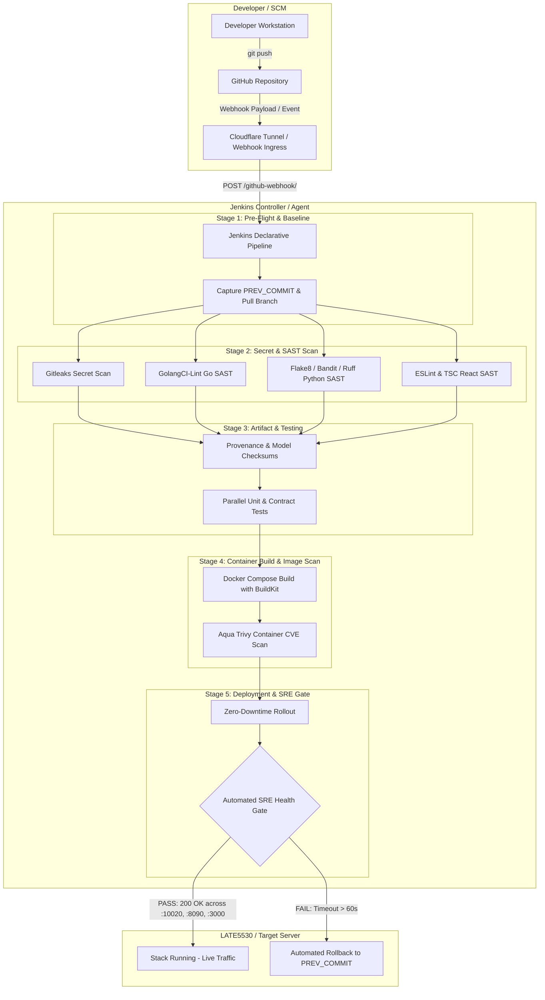

# Module 06: DevOps CI/CD Architecture & Pipeline Design

## 1. Executive Summary & Philosophy
In maritime intelligence systems like **HormuzWatch**, where geopolitical anomaly detection, vessel AIS telemetry, and live situational maps are ingested round the clock, service downtime or software regressions can jeopardize maritime situational awareness.

A **Production-Ready DevOps CI/CD Pipeline** enforces the principle of *Continuous Verification*:
- **Fail Fast**: Syntax errors, unit regressions, and code smells are detected within seconds of git push.
- **Shift-Left Security**: Secret scanning and container vulnerability CVE assessments are performed *before* artifacts are deployed.
- **Deterministic Artifacts**: Cryptographic hashes (SHA256) verify ML weights, DVC data versions, and container image layers.
- **Zero-Downtime Rollouts**: Traffic is shifted only when automated SRE health gates assert 100% service readiness.
- **Automated Rollback Safeguards**: On health probe failure, the pipeline automatically reverts the state to the previous working git commit.

---

## 2. End-to-End CI/CD Architecture

---

## 3. Core Components of HormuzWatch DevOps

| Tier | Technology | Purpose | Gate Criteria |
| :--- | :--- | :--- | :--- |
| **Pipeline Runner** | Jenkins LTS (JDK17) | Orchestrates declarative stages, parallel jobs, and post-actions | Timeout 35m, 0 unhandled failures |
| **Secret Scanning** | Gitleaks | Scans commit history & file tree for API keys, passwords, private keys | 0 leaks tolerated |
| **Go Static Analysis** | `golangci-lint` / `go vet` | Detects race conditions, shadow variables, unhandled errors | Exit code 0 |
| **Python Static Analysis** | `bandit`, `flake8`, `ruff` | AST vulnerability detection, security smells, PEP8 linting | High/Medium severity 0 |
| **Frontend SAST** | ESLint & TypeScript compiler | Type safety, dead code analysis, bundle validation | Exit code 0 |
| **Artifact Integrity** | Python SHA256 Registry | Cryptographic validation of ML model binaries & DVC data | Hash match |
| **Container Scanner** | Aqua Security Trivy | Scans OS packages (Debian/Alpine) and app dependencies for CVEs | 0 fixable CRITICAL CVEs |
| **Deployment Engine**| Docker Compose / Podman Quadlets | Manages container lifecycle, network isolation, persistent volumes | Zero-downtime recreation |
| **Health Probes** | Automated SRE Curl Loop | Probes `/health/live`, `/health`, and frontend root endpoint | 20 consecutive checks |

---

## 4. Key Takeaways for DevOps Engineers
1. **Never skip local pre-commit checks**: CI should be a validation gate, not a surprise detector.
2. **Treat Pipeline-as-Code with the same rigor as application code**: Maintain `Jenkinsfile` in version control.
3. **Decouple Build from Deploy**: Building container images and scanning them must happen *before* touching running production workloads.
