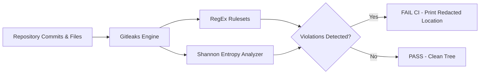

# Module 08: Container Security, Vulnerability Scanning (Trivy) & Secret Detection (Gitleaks)

## 1. The Container Supply Chain Threat Model
Deploying containerized microservices introduces attack surfaces across multiple layers:
1. **Base OS Vulnerabilities**: Outdated packages in Debian/Alpine base images (e.g. `glibc`, `openssl`, `libcrypto` CVEs).
2. **Language Runtime & Dependencies**: Vulnerable third-party libraries (`requests`, `gin-gonic`, `axios`, `numpy`).
3. **Misconfigurations**: Running as `root`, mounting sensitive host paths, or exposing internal debug ports.
4. **Credential Leaks**: Hardcoded API keys, JWT tokens, Supabase service keys, or private SSH keys committed to git history.

---

## 2. Secret Detection with Gitleaks

### How Gitleaks Works:
Gitleaks uses regular expressions, Shannon entropy scoring, and commit diff analysis to find secret patterns (AWS keys, GitHub tokens, database connection strings, JWTs) across the entire git commit graph.



### Running Gitleaks in Pipeline:
```bash
gitleaks detect --source . --verbose --no-git
```
*Fallback in containerized agent:*
```bash
docker run --rm -v "$(pwd):/path" zricethezav/gitleaks:latest detect --source=/path --verbose
```

---

## 3. Container Vulnerability Scanning with Aqua Security Trivy

### What Trivy Scans:
- **OS Packages**: dpkg, rpm, apk vulnerabilities via NVD and vendor security advisories.
- **Language-specific Packages**: Go modules (`go.sum`), Python (`requirements.txt` / pip wheel), Node (`package-lock.json`).
- **Dockerfile Misconfigurations**: Missing `USER` directive, usage of `latest` tags, unnecessary setuid binaries.

### Trivy Gate Strategy in HormuzWatch:
```bash
trivy image \
  --severity HIGH,CRITICAL \
  --scanners vuln \
  --no-progress \
  hormuzwatch-server:latest
```

### Severity Threshold Policy:
| Severity | Policy Action in CI | Description |
| :--- | :--- | :--- |
| **LOW / MEDIUM** | Log / Warning | Tracked in weekly dependency review |
| **HIGH** | Gate Threshold (Audit) | Alert team; fix within 7 days |
| **CRITICAL** | Immediate Build Failure (Exit 1) | Blocks deployment until base image or dependency is patched |

---

## 4. Hardening Container Base Images
To minimize Trivy CVE alerts:
1. **Multi-Stage Builds**: Compile binaries in a heavyweight builder image (e.g. `golang:1.22-bookworm`), then copy ONLY the compiled static binary into a minimal scratch/distroless or alpine runner.
2. **Rootless Execution**: Specify non-root user (`USER 1000:1000`) to prevent privilege escalation attacks.
3. **Pin Base Image Digests**: Use sha256 digests (`alpine@sha256:...`) instead of mutable tags.
