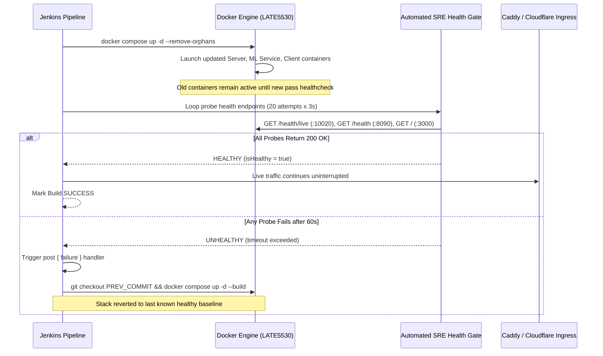

# Module 09: Zero-Downtime Deployment Strategies & Automated Rollbacks

## 1. Deployment Strategies Overview
When releasing new features to high-concurrency systems, standard downtime maintenance windows are unacceptable. Modern SRE patterns utilize automated deployment strategies:

```
┌─────────────────┬─────────────────────────────────────────────────────────────┐
│ Strategy        │ Mechanism & Tradeoffs                                       │
├─────────────────┼─────────────────────────────────────────────────────────────┤
│ Rolling Update  │ Incrementally replaces container instances behind reverse  │
│                 │ proxy. Low resource overhead; ensures zero dropped TCP conns.│
├─────────────────┼─────────────────────────────────────────────────────────────┤
│ Blue / Green    │ Deploys full new environment (Green) alongside current (Blue)│
│                 │ Instant traffic switch; requires 2x compute capacity.       │
├─────────────────┼─────────────────────────────────────────────────────────────┤
│ Canary Release  │ Routes 5%-10% of real user traffic to new release; monitors │
│                 │ telemetry (p99 latency, 5xx errors) before 100% rollout.    │
└─────────────────┴─────────────────────────────────────────────────────────────┘
```

---

## 2. HormuzWatch Rolling Update Implementation
HormuzWatch employs Docker Compose / Podman Quadlets with health check gates:



---

## 3. The Automated SRE Health Gate

### Why Simple `docker ps` is Insufficient:
A container may be in `Up (Running)` status while its internal process is deadlocked, failing database connections, or crashing on unhandled exceptions.

The health gate actively queries the application endpoints over HTTP:
```groovy
stage('Automated SRE Health Gate Verification') {
    steps {
        script {
            def isHealthy = false
            for (int i = 1; i <= 20; i++) {
                def serverCheck = sh(script: 'curl -sf http://localhost:10020/health/live >/dev/null', returnStatus: true)
                def mlCheck = sh(script: 'curl -sf http://localhost:8090/health >/dev/null', returnStatus: true)
                def clientCheck = sh(script: 'curl -sf -I http://localhost:3000 >/dev/null', returnStatus: true)

                if (serverCheck == 0 && mlCheck == 0 && clientCheck == 0) {
                    echo "==> [SRE Gate] All services HEALTHY!"
                    isHealthy = true
                    break
                }
                sleep(time: 3, unit: 'SECONDS')
            }
            if (!isHealthy) {
                error("Automated Health Gate FAILED! Rolling back.")
            }
        }
    }
}
```

---

## 4. Automated Rollback Mechanics
If any test, image scan, or health gate fails:
1. Jenkins catches the failure in declarative `post { failure { ... } }`.
2. Pipeline references `env.PREV_COMMIT` captured at the start of the build.
3. Git working tree is checked out to `PREV_COMMIT`.
4. `docker compose up -d --build` redeploys the last known good baseline.
5. SRE alerts are dispatched with failure logs.
