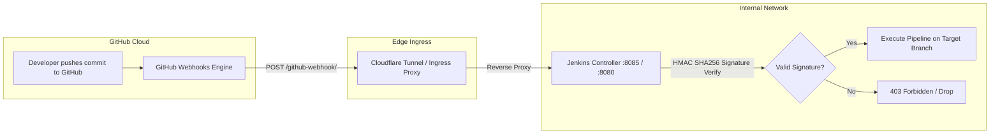

# Module 10: Jenkins Pipeline Engineering & GitHub Webhook Automation

## 1. Jenkins Architecture & Declarative Pipeline Best Practices
Jenkins serves as the continuous integration engine. The declarative pipeline (`Jenkinsfile`) standardizes builds through structured directives:
- **`options`**: Enforces strict build timeouts (`timeout(time: 35, unit: 'MINUTES')`), prevents concurrency collisions (`disableConcurrentBuilds()`), and rotates build logs (`buildDiscarder`).
- **`parameters`**: Enables targeted rollouts (e.g., custom branch, force rebuild flags, toggles for security/test stages).
- **`triggers`**: Enables both event-driven webhook triggers (`githubPush()`) and fallback interval polling (`pollSCM('H/5 * * * *')`).
- **`parallel`**: Runs isolated linting, SAST, and unit test suites simultaneously across multi-language components.

---

## 2. GitHub Webhook Ingress Architecture

---

## 3. GitHub Webhook Configuration Step-by-Step

### 1. Ingress URL Formation:
When routing through Cloudflare Tunnel or a public reverse proxy:
- **Payload URL**: `https://<YOUR-TUNNEL-DOMAIN>/github-webhook/`
  *(Example: `https://jenkins.aburcloud.com/github-webhook/` or `https://hormuzwatch.aburcloud.com/jenkins/github-webhook/`)*
- If running on local network / Tailscale WireGuard only: `http://100.66.64.31:8085/github-webhook/` (requires runner access).

### 2. GitHub Repository Settings:
1. Navigate to: `GitHub Repository -> Settings -> Webhooks -> Add webhook`
2. **Payload URL**: Enter the Ingress URL configured above.
3. **Content type**: Select `application/json` *(Crucial: Jenkins GitHub plugin expects application/json)*.
4. **Secret**: Enter a secure shared secret string (optional, matching Jenkins GitHub plugin configuration).
5. **Which events would you like to trigger this webhook?**:
   - Select **"Just the push event"** (or custom: Pushes & Pull Requests).
6. **Active**: Check `Active` and click **Add webhook**.

### 3. Jenkins Pipeline Configuration:
In Jenkins Pipeline Job configuration:
- Under **Build Triggers**, check **"GitHub hook trigger for GITScm polling"**.
- Ensure the Git SCM repository URL matches the GitHub repository URL.

---

## 4. Troubleshooting Webhooks
- **403 Forbidden / Invalid Crumb**: Ensure CSRF protection allows GitHub webhooks or use standard `/github-webhook/` endpoint which handles authentication tokens internally.
- **Trailing Slash Requirement**: GitHub webhook URL for Jenkins MUST end with a trailing slash (`/github-webhook/`). Without the trailing slash, Jenkins redirects with 302, which can drop POST body payloads.
