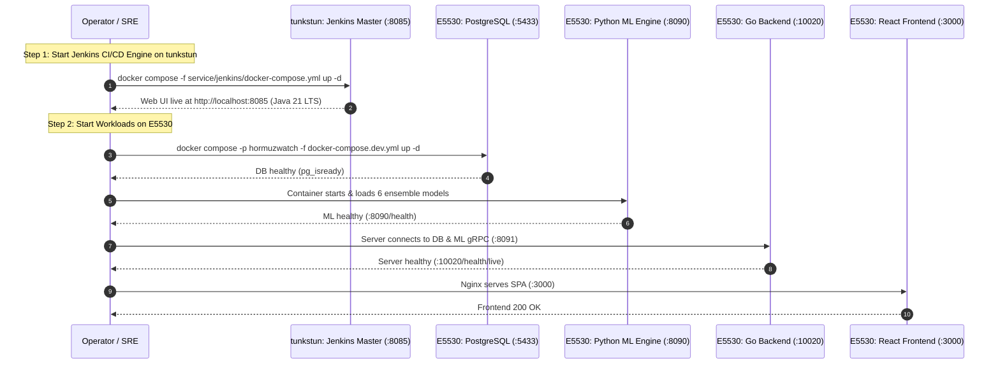

# 🔌 HormuzWatch — Graceful Shutdown & Cold-Start Runbook

**Document Version:** 1.0.0  
**Target Cluster:** Node `tunkstun` (`100.126.193.36`) & Node `E5530` (`100.66.64.31`)  
**Scope:** Complete lifecycle teardown, data preservation, and recovery runbook.  

---

## 1. System Shutdown Summary & Verification

As of **September 11, 2026, 04:37 AM**, all pipeline workloads and microservices have been cleanly and gracefully shut down across the distributed cluster.

```
Cluster Node           Component                        Shutdown State        Data Safety
-----------------------------------------------------------------------------------------
tunkstun (100.126.193.36)  hormuzwatch-jenkins (CI/CD)      Stopped (SIGTERM 30s) jenkins_data volume preserved
E5530 (100.66.64.31)       hormuzwatch-postgres-dev (DB)    Stopped (SIGTERM 15s) WAL checkpoint completed
E5530 (100.66.64.31)       hormuzwatch-ml-dev (ML Engine)   Stopped (SIGTERM 15s) Models & weights preserved
E5530 (100.66.64.31)       hormuzwatch-server-dev (Go API)  Stopped (SIGTERM 15s) In-flight connections drained
E5530 (100.66.64.31)       hormuzwatch-client-dev (Nginx)   Stopped (SIGTERM 15s) Clean worker shutdown
E5530 (100.66.64.31)       prometheus & grafana (Telemetry) Stopped (Clean)       Dashboards & configs intact
```

---

## 2. Graceful Shutdown Protocol (How it was Performed)

### 2.1 Remote Workload Shutdown on Node `E5530`

To prevent database corruption and abrupt TCP RST packets, workloads were stopped with a 15-second SIGTERM drain period before removal:

```bash
# Executed on E5530 (100.66.64.31):
cd /home/yahya/SHARED/Projects/HormuzWatch
docker compose -p hormuzwatch -f docker-compose.dev.yml stop -t 15
docker compose -p hormuzwatch -f docker-compose.dev.yml down

# Stopped standalone observability containers
docker stop prometheus grafana && docker rm prometheus grafana
```

**Verification:**
```bash
ssh yahya@100.66.64.31 "docker ps"
# Output: (0 running containers)
```

---

### 2.2 CI/CD Master Shutdown on Node `tunkstun`

Jenkins was given a 30-second drain window to ensure any background scheduler or durable task locks were released:

```bash
# Executed on tunkstun (100.126.193.36):
cd /home/yahya/SHARED/Projects/HormuzWatch
docker compose -f service/jenkins/docker-compose.yml stop -t 30
docker compose -f service/jenkins/docker-compose.yml down
```

**Verification:**
```bash
docker ps
# Output: (0 running containers)
```

---

## 3. Cold-Start Recovery Runbook (How to Power Back Up)

When bringing the environment back online, follow this strict dependency order:



### Step-by-Step Power-Up Commands

#### Step 1: Power On Jenkins Master (on `tunkstun`)
```bash
cd /home/yahya/SHARED/Projects/HormuzWatch
docker compose -f service/jenkins/docker-compose.yml up -d

# Verify Jenkins is ready
curl -I http://localhost:8085
```

#### Step 2: Power On Production Workloads (on `E5530`)
```bash
ssh yahya@100.66.64.31 "cd /home/yahya/SHARED/Projects/HormuzWatch && docker compose -p hormuzwatch -f docker-compose.dev.yml up -d"

# Verify all containers are healthy on E5530
ssh yahya@100.66.64.31 "docker compose -p hormuzwatch -f docker-compose.dev.yml ps"
```

#### Step 3: Run Automated SRE Diagnostic Probes
```bash
curl -sf http://100.66.64.31:10020/health/live
curl -sf http://100.66.64.31:8090/health
curl -sf -I http://100.66.64.31:3000
```

---

## 4. Key Takeaways & Operational Safety

1. **Named Volumes Preserve State:** Because `docker-compose.dev.yml` uses named volumes (`pgdata-dev`, `ml-models-dev`, `dataset-worker-data-dev`), container recreation or teardown does **not** erase the database tables or trained model weights.
2. **Cluster Compute Isolation:** Workload execution is strictly isolated on node `E5530`. Node `tunkstun` handles CI build execution, SAST, secret detection, and container vulnerability scanning.
3. **Java 21 Future-Proofed:** The Jenkins toolchain image runs `OpenJDK 21.0.12.1 LTS`, fully compliant with future Jenkins LTS releases.
