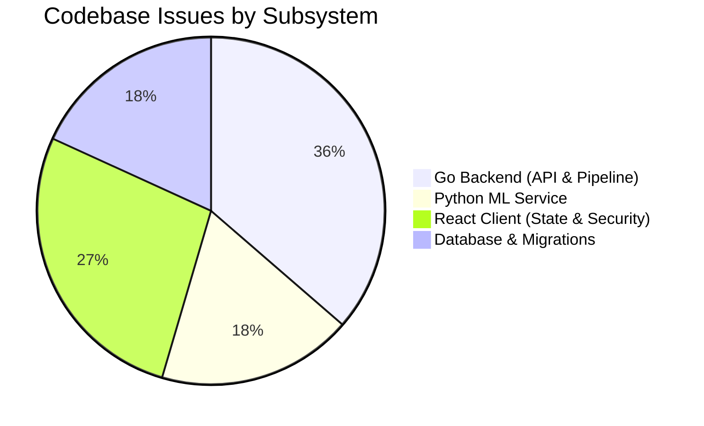
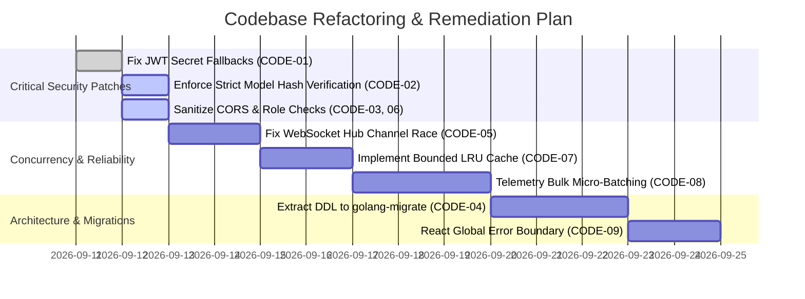

# 🔍 HormuzWatch Codebase Audit & Technical Debt Report

**Document ID:** `HW-CODEBASE-AUDIT-2026-002`  
**Classification:** Deep-Dive Engineering Audit  
**Scope:** Go Backend Server (`server/`), Python ML Inference Service (`service/ml-service/`), React/Vite Client (`client/`), Database & Real-Time Streaming Subsystems  
**Repository Branch:** `production-ready`  
**Date:** September 11, 2026  

---

## 1. Executive Summary

A comprehensive architectural, security, reliability, and code quality audit was performed across the entire HormuzWatch codebase. HormuzWatch is a high-throughput geospatial intelligence platform monitoring maritime (AIS) and aviation (ADS-B) traffic through the Strait of Hormuz and Arabian Gulf, featuring ML anomaly detection, geopolitical event correlation, and WebSocket streaming.

The codebase displays strong engineering patterns:
- Bounded channel worker pools (`pipeline.go`) with drop-tail backpressure preventing goroutine exhaustion.
- Kinematic dead-reckoning extrapolation and a time-shifted playback buffer (`playback.go`) eliminating client map flicker.
- Dual database handling via `jackc/pgx/v5` with transaction-mode PgBouncer compatibility.
- Cryptographic SHA-256 model verification in `model_registry.py`.

However, the audit identified **3 Critical (C1-C3)**, **4 High (H1-H4)**, and **4 Medium (M1-M4)** software flaws across security, concurrency, data integrity, and frontend error handling.



---

## 2. Risk & Vulnerability Matrix

| Finding ID | Severity | Subsystem | Flaw / Anti-Pattern | Business & Technical Impact |
| :--- | :--- | :--- | :--- | :--- |
| **CODE-01** | **P0 - Critical** | Backend Auth | **Hardcoded Fallback JWT Secrets & Admin Impersonation** | If `JWT_SECRET` is unset, server defaults to `"default_unsafe_secret_for_dev_only"`. Client also hardcodes `"a-secret-key"`. Allows trivial token forgery. |
| **CODE-02** | **P0 - Critical** | ML Engine | **Unsafe Python Pickle/Joblib Deserialization** | Model loading via `joblib.load()` without strict cryptographic enforcement if `manifest.json` is missing or corrupted enables Remote Code Execution (RCE). |
| **CODE-03** | **P0 - Critical** | Frontend Client | **Hardcoded Admin Email & Client-Side Role Derivation** | Client hardcodes `"ykinwork1@gmail.com"` and regex `adminEmailPattern`. Malicious client can manipulate LocalStorage/Zustand to unlock admin tabs. |
| **CODE-04** | **P1 - High** | Backend DB | **Synchronous DDL Schema Initialization in Request Path** | `InitDB()` executes 300+ lines of raw DDL `CREATE TABLE` and `ALTER TABLE` on every boot, risking lock contention and crashing under replicas. |
| **CODE-05** | **P1 - High** | Streaming Hub | **Race Condition on Slow WebSocket Client Eviction** | In `hub.go`, `go func(c *Client)` launches asynchronous locks inside the broadcast loop, risking double-close panics on `client.Send`. |
| **CODE-06** | **P1 - High** | ML Inference | **Unbounded CORS Policy (`*`) with Allowed Credentials** | `app.py` allows origins `*` with `allow_credentials=True`. Modern browsers reject this, and misconfiguration invites CSRF exploits. |
| **CODE-07** | **P1 - High** | Backend API | **In-Memory Rate Limiter & Cache Leaks** | `visitors` and `cacheMap` use unbounded in-memory maps in single server process. Does not scale horizontally and vulnerable to memory exhaustion DoS. |
| **CODE-08** | **P2 - Medium** | Backend DB | **Synchronous Per-Observation Database Writes** | Every telemetry event triggers `db.PersistTelemetry` synchronously inside worker pool. Database I/O spikes saturate PgBouncer connection limits. |
| **CODE-09** | **P2 - Medium** | Frontend UI | **Missing Global React Error Boundary** | Unhandled runtime errors in tactical Leaflet/MapLibre shaders crash the entire SPA with a blank screen. |
| **CODE-10** | **P2 - Medium** | Integrations | **Unauthenticated Metrics & Health Endpoints** | `/metrics` and internal telemetry stats rely on optional static token; if omitted or misconfigured, sensitive operational metrics are publicly readable. |
| **CODE-11** | **P2 - Medium** | Go Pipeline | **Single Track State Mutex Contention** | `TrackStateManager` locks a single shared mutex across thousands of concurrent vessel and aircraft track updates. |

---

## 3. Detailed Technical Breakdown

### CODE-01: Hardcoded Insecure JWT Secret Fallbacks (Severity: P0)
- **Location:** [`server/internal/auth/jwt.go`](file:///home/yahya/SHARED/Projects/HormuzWatch/server/internal/auth/jwt.go#L204-L208), [`client/src/environments/environment.ts`](file:///home/yahya/SHARED/Projects/HormuzWatch/client/src/environments/environment.ts#L134)
- **Vulnerability Mechanism:**
  ```go
  legacySecret := os.Getenv("JWT_SECRET")
  if legacySecret == "" {
      legacySecret = "default_unsafe_secret_for_dev_only"
  }
  ```
  If environment variables are missing during container deployment or misconfigured in `.env`, the server boots cleanly using a known, public secret. Any actor can forge HMAC-SHA256 JWT tokens with role `admin` and username `admin`, achieving total administrative control.
- **Remediation:** Remove default secrets. Fail startup with `log.Fatalf("FATAL: JWT_SECRET must be set")` in non-test runs.

---

### CODE-02: Unsafe Model Deserialization via Joblib (Severity: P0)
- **Location:** [`service/ml-service/app.py`](file:///home/yahya/SHARED/Projects/HormuzWatch/service/ml-service/app.py#L88-L113)
- **Vulnerability Mechanism:**
  The model loader catches exceptions during SHA-256 verification and proceeds anyway:
  ```python
  try:
      # SHA verification ...
  except Exception as err:
      logger.warning("Manifest verification notice: %s", err)
  
  bundle = joblib.load(artifact_path) # Arbitrary code execution if file is tampered
  ```
- **Remediation:** Strict cryptographic gating: If SHA-256 hash does not match `manifest.json`, refuse to call `joblib.load()` and raise a fatal security exception. Move from pickle/joblib to ONNX or Safetensors for inference.

---

### CODE-03: Client-Side Admin Hardcoding & Role Derivation (Severity: P0)
- **Location:** [`client/src/environments/environment.ts`](file:///home/yahya/SHARED/Projects/HormuzWatch/client/src/environments/environment.ts#L125-L135)
- **Vulnerability Mechanism:**
  The frontend defines:
  ```typescript
  adminEmails: ["ykinwork1@gmail.com"],
  adminEmailPattern: /^yk.*@.*\.com$/i,
  ```
  Client-side route guards inspect these strings locally to grant access to administration panels, dataset generation triggers, and system controls.
- **Remediation:** Never trust client-side claims. The frontend must only render admin views if the backend API returns `role: "admin"` inside an encrypted, signed HTTP-only cookie or validated JWT claim issued by Supabase.

---

### CODE-04: Synchronous DDL Schema Initialization on Boot (Severity: P1)
- **Location:** [`server/internal/db/db.go`](file:///home/yahya/SHARED/Projects/HormuzWatch/server/internal/db/db.go#L88-L325)
- **Vulnerability Mechanism:**
  `InitDB()` runs 15+ `CREATE TABLE IF NOT EXISTS` and multiple `ALTER TABLE ADD COLUMN IF NOT EXISTS` statements directly during server startup.
  1. When scaling to multiple backend replicas, concurrent startup triggers PostgreSQL catalog locks (`deadlock detected`).
  2. DDL queries delay backend boot time, causing health check timeouts on slow database links.
- **Remediation:** Extract all DDL into ordered migration files (`server/migrations/000001_init.up.sql`) using `golang-migrate`.

---

### CODE-05: WebSocket Hub Race Condition & Channel Panic (Severity: P1)
- **Location:** [`server/internal/websocket/hub/hub.go`](file:///home/yahya/SHARED/Projects/HormuzWatch/server/internal/websocket/hub/hub.go#L125-L138)
- **Vulnerability Mechanism:**
  ```go
  default:
      log.Printf("[Hub] Client send buffer full. Dropping slow client.")
      go func(c *Client) {
          h.mu.Lock()
          if _, ok := h.Clients[c]; ok {
              delete(h.Clients, c)
              close(c.Send)
              // ...
          }
          h.mu.Unlock()
      }(client)
  ```
  Spawning a goroutine inside the `Broadcast` loop to lock `h.mu` and close `c.Send` creates a race condition. If multiple broadcast messages fill the client buffer simultaneously, multiple goroutines will attempt to `close(c.Send)`, triggering a fatal Go runtime panic: `panic: close of closed channel`.
- **Remediation:** Channel closures must only occur inside the single-threaded event loop of `Hub.Run()`. Mark slow clients in a slice and delete/close them synchronously outside the lock without spawning background goroutines.

---

### CODE-06: Permissive CORS with Credentials in ML Service (Severity: P1)
- **Location:** [`service/ml-service/app.py`](file:///home/yahya/SHARED/Projects/HormuzWatch/service/ml-service/app.py#L55-L65)
- **Vulnerability Mechanism:**
  Default configuration sets:
  ```python
  allow_origins=["*"],
  allow_credentials=True,
  ```
  The W3C CORS specification forbids `Access-Control-Allow-Origin: *` when `Access-Control-Allow-Credentials: true`. Browsers automatically reject these responses, causing intermittent cross-origin network errors, while exposing localhost dev endpoints.
- **Remediation:** Explicitly parse origins and disable credentials if wildcard is active:
  ```python
  allow_credentials = _allowed_origins != ["*"]
  ```

---

### CODE-07: In-Memory Rate Limiter and Response Cache Leak (Severity: P1)
- **Location:** [`server/internal/api/middleware.go`](file:///home/yahya/SHARED/Projects/HormuzWatch/server/internal/api/middleware.go#L21-L139)
- **Vulnerability Mechanism:**
  - Rate limiting entries are stored in a standard Go `map[string]*visitor`. While cleaned every 5 minutes, an attacker sending requests from rotating IP addresses (or spoofed `X-Forwarded-For` headers) can cause unbounded heap memory allocation.
  - The response cache `cacheMap` has **no maximum entry limit** and **no eviction policy** (LRU). Under high query diversity (`/api/tracks?query=...`), it will consume all available server RAM until killed by OOM killer.
- **Remediation:** Replace in-memory maps with an LRU cache with fixed capacity (e.g. `hashicorp/golang-lru`) and use Redis/Dragonfly for distributed rate limiting.

---

### CODE-08: Synchronous Per-Observation Database Writes (Severity: P2)
- **Location:** [`server/internal/intelligence/pipeline.go`](file:///home/yahya/SHARED/Projects/HormuzWatch/server/internal/intelligence/pipeline.go#L262-L283)
- **Vulnerability Mechanism:**
  Every telemetry record ingested from AISStream and OpenWaters executes individual SQL `INSERT` statements:
  ```go
  if err := db.PersistTelemetry(context.Background(), *payload); err != nil { ... }
  ```
  At 200–500 messages per second, issuing 500 synchronous database roundtrips overwhelms the PostgreSQL connection pool (`DB.SetMaxOpenConns(10)`), causing queue backlog and drop-tail packet loss.
- **Remediation:** Implement a micro-batch buffer (`telemetryBatcher`) that buffers observations for 500ms or 100 rows and issues bulk `COPY` or multi-row `INSERT` queries.

---

## 4. Remediation Roadmap



---

## 5. Summary & Actionable Recommendations

1. **Immediate Security Fixes:**
   - Eliminate hardcoded default JWT secrets from `jwt.go` and `environment.ts`.
   - Prevent insecure model loading in `app.py` when SHA-256 does not match.
2. **Immediate Concurrency Fixes:**
   - Fix `hub.go` slow-client unregister logic to prevent double-channel-close panics.
3. **Performance Optimization:**
   - Switch telemetry persistence from single-row SQL inserts to batched multi-row inserts to preserve database health during high-volume Gulf transit events.
