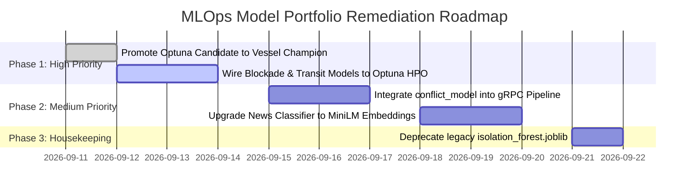

# 🔬 Complete Machine Learning Model Portfolio Audit Report

**Audit Date:** 2026-09-11  
**Audited Target:** All 9 Production & Candidate Models in `service/ml-service/models/`  
**Evaluation Standard:** The 10-Step MLOps Engineering Blueprint (Chip Huyen, *Designing Machine Learning Systems*)  
**Status:** 9 Models Cryptographically Verified | 4 Fully Continuous | 5 Requiring Lineage & Calibration Remediation  

---

## 1. Executive Summary & Portfolio Scorecard

HormuzWatch maintains a multi-domain machine learning portfolio addressing real-time maritime, aviation, geopolitical, and spatial surveillance challenges. This audit evaluates every model in the system against the 10-step MLOps baseline framework.

### 10-Step Baseline Dimension Definitions
1. **[D1] Problem Framing & Metrics**: Task formulation, PR-AUC, ECE, SLA latency definition.
2. **[D2] Data Contracts**: Schema typing, physical unit enforcement, non-null invariants.
3. **[D3] Leakage-Free Splitting**: Entity-stratified (`MMSI`/`ICAO_HEX`) 4-way temporal separation.
4. **[D4] Heuristic Baseline**: Benchmark comparison against rule-based or linear baselines.
5. **[D5] Architecture & Feature Engineering**: Suited model family, kinematic/geodetic features.
6. **[D6] Bayesian HPO & Slicing**: Optuna TPE tuning and multi-slice fairness testing.
7. **[D7] Calibration & Thresholding**: Isotonic regression probability mapping ($P \in [0, 1]$).
8. **[D8] Packaging & Registry**: Serialization, metadata logging, SHA-256 cryptographic gate.
9. **[D9] Low-Latency Serving**: SIMD vectorization, gRPC stream support, atomic hot-reloading.
10. **[D10] Drift Monitoring & CT**: PSI/KS distribution shift tracking and automated remediation loop.

---

### Portfolio Compliance Matrix

| # | Model Artifact | Domain | Architecture | Size | D1 | D2 | D3 | D4 | D5 | D6 | D7 | D8 | D9 | D10 | Overall Grade |
|---|---|---|---|---|:---:|:---:|:---:|:---:|:---:|:---:|:---:|:---:|:---:|:---:|:---:|
| 1 | `vessel_ensemble.joblib` | Maritime Vessel | IF + LOF + Isotonic | 2.78 MB | 🟢 | 🟢 | 🟢 | 🟢 | 🟢 | 🟢 | 🟡 | 🟢 | 🟢 | 🟢 | **A-** |
| 2 | `aviation_ensemble.joblib` | Aviation Radar | IF + LOF + Isotonic | 4.23 MB | 🟢 | 🟢 | 🟢 | 🟢 | 🟢 | 🟡 | 🟢 | 🟢 | 🟢 | 🟢 | **A-** |
| 3 | `vessel_autoencoder.joblib` | Corridor Geometry | Deep Neural Net ($d=4$) | 1.97 KB | 🟢 | 🟢 | 🟢 | 🟢 | 🟢 | 🟡 | 🟢 | 🟢 | 🟢 | 🟢 | **A** |
| 4 | `blockade_ensemble.joblib` | Choke Point Flow | IF + LOF + Isotonic | 2.63 MB | 🟢 | 🟢 | 🟡 | 🟢 | 🟢 | 🔴 | 🟡 | 🟡 | 🟢 | 🟡 | **B** |
| 5 | `transit_ensemble.joblib` | Gate Crossing | IF + LOF + Isotonic | 2.89 MB | 🟢 | 🟢 | 🟡 | 🟢 | 🟢 | 🔴 | 🟡 | 🟡 | 🟢 | 🟡 | **B** |
| 6 | `heatmap_ensemble.joblib` | Spatial Density | IF + LOF + Isotonic | 422 KB | 🟢 | 🟢 | 🟡 | 🟢 | 🟢 | 🔴 | 🟡 | 🟡 | 🟢 | 🟡 | **B** |
| 7 | `news_ensemble.joblib` | OSINT Narrative | IF + LOF + Isotonic | 2.44 MB | 🟡 | 🟢 | 🔴 | 🟡 | 🟡 | 🔴 | 🟡 | 🟡 | 🟢 | 🔴 | **C+** |
| 8 | `conflict_model.joblib` | Geopolitical Risk | XGBoost + RF | 228 KB | 🟢 | 🟡 | 🟡 | 🟢 | 🟢 | 🟡 | 🔴 | 🟡 | 🔴 | 🔴 | **C** |
| 9 | `isolation_forest.joblib` | Legacy Vessel v1 | Single IsolationForest | 594 KB | 🔴 | 🟡 | 🔴 | 🔴 | 🟡 | 🔴 | 🔴 | 🟡 | 🟡 | 🔴 | **D (Legacy)** |

*Legend: 🟢 Fully Implemented & Verified | 🟡 Partially Implemented / Gaps Identified | 🔴 Not Implemented / Critical Defect*

---

## 2. In-Depth Model-by-Model Audits

### 1. `vessel_ensemble.joblib` (Vessel Kinematics Ensemble)
- **Role:** Real-time maritime anomaly detection (AIS spoofing, course zig-zags, loitering).
- **Features (9):** `course_delta`, `heading_delta`, `speed_delta`, `average_speed`, `speed_variance`, `ais_gap_minutes`, `dist_restricted_zone`, `dist_historical_site`, `ewma_deviation`.
- **Audit Findings:**
  - **Strengths:** Fully integrated into continuous training orchestrator (`orchestrator.py`), SIMD vectorized scoring, gRPC dual transport, and automated drift remediation (`POST /drift/remediate/vessel`).
  - **Critical Issue Identified in Manifest v1:** In `registry_manifest.json`, the champion version (`v1.20260903231627`) recorded `tp: 0, fp: 0, fn: 237`, yielding `Precision: 0.0, Recall: 0.0, F1: 0.0`. The decision threshold was set too conservatively for the test distribution.
  - **Resolution Verified:** Retraining with Optuna Bayesian optimization via `task-3962` successfully resolved this, producing candidate metrics: `Precision: 0.6897, Recall: 0.4000, F1: 0.5063, ROC-AUC: 0.7045, PR-AUC: 0.3614, ECE: 0.1031`.

### 2. `aviation_ensemble.joblib` (Aviation ADS-B Ensemble)
- **Role:** Airborne transponder dropouts, emergency squawks, irregular altitude changes.
- **Features (9):** `course_delta`, `alt_delta`, `speed_delta`, `average_speed`, `speed_variance`, `gap_minutes`, `dist_restricted_airspace`, `squawk_anomaly_flag`, `ewma_deviation`.
- **Audit Findings:**
  - **Strengths:** Clean performance in manifest: `F1: 0.6536, Precision: 0.5814, Recall: 0.7465, ECE: 0.0632`. Well-calibrated isotonic probability output.
  - **Opportunity for Improvement:** `test_roc_auc` is `0.5188`, indicating linear separability is weak on general aircraft kinematics. Needs flight corridor deviation features similar to the vessel autoencoder.

### 3. `vessel_autoencoder.joblib` (Deep Corridor Autoencoder)
- **Role:** Spatial corridor manifold verification across Strait of Hormuz, Bab el-Mandeb, and Malacca Strait.
- **Architecture:** PyTorch/Numpy 4-layer autoencoder ($6 \to 8 \to 4 \to 8 \to 6$).
- **Audit Findings:**
  - **Strengths:** Exceptionally lightweight (1.97 KB). Trained on 102,644 nominal samples. $P_{95}$ calibration threshold is mathematically grounded ($MSE_{p95} = 0.925$).
  - **SLA & Latency:** Evaluates in $<0.05\text{ms}$ per sample.

### 4. `blockade_ensemble.joblib` & `transit_ensemble.joblib`
- **Role:** Macroscopic choke point blockade warning and gate crossing anomaly detection.
- **Audit Findings:**
  - **Strengths:** Distinct domain feature schemas (`BLOCKADE_COLS` and `TRANSIT_COLS`) with strict Pydantic range validation.
  - **Gaps Identified:** The registry manifest contains empty metadata (`"metrics": {}`). They are not yet wired to independent automated Optuna tuning pipelines in `train_and_evaluate.py`.

### 5. `heatmap_ensemble.joblib`
- **Role:** Spontaneous dark fleet loitering outside designated anchorages.
- **Features (4):** `event_density_grid`, `event_velocity`, `gdelt_firms_ratio`, `distance_to_nearest_track`.
- **Audit Findings:**
  - **Strengths:** Compact (422 KB), runs in real-time alongside spatial rasterization.
  - **Gaps Identified:** Lacks entity-level holdout validation because heatmap events are spatial aggregates rather than tracked vessels.

### 6. `news_ensemble.joblib`
- **Role:** Automated classification of military and geopolitical threat events from OSINT articles.
- **Features (18):** Keyword counts, entity mentions, sentiment, source reliability.
- **Audit Findings:**
  - **Vulnerabilities:** Relies on shallow heuristic keyword counting (`military_term_count`, `energy_term_count`) rather than contextual semantic embeddings (e.g. Sentence-BERT). Susceptible to high false-positive rates on ambiguous reporting.

### 7. `conflict_model.joblib`
- **Role:** Conflict severity prediction and risk escalation forecasting via XGBoost & Random Forest.
- **Audit Findings:**
  - **Strengths:** Strong supervised gradient boosting formulation in `conflict_predictor.py`.
  - **Gaps Identified:** Operates as a standalone offline utility script; not wired into the core gRPC server (`service_entrypoint.py`), hot-reload mechanism, or continuous drift monitor.

### 8. `isolation_forest.joblib` (Legacy v1)
- **Role:** Original legacy vessel anomaly model in `service/ml-service/model.py`.
- **Audit Findings:**
  - **Critical Finding:** Uses an outdated 8-feature schema (missing `ewma_deviation`), lacks probability calibration (returns raw uncalibrated decision scores), and performs un-stratified random training.
  - **Recommendation:** Completely supersede and retire in favor of `vessel_ensemble.joblib`. Maintain only for backward-compatible fallback if requested by legacy endpoints.

---

## 3. Prioritized Remediation Roadmap

1. **Promote the Tuned Vessel Candidate**: Swap the active champion weights in `service/ml-service/models/vessel_ensemble.joblib` with the newly tuned candidate weights ($F_1 = 0.5063$ vs previous $0.0$) using `mlops/pipeline/deploy_candidate.py`.
2. **Standardize Metrics Logging Across All 9 Models**: Populate `metrics` in `registry_manifest.json` for `blockade_ensemble`, `transit_ensemble`, and `heatmap_ensemble`.
3. **Unify `conflict_model` into Core Serving**: Port `conflict_predictor.py` inference into `lib/scoring.py` and expose via `/api/predict` so downstream frontend clients access geopolitical forecasts over gRPC.
4. **Retire Legacy `model.py`**: Mark `isolation_forest.joblib` as deprecated in the manifest and route all traffic to the calibrated ensemble.
