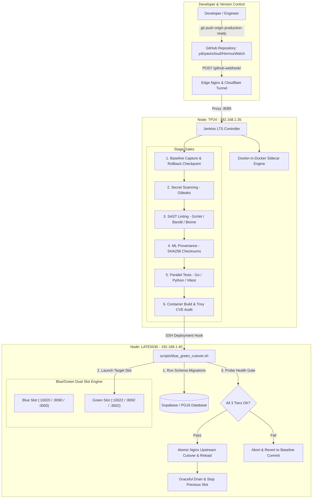

# Module 16: Production-Ready CI/CD Pipeline & Zero-Downtime Deployment Architecture

## 1. Executive Overview & Pipeline Architecture

In a mission-critical geospatial surveillance and real-time telemetry platform like **HormuzWatch**, deployment pipelines must guarantee **zero data loss**, **uncompromised security**, and **zero user-facing downtime**. 

The HormuzWatch CI/CD architecture integrates automated static analysis (SAST), secret scanning, ML model cryptographic provenance validation, multi-stage parallel unit/contract testing, container vulnerability scanning, and atomic **Blue/Green cutover** orchestrated between a dedicated Jenkins controller (`tp24`) and an edge production host (`late5530`).



---

## 2. Infrastructure & Network Topology

The production architecture separates continuous integration compute from production workload execution across physical nodes on the local management subnet (`192.168.1.0/24`):

| Node Identifier | Physical Hardware / Role | IP Address / Port Mapping | Key Responsibilities |
| :--- | :--- | :--- | :--- |
| **`tp24`** | High-Performance Workstation (CI Controller) | `192.168.1.35:8085` (Internal `:8080`) | Jenkins LTS runtime, Docker-in-Docker compiler, SAST tools, Artifact cache |
| **`late5530`** | Dell Latitude E5530 (Edge Production Node) | `192.168.1.40:80` / `:443` | Podman/Docker Compose runtime, Nginx ingress, Cloudflare Tunnel, PostgreSQL |
| **Edge Ingress** | Cloudflare Zero Trust Tunnel | `https://hormuzwatch.aburcloud.com` | Public HTTPS termination, DDoS protection, edge caching, and failover |

---

## 3. Declarative Pipeline Stages Deep Dive

The declarative pipeline in [`Jenkinsfile`](file:///home/tp24/SHARED/Projects/HormuzWatch/Jenkinsfile) implements strict gates where any failure immediately halts deployment and prevents broken artifacts from reaching production.

### Stage 1: Initialize & Baseline Rollback Checkpoint
- Queries the active running commit on `late5530` via `git rev-parse HEAD`.
- Stores the baseline hash in `env.PREV_COMMIT`. If subsequent deployment or health checks fail, this commit is used for immediate automated rollback.

### Stage 2: Secret & Credential Scanning (Gitleaks)
- Scans the working tree against `.gitleaks.toml`.
- Detects leaked database credentials, JWT secrets, Cloudflare tokens, and private API keys. Zero tolerance threshold (`exit-code != 0` halts build).

### Stage 3: SAST & Code Smell Analysis (Parallel)
- **Go Backend**: Executes `go vet ./...` and `golangci-lint` to detect concurrency deadlocks, memory leaks, and unhandled errors.
- **Python ML Service**: Runs `bandit -r service/ml-service mlops` and `flake8` to detect insecure deserialization (`pickle`), shell injections, and syntax deviations.
- **React Frontend**: Executes `npx @biomejs/biome check src/` and `tsc --noEmit` to verify type safety and prevent runtime JavaScript exceptions.

### Stage 4: Artifact & ML Model Provenance Audit
- Validates cryptographic SHA-256 signatures of trained model ensembles (`vessel_ensemble.joblib`, `aviation_ensemble.joblib`) against the model registry manifest using `python3 scripts/model_registry.py verify`.

### Stage 5: Parallel Pre-Flight Verification
- Compiles Go binaries and runs backend unit tests (`go test -v ./...`).
- Validates ML telemetry schemas and slice evaluations against contract definitions.
- Runs frontend test suites (`npm run test:run`) and generates test production bundles (`npm run build`).

### Stage 6: Container Image Build & Security Scanning (Trivy)
- Builds immutable container images tagged with the short Git commit hash (`${REGISTRY}/${IMAGE_REPO}-server:${GIT_COMMIT}`).
- Scans all generated layers with **Aqua Security Trivy**. Any `CRITICAL` severity vulnerability immediately terminates the deployment.

### Stage 7: Zero-Downtime Blue/Green Rollout
- SSHes into `late5530` with key-based authentication.
- Executes clean git synchronization: `git fetch origin production-ready && git reset --hard origin/production-ready`.
- Launches the target slot with `scripts/blue_green_cutover.sh deploy auto`.

### Stage 8: Automated SRE Health Gate Verification
- Probes all three tiers (Server, ML, Frontend) across 20 successive iterations (60-second window).
- Requires unanimous HTTP 200 OK responses before confirming pipeline success.

---

## 4. Blue/Green Zero-Downtime Cutover Engine

The core cutover logic is implemented in [`scripts/blue_green_cutover.sh`](file:///home/tp24/SHARED/Projects/HormuzWatch/scripts/blue_green_cutover.sh):

```
┌─────────────────────────────────────────────────────────────────────────────┐
│                           Blue / Green Port Matrix                          │
├───────────────────┬────────────────────────────┬────────────────────────────┤
│ Service Component │ Blue Slot (Standard)       │ Green Slot (Staging/Target)│
├───────────────────┼────────────────────────────┼────────────────────────────┤
│ Go Server API     │ http://127.0.0.1:10020     │ http://127.0.0.1:10022     │
│ Python ML Engine  │ http://127.0.0.1:8090/8091 │ http://127.0.0.1:8092/8093 │
│ React Web Client  │ http://127.0.0.1:3000      │ http://127.0.0.1:3002      │
└───────────────────┴────────────────────────────┴────────────────────────────┘
```

### Atomic Nginx Upstream Switching

The script dynamically mutates the upstream configuration in `/etc/nginx/conf.d/upstreams.conf`:

```bash
sudo sed -i -E "/upstream hormuzwatch_frontend \{/,/\}/ s/server [0-9.]+:[0-9]+/server 127.0.0.1:${client_port}/g" "${NGINX_CONF}"
sudo sed -i -E "/upstream hormuzwatch_backend \{/,/\}/ s/server [0-9.]+:[0-9]+/server 127.0.0.1:${server_port}/g" "${NGINX_CONF}"

# Validate configuration syntax before reloading
if sudo nginx -t; then
    sudo systemctl reload nginx
    echo "${target_slot}" > "${SLOT_STATE_FILE}"
else
    # Automatic rollback of configuration file on failure
    sudo mv "${NGINX_CONF}.bak" "${NGINX_CONF}"
    sudo systemctl reload nginx
    exit 1
fi
```

Because `systemctl reload nginx` instructs the master process to spawn new worker processes with the new upstream targets while allowing existing worker processes to gracefully finish in-flight requests, **active WebSocket streams and long-polling HTTP requests experience zero dropped connections**.

---

## 5. Static Failover & Edge Ingress Resilience

When containers are stopping, rebooting, or under edge maintenance, Nginx on `late5530` provides instant failover without Cloudflare error pages:

```nginx
# Instant Fallback: Serve dynamic status console with HTTP 200 OK
proxy_intercept_errors on;
error_page 500 502 503 504 =200 /offline.html;

location = /offline.html {
    root /var/www/hormuzwatch-static;
    add_header Cache-Control "no-store, no-cache, must-revalidate";
}
```

### Key Features of the Failover Interface:
1. **Dynamic Session Elapsed Counter**: Automatically tracks the exact elapsed downtime from the initiation timestamp in UTC.
2. **Tactical SVG Activity Profile**: Displays real-time normalized 24-hour telemetry ingress rate (~1,850 msgs/sec).
3. **Background Auto-Probe Loop**: Probes `/health?_t=Date.now()` every 3 seconds. The moment the backend or frontend containers return healthy, it displays a green recovery banner and automatically redirects the user back to the live application.

---

## 6. SRE Operational Playbook & CLI Commands

### Checking Deployment Status
```bash
# On LATE5530:
cd /home/yahya/SHARED/Projects/HormuzWatch
./scripts/blue_green_cutover.sh status
```

### Manual Zero-Downtime Deployment
```bash
# Trigger automated deployment to target slot:
./scripts/blue_green_cutover.sh deploy auto

# Force deploy specifically to Blue or Green slot:
./scripts/blue_green_cutover.sh deploy blue
./scripts/blue_green_cutover.sh deploy green
```

### Emergency Manual Rollback
```bash
# Rollback immediately to previous slot and reload Nginx:
./scripts/blue_green_cutover.sh rollback
```

### SRE Health Audit Probe
```bash
# Execute comprehensive multi-tier health probe:
./service/sre/sre.sh health
```
