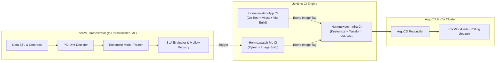

# 🚀 Module 18: Decoupled Multi-Repo CI/CD, Jenkins, ZenML & GitOps Architecture

## 1. Architectural Evolution: Monolith to Decoupled Services

As an enterprise intelligence platform grows, housing the **Go API server**, the **React GIS frontend**, the **PyTorch/FastAPI ML engine**, and the **Kubernetes/Terraform infrastructure** in a single monorepo introduces pipeline bottlenecks, bloated Docker builds, and complex release permissions.

By decoupling into three specialized repositories:
- **`Hormuzwatch-App`**: Application layer (Go 1.23 + React 18 / Vite / Tailwind)
- **`Hormuzwatch-ML`**: Machine Learning & Analytics layer (FastAPI + YOLO + ZenML MLOps)
- **`Hormuzwatch-Infra`**: GitOps & Infrastructure layer (K3s K8s manifests, ArgoCD, Terraform Azure IaC)

We achieve **independent versioning**, **parallel CI test runs**, and **least-privilege security boundaries**.

---

## 2. The Multi-Engine CI/CD & MLOps Hierarchy

---

## 3. The Role of ZenML in MLOps

### Why ZenML is Decoupled from Jenkins
* **Task Scope**: Jenkins handles *source code compilation, testing, and container packaging*. ZenML handles *data contracts, feature pipelines, hyperparameter search, drift detection, and ML model registry promotion*.
* **Reproducibility**: ZenML tracks code, data hashes, and environment stacks (`ZenML Stack`) together, ensuring that every trained weight in MLflow has full lineage back to the raw AIS telemetry snapshot.

### ZenML Pipeline Lifecycle in `Hormuzwatch-ML`:
1. **`extract_telemetry_step`**: Queries PostgreSQL/Parquet datastores for recent vessel and flight coordinates.
2. **`validate_contracts_step`**: Applies schema checks to ensure no anomalous coordinate ranges or corrupted timestamps.
3. **`drift_detector_step`**: Computes Population Stability Index (PSI) and 2-Sample Kolmogorov-Smirnov statistics against baseline datasets.
4. **`trainer_step`**: Trains an ensemble of Isolation Forest, Local Outlier Factor (LOF), and Isotonic Calibrated Regressors.
5. **`evaluator_step`**: Tests candidate model against SLA thresholds ($\text{ROC-AUC} \ge 0.85$, $\text{Latency} \le 35\text{ms}$).
6. **`deployer_step`**: Automatically promotes candidate weights to `production` in MLflow, notifying Jenkins to publish a new container release.

---

## 4. Summary: The Golden Triangle of Modern DevOps/MLOps

1. **Jenkins** = The **Build & Quality Guardian** (Code $\rightarrow$ Test $\rightarrow$ Docker Image)
2. **ZenML** = The **AI/ML Lifecycle Orchestrator** (Data $\rightarrow$ Drift Check $\rightarrow$ Training $\rightarrow$ MLflow Model)
3. **ArgoCD** = The **Runtime State Reconciler** (Git Config $\rightarrow$ K3s Cluster State)
