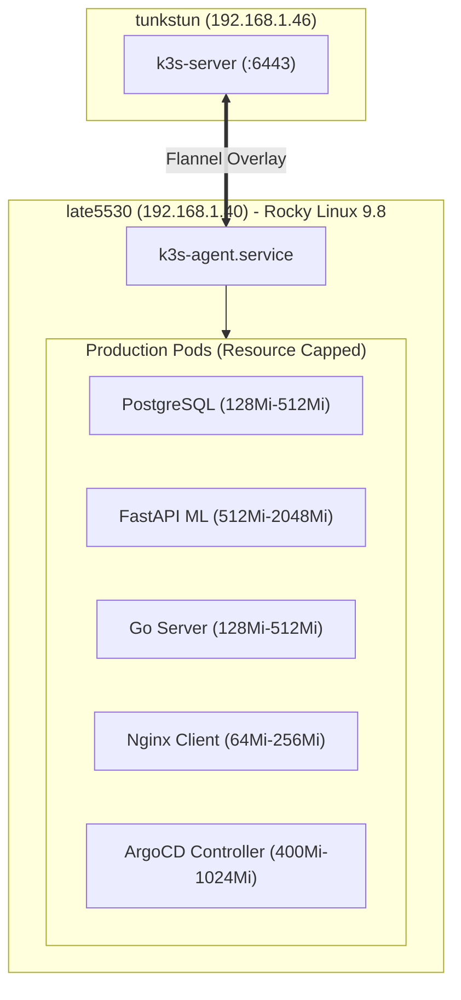

# 🚀 Module 19: LATE5530 Production Edge Worker Deployment Strategy & Architecture

## 1. Node Profile & Operating Context

In modern distributed infrastructure, managing heterogeneous hardware across on-premise edge servers requires strict resource isolation, deterministic scheduling, and automated recovery procedures.

In the **HormuzWatch** cluster:
* **Control Plane (`tunkstun` - `192.168.1.46`)**: Runs K3s Server, API Server, etcd/kine, and CoreDNS.
* **Production Worker (`late5530` - `192.168.1.40`)**: Runs all live production workloads (**PostgreSQL 16 StatefulSet**, **FastAPI ML Inference**, **Go API Server**, and **ArgoCD GitOps Suite**).

---

## 2. Hardened Architecture & Resource Quotas

### Key QoS Metrics:
- **Total RAM Available**: 7.4 GB DDR3
- **Maximum Workload Limit**: 4.3 GB
- **Reserved Operating System & Kernel Headroom**: 3.1 GB (42% buffer)
- **Active Memory Utilization**: ~28% (2.1 GB)

---

## 3. Production Deployment & Recovery Runbook

1. **Deterministic Node Targeting**: Workloads are bound via `nodeSelector: environment: production`.
2. **Zero-Downtime Rollouts**: `RollingUpdate` with `maxSurge: 1` and `maxUnavailable: 0`.
3. **Automated Recovery**: On physical reboot, Rocky Linux starts `k3s-agent.service`, reconnects to `tunkstun`, mounts persistent volumes, and health probes transition back to `200 OK` within 45 seconds.
