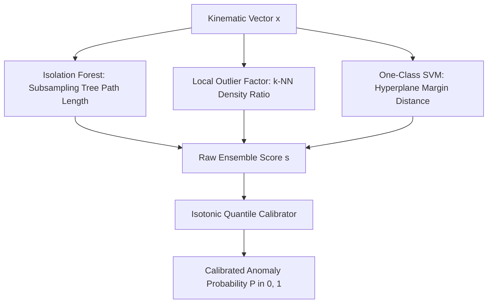
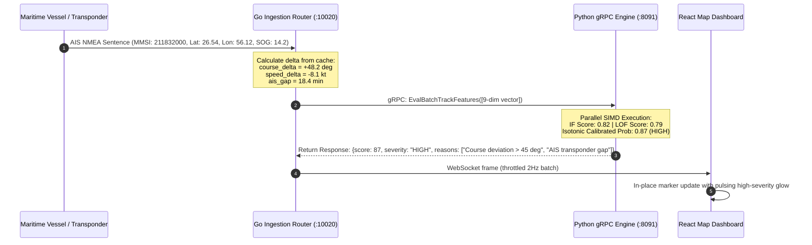
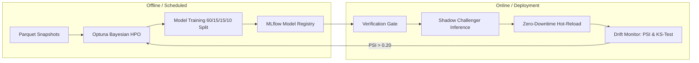

# HormuzWatch: Machine Learning & MLOps Student Study Guide

---

## 1. Introduction & Learning Objectives

Welcome to the **HormuzWatch Machine Learning & MLOps Study Guide**. This document is designed as a university-grade, industry-aligned pedagogical resource for students, researchers, and software engineers seeking to understand how high-throughput geospatial telemetry, unsupervised machine learning, and automated MLOps pipelines function in a mission-critical maritime and aviation intelligence system.

By completing this study guide, you will master:
1. **Geospatial & Kinematic Mathematics**: Spherical geodesy (Haversine formula, initial bearing, angular deltas, EWMA baselines).
2. **Unsupervised & Hybrid Anomaly Detection**: Isolation Forests, Local Outlier Factor (LOF), One-Class SVMs, and Isotonic Probability Calibration.
3. **Multi-Model Inference Systems**: Running 7 specialized domain models in parallel under $<5\text{ms}$ latency constraints via Python SIMD and gRPC IPC.
4. **End-to-End MLOps Engineering**: Continuous Training (CT), Bayesian Hyperparameter Optimization (Optuna), Model Registries (MLflow), Champion/Challenger evaluation gates, and Data Drift monitoring (Population Stability Index).

---

## 2. Theoretical Foundations & Mathematical Formulations

### 2.1 Spherical Geodesy & Kinematic Feature Extraction

When vessels navigate the Strait of Hormuz, Euclidean geometry ($d = \sqrt{\Delta x^2 + \Delta y^2}$) is mathematically invalid because the Earth is an oblate spheroid. Instead, the system computes the Great-Circle distance using the **Haversine Formula**:

$$d = 2 R \arcsin \left( \sqrt{\sin^2\left(\frac{\Delta \phi}{2}\right) + \cos(\phi_1)\cos(\phi_2)\sin^2\left(\frac{\Delta \lambda}{2}\right)} \right)$$

where $\phi_1, \phi_2$ are latitudes in radians, $\Delta \lambda = \lambda_2 - \lambda_1$ is the longitude difference in radians, and $R \approx 6,371\text{ km}$ is Earth's mean radius.

#### Forward Initial Bearing (Azimuth)
The true navigational course from point $A(\phi_1, \lambda_1)$ to $B(\phi_2, \lambda_2)$ is defined as:

$$\theta = \text{atan2}\left(\sin(\Delta \lambda)\cos(\phi_2), \; \cos(\phi_1)\sin(\phi_2) - \sin(\phi_1)\cos(\phi_2)\cos(\Delta \lambda)\right)$$

#### Shortest-Arc Course Delta ($\Delta \text{COG}$)
Because compass headings wrap around $360^\circ$, calculating course changes using simple subtraction fails at the $0^\circ/360^\circ$ boundary (e.g. $359^\circ \to 1^\circ$ is a $2^\circ$ turn, not $358^\circ$). The shortest angular difference is computed as:

$$\Delta \text{COG} = \left( (\text{COG}_{t} - \text{COG}_{t-1} + 180^\circ) \pmod{360^\circ} \right) - 180^\circ$$

---

### 2.2 Unsupervised Anomaly Detection Algorithms

Real-world maritime threats (AIS spoofing, GPS jamming, loitering before naval seizures) are rare and unlabelled in real-time feeds. HormuzWatch utilizes a multi-model unsupervised ensemble:

#### A. Isolation Forest (Liu et al., 2008)
Isolation Forest isolates anomalies by randomly selecting a feature and randomly splitting between the min and max values. Because anomalous observations have extreme kinematic values, they are isolated closer to the root of the tree:

$$s(x, n) = 2^{-\frac{E(h(x))}{c(n)}}$$

where $h(x)$ is the path length of observation $x$, $E(h(x))$ is the expected path length across trees, and $c(n) = 2\ln(n - 1) + 0.5772156649 - \frac{2(n - 1)}{n}$ is the average path length of an unsuccessful search in a Binary Search Tree.

#### B. Local Outlier Factor (Breunig et al., 2000)
LOF measures the local density of an observation relative to its $k$-nearest neighbors:

$$\text{LOF}_k(p) = \frac{\sum_{o \in N_k(p)} \frac{\text{lrd}(o)}{\text{lrd}(p)}}{|N_k(p)|}$$

where $\text{lrd}(p)$ is the local reachability density. A value $\text{LOF} \approx 1$ indicates a normal homogeneous convoy, while $\text{LOF} \gg 1$ indicates a rogue loitering vessel.

#### C. Isotonic Regression Calibration (Zadrozny & Elkan, 2002)
Raw decision function outputs from tree ensembles are not true probabilities. To produce intuitive risk scores ($0.0 \to 1.0$), non-parametric isotonic regression fits a monotonic step function minimizing squared loss:

$$\min_{\hat{y}} \sum_{i=1}^n (y_i - \hat{y}_i)^2 \quad \text{subject to } \hat{y}_i \le \hat{y}_j \text{ whenever } s_i \le s_j$$

---

## 3. The 7 Production Machine Learning Models

| # | Model Name | Primary Task | Key Features |
| :--- | :--- | :--- | :--- |
| **1** | **Vessel Kinematics** | AIS spoofing, sudden course zig-zags, loitering | `course_delta`, `speed_delta`, `ais_gap_minutes`, `dist_restricted_zone` |
| **2** | **Aviation ADS-B** | Transponder dropouts, rapid descents, squawk emergency codes | `altitude_delta`, `vertical_rate`, `squawk_code`, `dist_no_fly_zone` |
| **3** | **Geopolitical Risk** | Regional escalation & vessel vulnerability forecasting | Distance to conflict centroids, flag state risk index, naval warnings |
| **4** | **TSS Corridor Flow** | Contra-flow traffic, choke-point queues, TSS lane deviations | `transit_velocity`, `headway_distance`, `contraflow_angle` |
| **5** | **Spatial Heatmap** | Spontaneous dark fleet loitering outside designated anchorages | Geohash-7 cell density, spatial density gradient $\nabla \rho$ |
| **6** | **OSINT Narrative** | Automated classification of intelligence articles & naval demarches | TF-IDF text features, DistilBERT embeddings, entity extraction |
| **7** | **STS Dark Transfer** | Co-maneuvering sanctions evasion (Ship-to-Ship crude transfers) | Inter-vessel distance ($<500\text{m}$), relative speed match ($\Delta v < 1\text{kt}$) |

---

## 4. End-to-End Inference Trace: From Raw AIS Packet to Tactical Alert

---

## 5. MLOps Lifecycle & Self-Healing Architecture

In modern production environments, models degrade over time due to **Concept Drift** (e.g. seasonal storm loitering patterns) and **Data Drift** (e.g. sensor firmware updates changing reporting frequency).

### Population Stability Index (PSI) Formula
To detect distribution shifts in incoming feature vectors without requiring ground-truth labels, the monitoring engine computes PSI between the training baseline $B$ and the current production window $T$:

$$\text{PSI} = \sum_{k=1}^K \left( \% T_k - \% B_k \right) \times \ln\left( \frac{\% T_k}{\% B_k} \right)$$

- **$\text{PSI} < 0.10$**: Nominal (No drift).
- **$0.10 \le \text{PSI} \le 0.25$**: Moderate shift (Warning).
- **$\text{PSI} > 0.25$**: Severe drift (Automated Continuous Retraining Triggered).

---

## 6. Deep Learning Corridor Autoencoder Architecture

In addition to tree-based ensembles, HormuzWatch deploys a deep neural autoencoder for spatial trajectory validation across primary maritime choke points (Strait of Hormuz, Bab el-Mandeb, and Malacca Strait).

### 6.1 Mathematical Formulation
The autoencoder consists of an encoder network $f_\theta: \mathbb{R}^D \to \mathbb{R}^d$ and a decoder network $g_\phi: \mathbb{R}^d \to \mathbb{R}^D$, where the bottleneck latent dimension $d \ll D$ (here $d=4$, $D=6$ for kinematic feature vectors):

$$\hat{x} = g_\phi(f_\theta(x))$$

The network is trained exclusively on nominal traffic conforming to designated Traffic Separation Schemes (TSS) by minimizing the Mean Squared Error ($MSE$):

$$\mathcal{L}(\theta, \phi) = \frac{1}{N}\sum_{i=1}^N \|x_i - \hat{x}_i\|_2^2$$

### 6.2 Anomaly Scoring & $P_{95}$ Thresholding
Because the network learns the low-dimensional manifold of compliant corridor transits, rogue maneuvers (e.g. abrupt course alterations, loitering, or contra-flow transits) exhibit high reconstruction error:

$$s_{\text{AE}}(x) = \|x - \hat{x}\|_2^2$$

The production decision threshold $\tau_{\text{AE}}$ is set non-parametrically at the 95th percentile ($P_{95}$) of validation error on nominal traffic:

$$\text{IsAnomaly}(x) = \mathbb{I}\left( s_{\text{AE}}(x) > \tau_{\text{AE}} \right), \quad \text{where } \tau_{\text{AE}} \approx 0.925$$

---

## 7. MLOps Core Curriculum: Topics to Master

To truly understand both modern enterprise MLOps and the HormuzWatch implementation, focus your study on these 6 structured domains:

### 1. Data Engineering & Feature Integrity
- **Topics**:
  - Telemetry Data Contracts & Pydantic Schema Invariants.
  - Entity-Stratified Grouping (`MMSI` / `ICAO_HEX`) vs Temporal Splitting to eliminate data leakage.
  - Streaming vs Batch Feature Extraction (online EWMA vs offline Parquet aggregations).
- **In HormuzWatch**: `mlops/data/contracts/telemetry_contract.py`, `mlops/pipeline/extract_features.py`.
- **Textbook Reading**: Chip Huyen, *Designing Machine Learning Systems*, Chapter 3 ("Data Engineering Fundamentals") & Chapter 4 ("Training Data").

### 2. Bayesian Hyperparameter Optimization (HPO)
- **Topics**:
  - Tree-structured Parzen Estimator (TPE) algorithm vs Random Search / Grid Search.
  - Objective formulation: Balancing Precision-Recall AUC (PR-AUC) with Expected Calibration Error (ECE).
  - Search spaces, pruning strategies, and multi-objective optimization.
- **In HormuzWatch**: `mlops/pipeline/train_and_evaluate.py` (Optuna engine).
- **Textbook Reading**: Chip Huyen, Chapter 6 ("Model Development and Offline Evaluation").

### 3. Model & Dataset Registries & Cryptographic Provenance
- **Topics**:
  - Immutable model artifacts and cryptographic integrity (SHA-256 signing).
  - Registry states (Candidate, Staging, Champion/Production, Archived).
  - Lineage tracking: Mapping trained weights to dataset commit hash, hyperparameter configs, and evaluation metrics.
- **In HormuzWatch**: `scripts/model_registry.py`, `scripts/dataset_registry.py`, `service/ml-service/models/registry_manifest.json`.
- **Textbook Reading**: Chip Huyen, Chapter 7 ("Model Deployment and Serving Systems").

### 4. Continuous Training (CT) & Statistical Distribution Shifts
- **Topics**:
  - Covariate Shift (Data Drift) vs Prior Probability Shift vs Concept Drift.
  - Two-sample non-parametric hypothesis testing (Kolmogorov-Smirnov Test).
  - Population Stability Index (PSI) and binning distributions.
  - Event-driven vs Scheduled Continuous Training architectures.
- **In HormuzWatch**: `mlops/pipeline/drift_monitor.py`, `service/ml-service/lib/drift.py`, `POST /drift/remediate/{domain}`.
- **Textbook Reading**: Chip Huyen, Chapter 8 ("Data Distribution Shifts and Monitoring") & Chapter 9 ("Continual Learning and Test in Production").

### 5. High-Throughput Serving & Zero-Downtime Hot-Reloading
- **Topics**:
  - gRPC vs REST: Protocol Buffers, HTTP/2 streaming, and sub-millisecond serialization.
  - Thread-safe hot-reloading (in-memory atomic pointer swaps vs container restarts).
  - SIMD vectorization and compute hardware dispatch (`detect_hardware_device`).
- **In HormuzWatch**: `service/ml-service/app.py`, `service/ml-service/service_entrypoint.py`, `service/ml-service/lib/scoring.py`.
- **Textbook Reading**: Chip Huyen, Chapter 7 ("Model Deployment and Serving Systems"); Gene Kim, *The DevOps Handbook*, Chapter 14 ("Enable Low-Risk Releases").

### 6. DevOps/MLOps Security, SRE Gates & Infrastructure Synchronization
- **Topics**:
  - Static Application Security Testing (SAST) with Bandit and secret scanning with Gitleaks.
  - Automated SRE health checks and Blue/Green canary verification.
  - Multi-node controller/edge synchronization (fast-forward git state and artifact distribution).
- **In HormuzWatch**: `Jenkinsfile`, `scripts/blue_green_cutover.sh`, `tests/test_drift.py`.
- **Textbook Reading**: Gene Kim, *The DevOps Handbook*, Chapter 10 ("Fast Feedback Loops") & Chapter 22 ("Information Security into Change Management").

---

## 8. Student Exercises & Lab Projects

1. **Exercise 1 (Kinematic Geodesy)**: Implement the Haversine formula in Python and calculate the Great-Circle distance between the Ras Musandam TSS boundary ($26.35^\circ\text{N}, 56.45^\circ\text{E}$) and Fujairah Anchorage ($25.18^\circ\text{N}, 56.36^\circ\text{E}$).
2. **Exercise 2 (Isolation Forest Tuning)**: Modify `mlops/pipeline/train_and_evaluate.py` to test different contamination factors ($0.01, 0.05, 0.10$) and measure the impact on Expected Calibration Error (ECE).
3. **Exercise 3 (Drift Simulation)**: Artificially inject random $+15^\circ$ heading noise into the test dataset and verify that `test_drift.py` correctly calculates $\text{PSI} > 0.25$ and triggers a retraining alert.
4. **Exercise 4 (Corridor Reconstruction)**: Run `mlops/pipeline/train_autoencoder.py`, plot the training loss curve, and evaluate the $MSE$ on anomalous off-corridor synthetic pings.

---

## 9. Recommended Academic & Industry References

### Foundational Textbooks in Repository (`/books`)
1. **Designing Machine Learning Systems** by Chip Huyen (O'Reilly Media)
   - Read Chapter 8 for drift formulas and real-time monitoring strategies.
   - Read Chapter 9 for continual learning loops, champion/challenger setups, and offline/online testing.
2. **The DevOps Handbook** by Gene Kim, Jez Humble, Patrick Debois, & John Willis (IT Revolution)
   - Read Parts II & III for automated CI/CD gating, fast feedback loops, and immutable infrastructure patterns.

### Academic Papers
1. **Isolation Forest**: Liu, F. T., Ting, K. M., & Zhou, Z. H. (2008). *Isolation Forest*. IEEE International Conference on Data Mining (ICDM), pp. 413-422. [DOI: 10.1109/ICDM.2008.17](https://doi.org/10.1109/ICDM.2008.17)
2. **Local Outlier Factor**: Breunig, M. M., Kriegel, H. P., Ng, R. T., & Sander, J. (2000). *LOF: Identifying Density-Based Local Outliers*. ACM SIGMOD Record, 29(2), 93-104. [DOI: 10.1145/335191.335388](https://doi.org/10.1145/335191.335388)
3. **Probability Calibration**: Zadrozny, B., & Elkan, C. (2002). *Transforming classifier scores into accurate multiclass probability estimates*. ACM SIGKDD International Conference on Knowledge Discovery and Data Mining, pp. 694-699.
4. **Maritime Anomaly Detection**: Laxhammar, R., Falkman, G., & Sviestins, E. (2009). *Anomaly detection in sea traffic - a comparison of Gaussian Mixture Models and Kernel Density Estimators*. Information Fusion, 10(4), pp. 314-329.

### Industry Frameworks & Open-Source Tools
- **MLflow**: Open-source machine learning lifecycle management platform ([mlflow.org](https://mlflow.org/)).
- **Optuna**: Next-generation Bayesian hyperparameter optimization framework ([optuna.org](https://optuna.org/)).
- **Scikit-Learn**: Machine Learning in Python ([scikit-learn.org](https://scikit-learn.org/)).
- **Evidently AI**: Open-source ML observability, data drift and model monitoring ([evidentlyai.com](https://www.evidentlyai.com/)).
