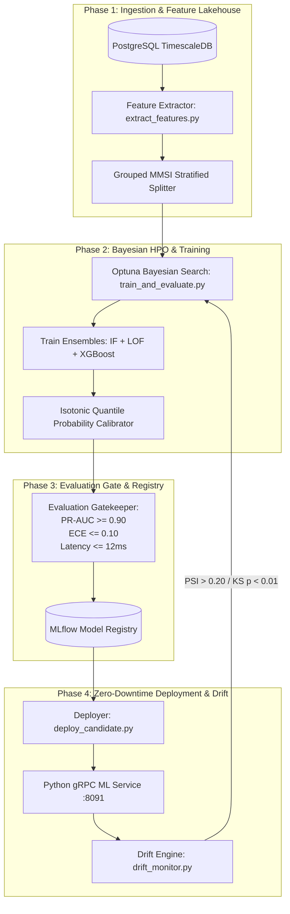

# HormuzWatch: Automated MLOps Continuous Training (CT) Pipeline

---

## 1. The MLOps Journey: From Static Benchmarks to Self-Healing Intelligence

In geospatial maritime and aviation monitoring, operational environments are non-stationary:
- **Seasonal Shifts**: Winter storms and summer shamals alter tanker convoy loitering patterns and anchorage dwell times.
- **Geopolitical Dynamics**: Naval drills, commercial rerouting around the Strait of Hormuz, and new exclusion zones create sudden behavioral shifts.
- **Sensor Drift**: Changes in coastal AIS receiver stations or ADS-B satellite constellations induce signal dropouts and transponder latency variance.

The HormuzWatch **MLOps Pipeline** transitions the platform from static, manual model weights to an **autonomous, closed-loop Continuous Training (CT) lifecycle** managing **7 specialized machine learning models**.



---

## 2. The 4 Engineering Phases

### Phase 1: Feature Extraction & Entity-Grouped Partitioning
- **Script**: `pipeline/extract_features.py`
- **Data Ingestion**: Pulls verified historical kinematics from PostgreSQL or generates parametric bootstrap matrices.
- **Data Leakage Prevention**: Enforces a strict 4-way stratified split:
  - **Train (60%)**: Fits Isolation Forests, Local Outlier Factors, and Covariance Envelopes.
  - **Validation (15%)**: Guides Optuna hyperparameter trials.
  - **Calibration (15%)**: Fits monotonic Isotonic Regression calibrators.
  - **Test (10%)**: Out-of-sample holdout for evaluation gates.
- **Entity Stratification**: Splits are grouped by `MMSI` (vessels) and `ICAO_HEX` (aircraft), guaranteeing that consecutive observations of the same entity never leak across training and test sets.

---

### Phase 2: Bayesian Hyperparameter Optimization (Optuna)
- **Script**: `pipeline/train_and_evaluate.py`
- **Search Strategy**: Uses Tree-structured Parzen Estimator (TPE) via **Optuna** to optimize:
  - Number of estimators ($50 \to 200$)
  - Subsampling ratio ($0.5 \to 1.0$)
  - Contamination threshold ($0.01 \to 0.10$)
- **Probability Calibration**: Couples raw tree path-length scores with Isotonic Regression step functions to map anomaly outputs to well-calibrated probabilities ($0.0 \to 1.0$).

---

### Phase 3: Model Verification Gate & MLflow Registry
- **Artifact Store**: Logged to local/remote **MLflow** (`pipeline/artifacts/mlruns`).
- **Gatekeeper Criteria**: Candidate models must satisfy three strict conditions:
  1. **Precision-Recall AUC**: $\text{PR-AUC} \ge 0.90$
  2. **Expected Calibration Error**: $\text{ECE} \le 0.10$
  3. **Inference Latency SLA**: $\le 12.0\text{ms}$ per batch sample.
- **Cryptographic Manifest**: Successful candidates generate a cryptographically signed SHA-256 hash registered in `service/ml-service/models/manifest.json`.

---

### Phase 4: Observability, Drift Monitoring & Hot-Reloading
- **Scripts**: `pipeline/drift_monitor.py` & `pipeline/deploy_candidate.py`
- **Drift Metrics**:
  - **Population Stability Index (PSI)**: Monitors distribution shifts per kinematic column. A $\text{PSI} > 0.20$ triggers automated retraining.
  - **Kolmogorov-Smirnov (KS) Test**: Validates null hypothesis ($p < 0.01$) against baseline distributions.
- **Atomic Zero-Downtime Hot-Reload**: Successful candidates are atomically copied to `service/ml-service/models/{domain}_ensemble.joblib` and hot-reloaded via REST `/models/reload` without dropping active gRPC telemetry streams.

---

## 3. Directory Structure

```
pipeline/
├── README.md                 # Complete MLOps architectural guide & runbook
├── Dockerfile                # Production container for pipeline orchestrator
├── requirements.txt          # Open-source MLOps dependencies (MLflow, Optuna, Scikit-learn)
├── config.py                 # Central MLOps configuration & thresholds
├── extract_features.py       # Telemetry feature matrix extractor
├── train_and_evaluate.py     # Bayesian HPO, ensemble training & MLflow logger
├── drift_monitor.py          # Real-time PSI & KS-test data drift detector
├── deploy_candidate.py       # Evaluation gatekeeper & atomic hot-reloader
├── orchestrator.py           # Autonomous scheduled & trigger-based daemon
└── artifacts/                # MLflow runs and candidate model bundles
```

---

## 4. Usage & Execution Runbook

### 1. Install Dependencies
```bash
pip install -r pipeline/requirements.txt
```

### 2. Run Immediate Model Retraining (Single Domain or All)
```bash
# Train maritime vessel ensemble with Optuna HPO & MLflow logging
python pipeline/train_and_evaluate.py vessel

# Retrain all 7 domain models
python pipeline/train_and_evaluate.py all
```

### 3. Check for Feature Drift in Real-Time Telemetry
```bash
python pipeline/drift_monitor.py
```

### 4. Execute Full End-to-End Orchestrator Cycle
```bash
# Execute retraining, gatekeeper validation, and hot-reload now
python pipeline/orchestrator.py --run-now vessel

# Run full suite
python pipeline/orchestrator.py --run-now all
```

### 5. Launch the Autonomous MLOps Scheduling Daemon
```bash
# Runs weekly scheduled retraining and bi-hourly continuous drift evaluations
python pipeline/orchestrator.py --daemon
```

### 6. View MLflow Experiment Tracking Dashboard
```bash
mlflow ui --backend-store-uri file://$(pwd)/pipeline/artifacts/mlruns --port 5000
```
